# 基础语法

[toc]


## 变量作用域

### 形参、局部变量

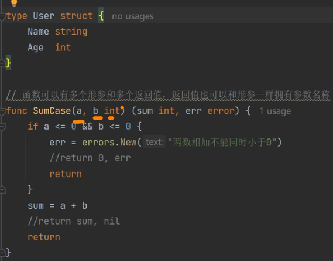

值传递和引用传递
```go
//值传递和引用传递
func ReferenceCase(a int ,b *int){
    a+=1
    *b+=1
}
// ======================
a:=10
b:=20
_case.ReferenceCasse(a,&b)
```
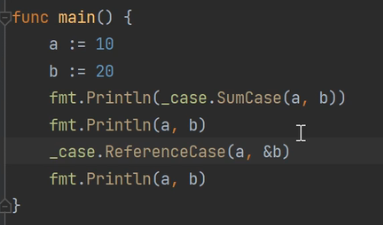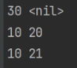

### 全局变量(当前包的全局变量)

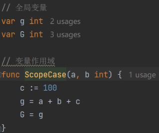

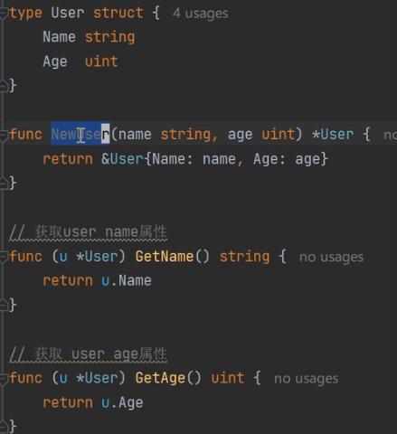

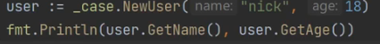

## 泛型 generic  T


~ 衍生类型

### 泛型使用 [T interface{int|float64}]

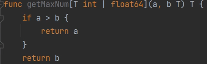

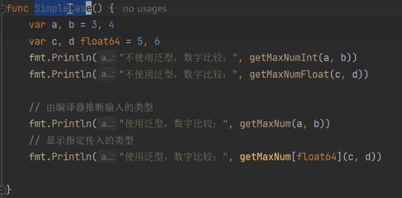

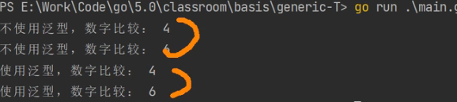

#### 别名和衍生类型

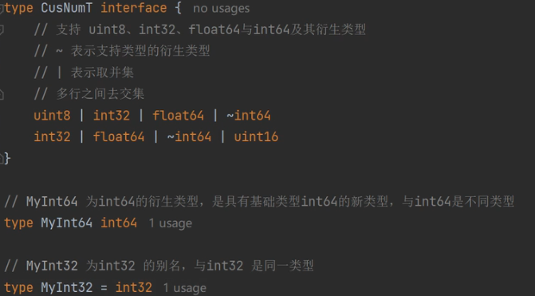

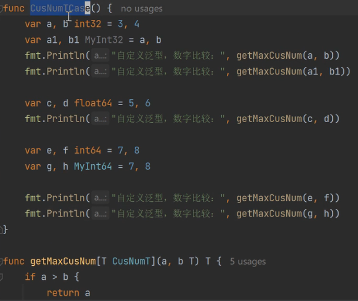

#### 内置类型

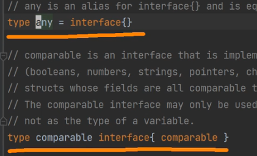

comparable

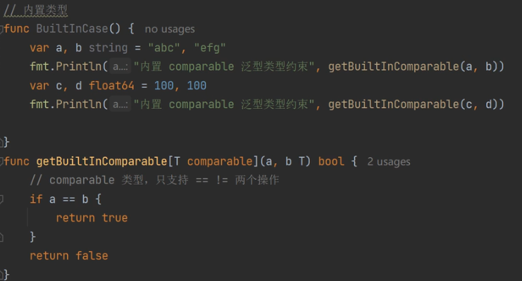

any

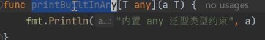

### 泛型类型

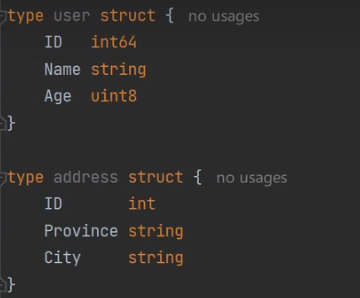


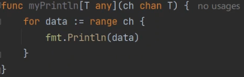

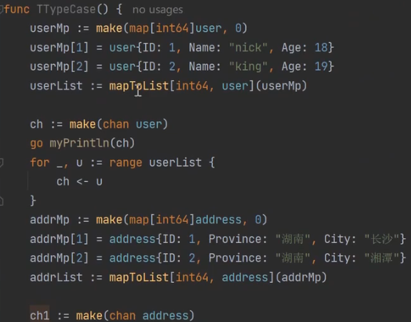

> 控制台异常打印,限制

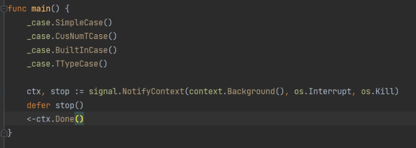

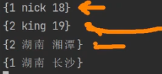

#### 泛型切片

`type List[T any] []T`

#### 泛型集合

`type MapT[k comparable,v any] map[k]v`

#### 泛型通道

`type Chan[T any] chan T`

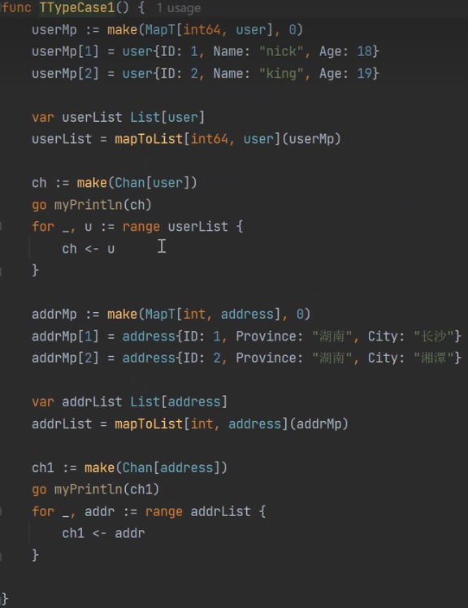

### 泛型接口

基本接口: 可用于变量的定义
```go
type ToString interface{
    String() string
}
// type s ToString
```

泛型接口

```go
type GetKey[T comparable] interface{
    any
    Get() T
}
// type s GetKey[T] 会报错，不确定的类型
// type s GetKey[comparable] 也会报错，不确定的类型
// type s GetKey[string] 会报错
```

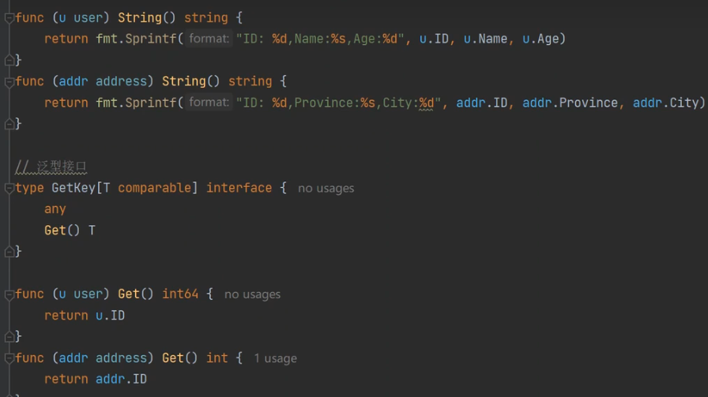

列表转集合

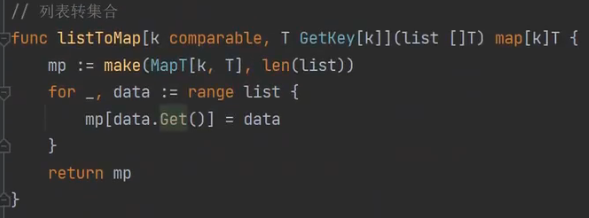

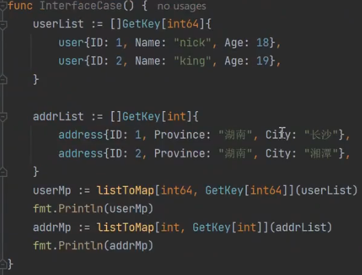

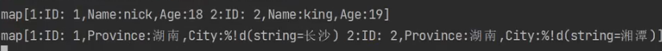

### 泛型结构体和receiver

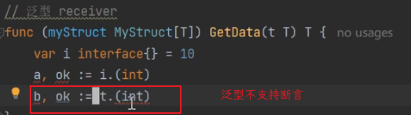

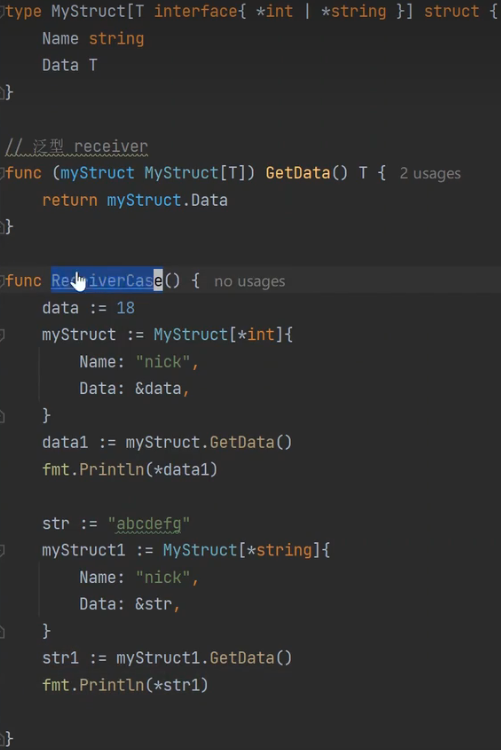

## 流程控制

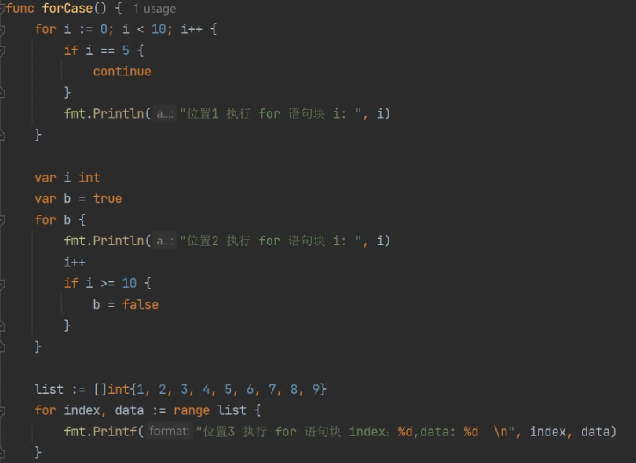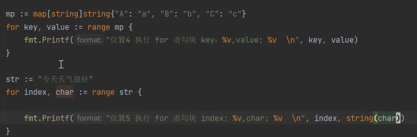

死循环：

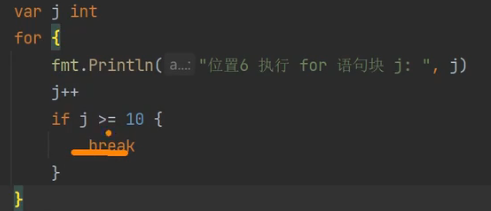

嵌套循环：

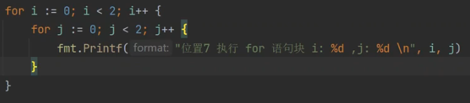

跳出label

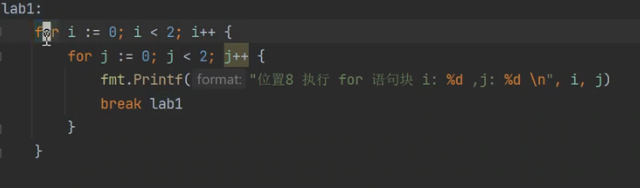

### switch

fallthrough 穿透

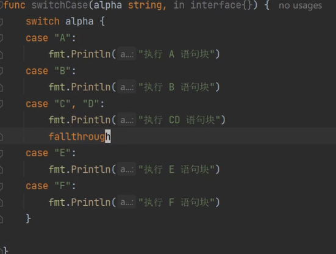

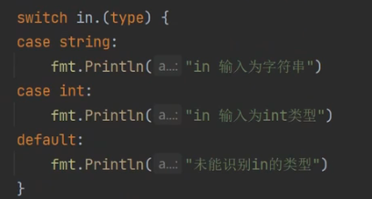

### goto语句

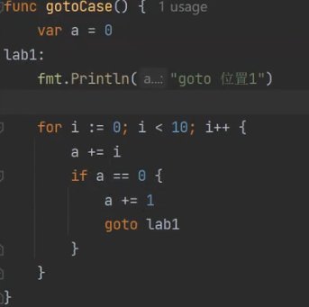

## golang标准库

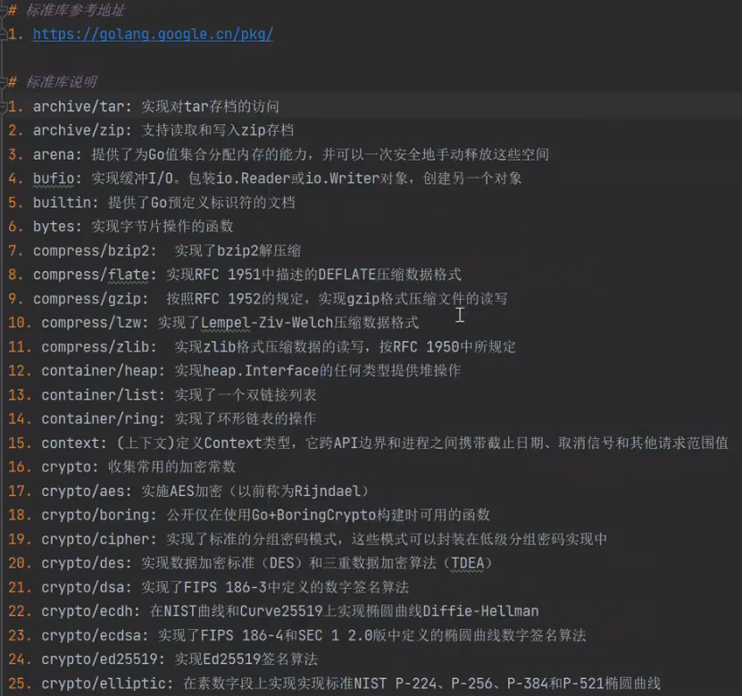

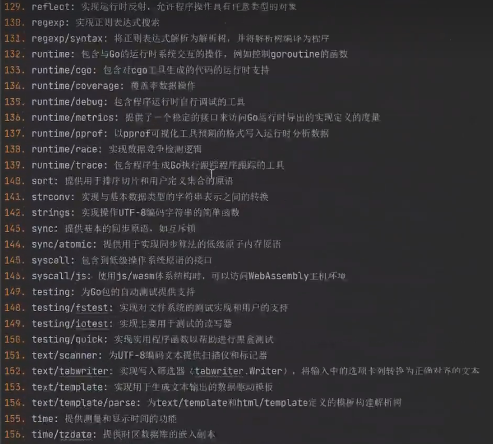

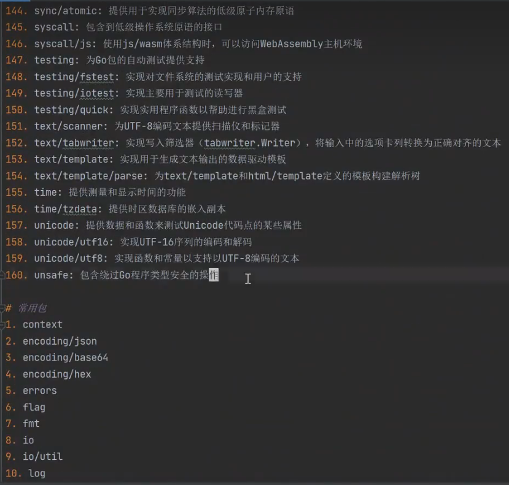

常用包


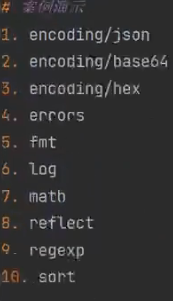

### encoding

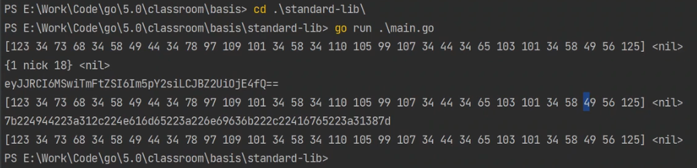

#### json

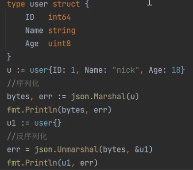

#### base64编解码

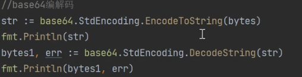

#### 16进制编解码  hex

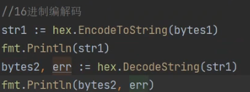

### error

自定义error

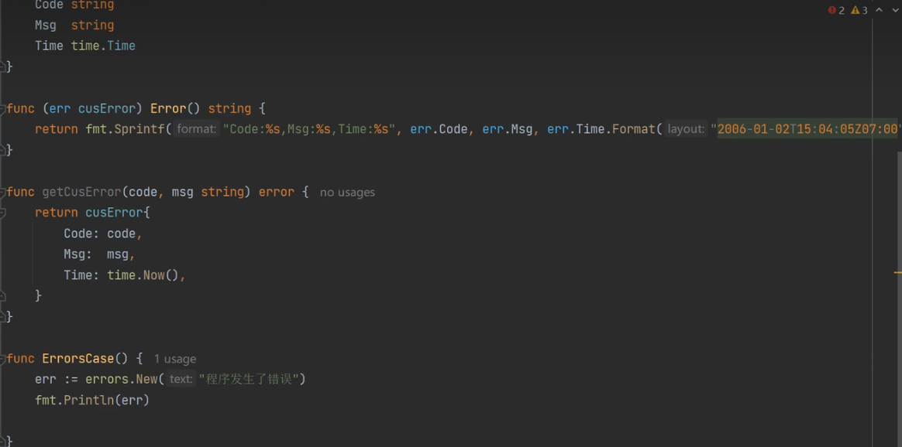

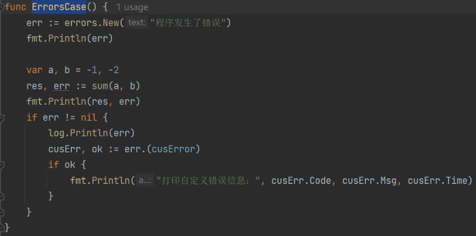

### fmt

#### 输出位置


#### 占位符

##### 通用占位符

%% 输出百分号

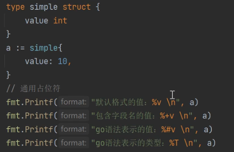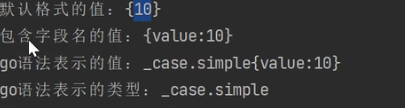

##### 	整数占位符

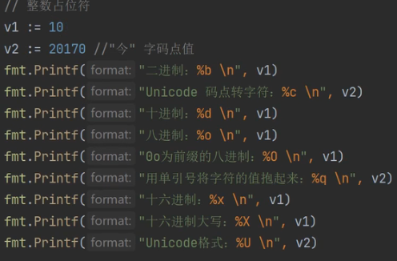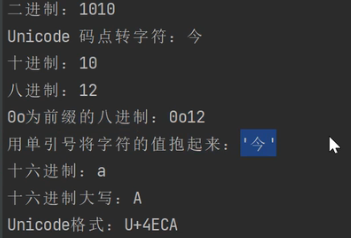

##### 宽度占位符

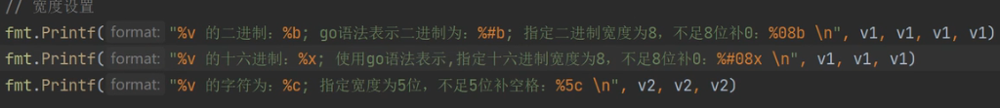
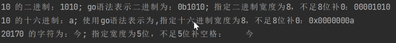

##### 浮点占位符


##### 字符串占位符


##### 指针占位符


### log


### math


### reflect


slice


### regexp


### sort

#### 根据年龄从小到大


#### 按照id排序

自定义排序的类型，实现Len、Swap、Less

​	


## 数据类型和变量

rune是int32别名


### 类型定义

值类型默认至为0，引用类型默认值为nil

#### 值类型


#### 引用类型


### 常量定义


iota  _跳过_


### 结构体类型


### new和make

new可以用于创建任意类型。并返回指针


make 仅仅用于切片、通道、集合的初始化


### 类型转换：


#### string与[]byte


#### 字符串与rune转换

type rune int32


#### 接口类型转具体类型


#### 时间类型转字符串


#### uintptr 无符号指针类型


## 语言结构+语法基础


### 预定义标识


### 运算符和优先级

#### 算术运算符


#### 关系运算


#### 逻辑运算


#### 位运算


#### 赋值运算


#### 运算符优先级


## 异常捕获处理defer/recover

### 应用场景

#### defer：

```bash
1、资源释放
2、异常捕获和处理
```


#### recover


#### panic


