# gin 框架

[toc]

## gin介绍

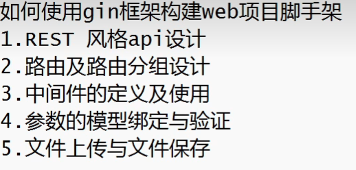

### golang原生http

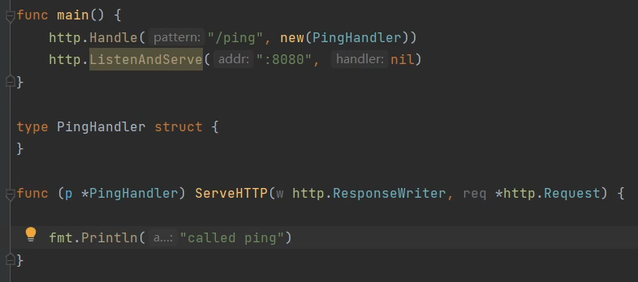

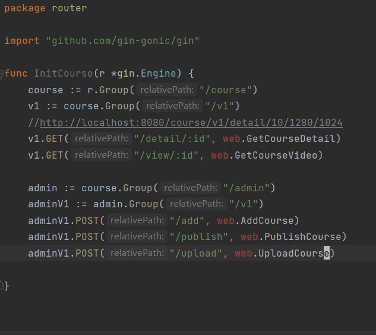

### 路由初始化

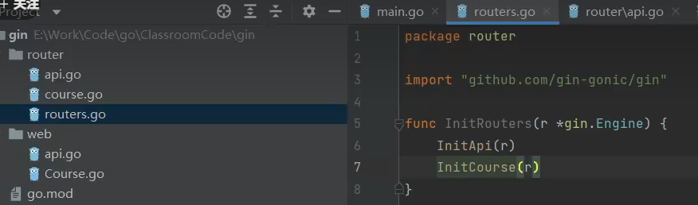

main

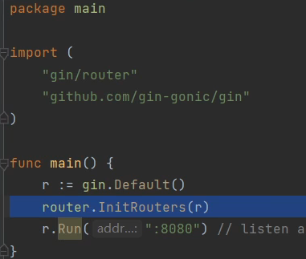

#### 路由使用

### 中间件

#### log打印

#### tolen校验

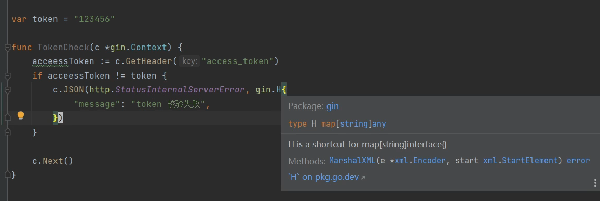

c.Abort()后续的中间件不会在执行了

##### 中间件使用

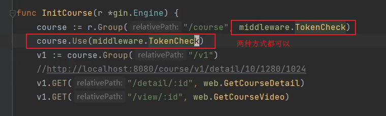

#### 登录中间件

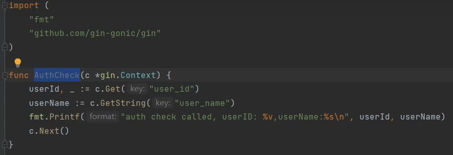

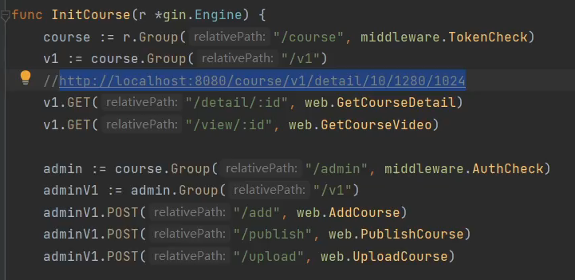

### 参数

#### post

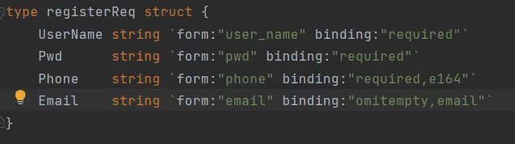

参数格式校验 validater

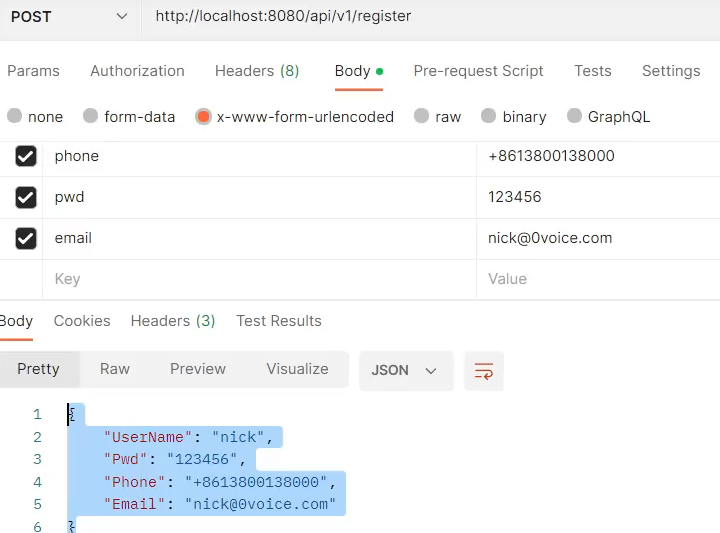

#### get

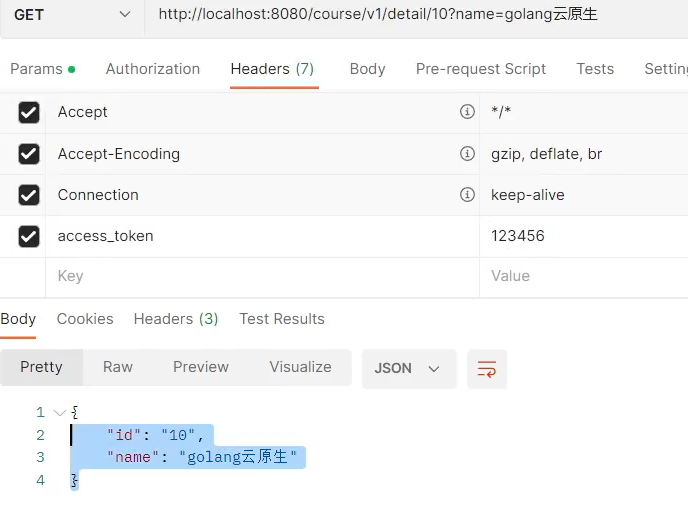

#### upload

##### 单文件上传

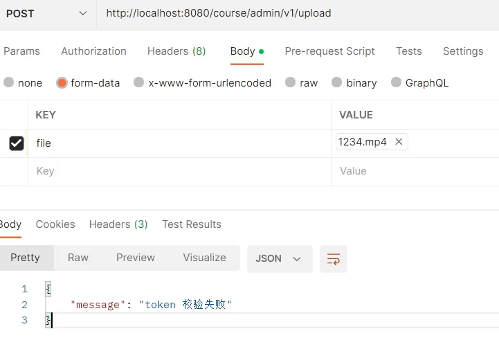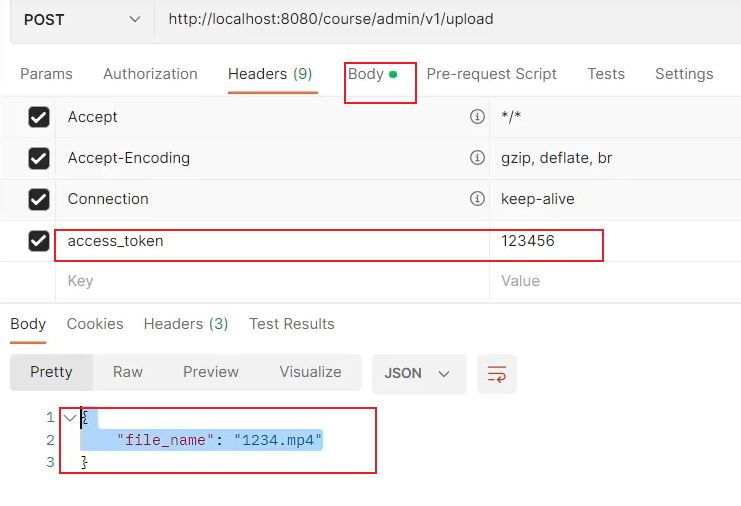

##### 多文件上传

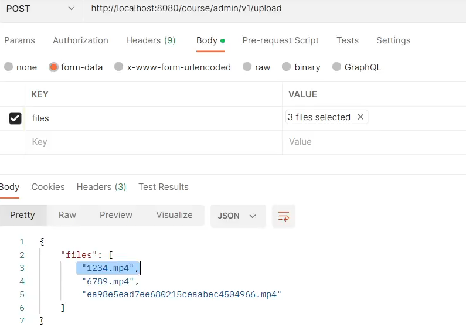

## go课程

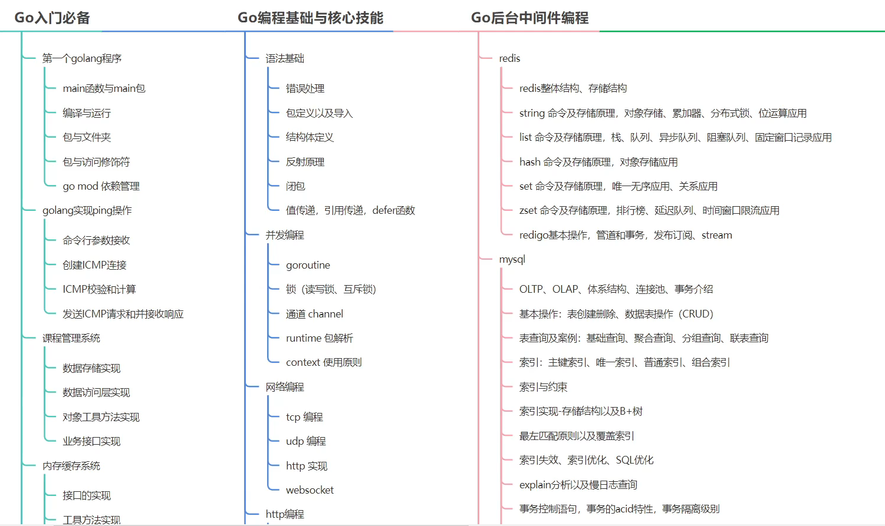

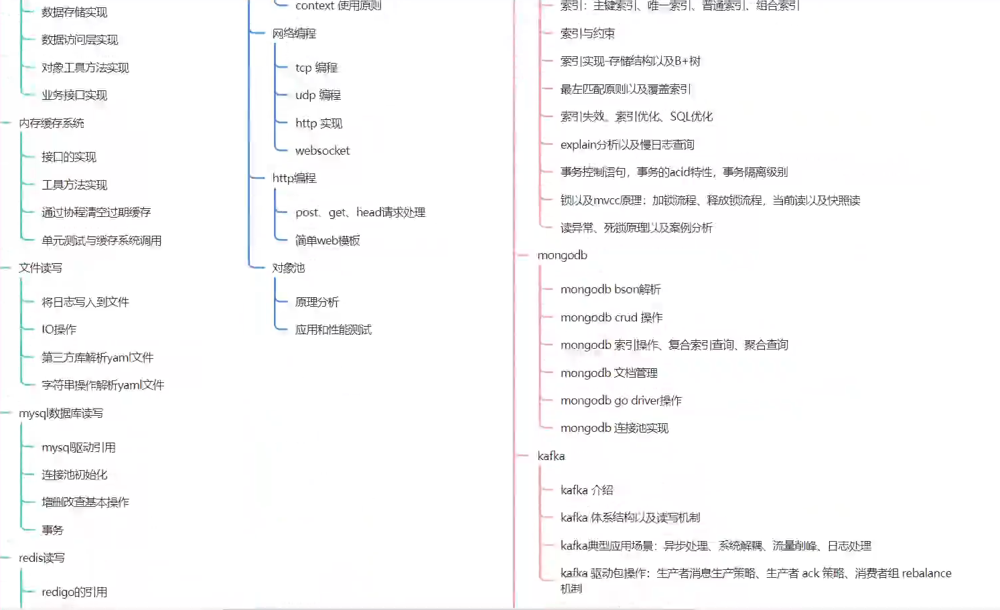

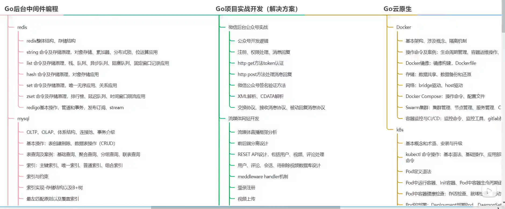

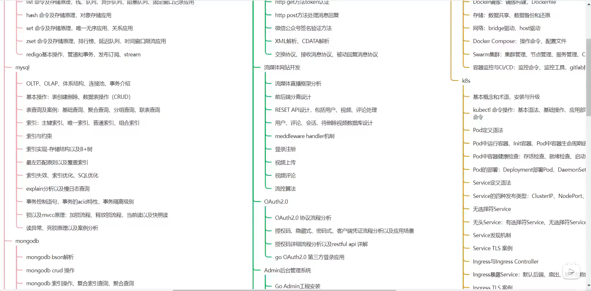

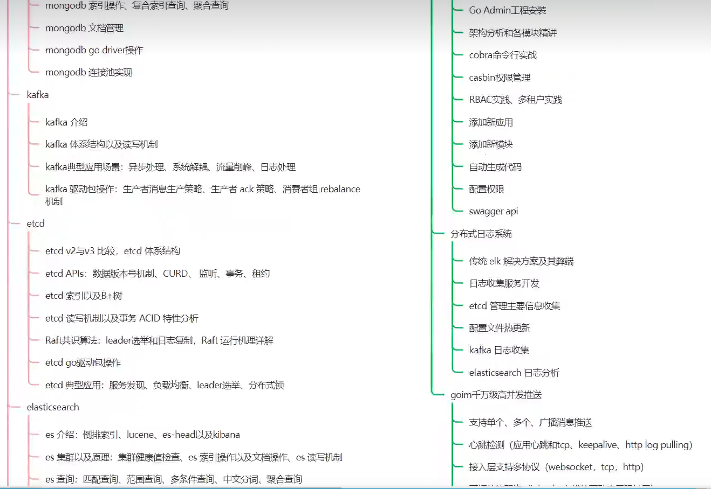

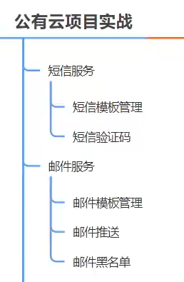

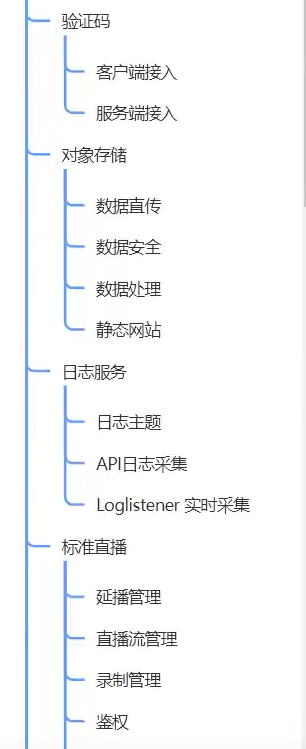

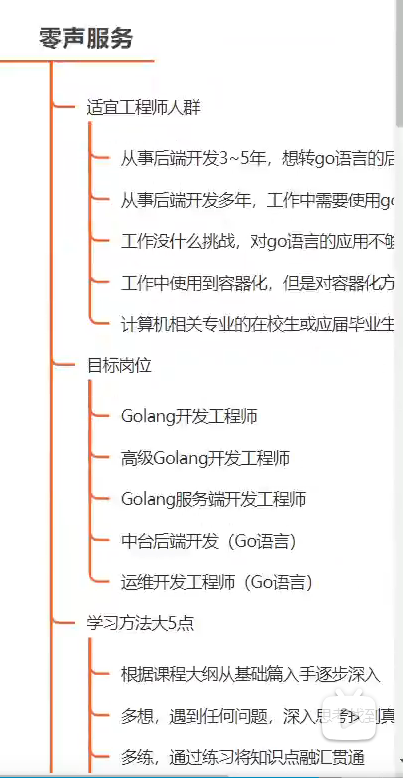

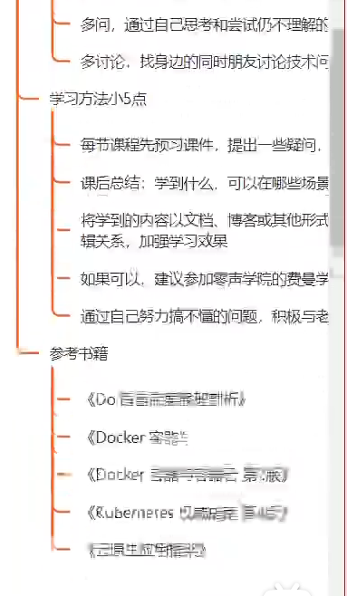