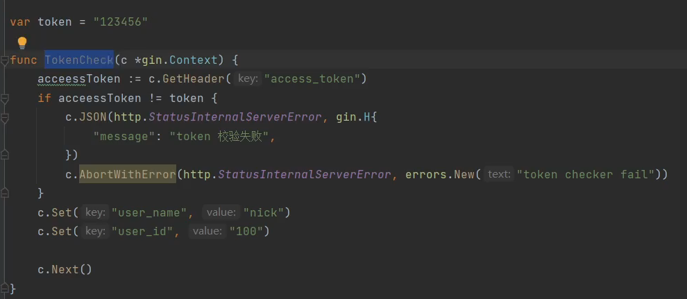

# gin 框架

[toc]

## gin介绍

### golang原生http

### 路由初始化

main

#### 路由使用

### 中间件

#### log打印

#### tolen校验

c.Abort()后续的中间件不会在执行了

##### 中间件使用

#### 登录中间件

### 参数

#### post

参数格式校验 validater

#### get

#### upload

##### 单文件上传

##### 多文件上传

## go课程

