# golang 开源验证框架validator

[toc]

QQ：2041993283

https://yuque.com/yinian-cpwpp/veangt/qi6mgo

## 必会的三个操作

1. validator单个字段格式验证
2. validator结构绑定格式验证
3. 切片与集合内元素格式验证

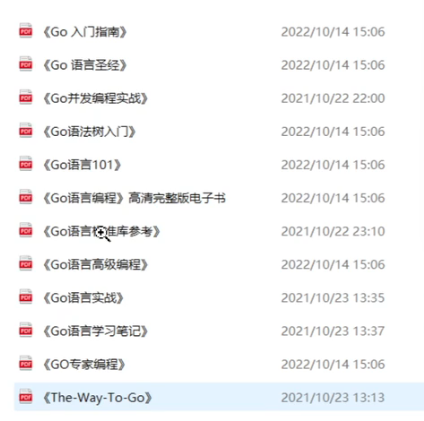

## go-playground/validator

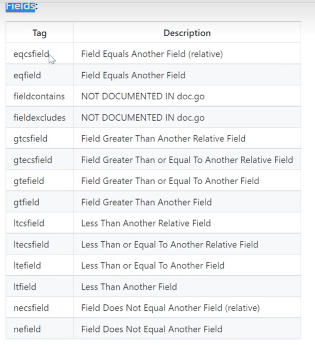

string

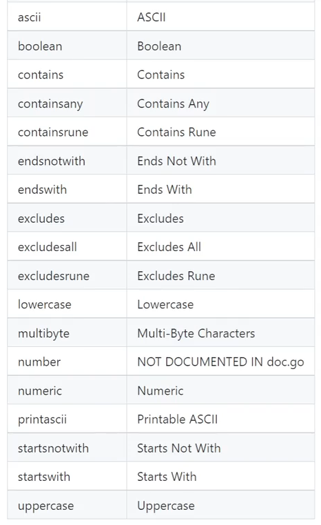

format\other\

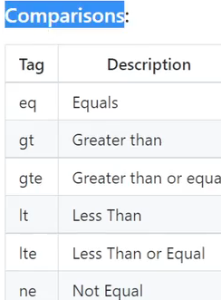

## 单个字段验证

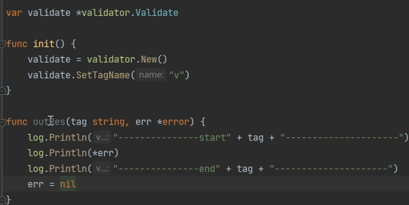

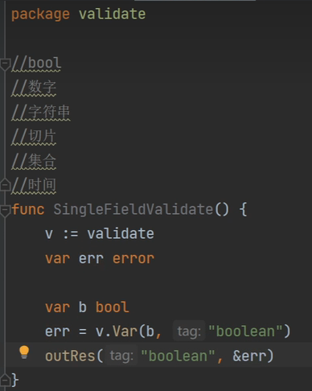

numeric 校验小数

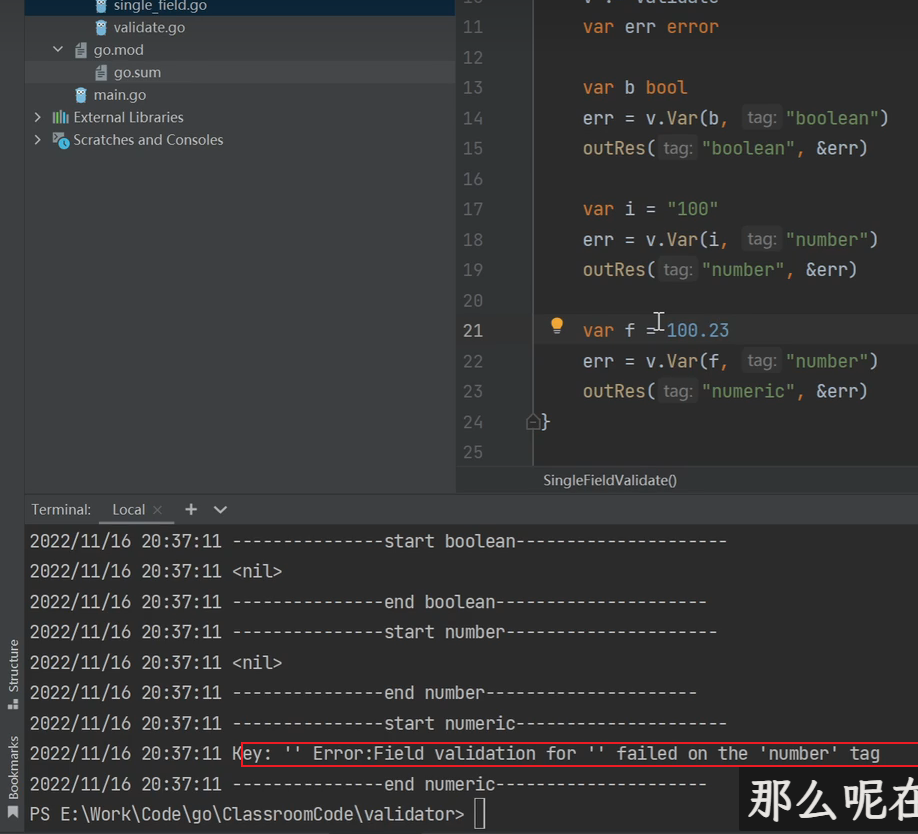

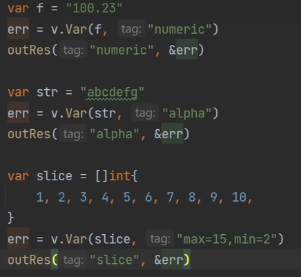

map

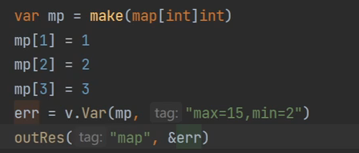

time

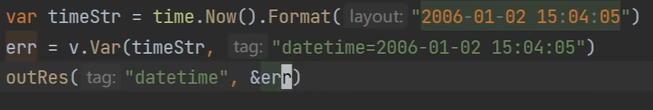

字段对比

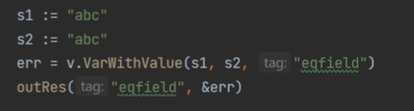

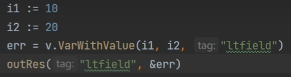

## 结构体验证

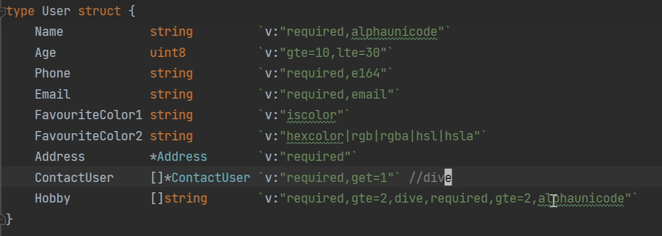

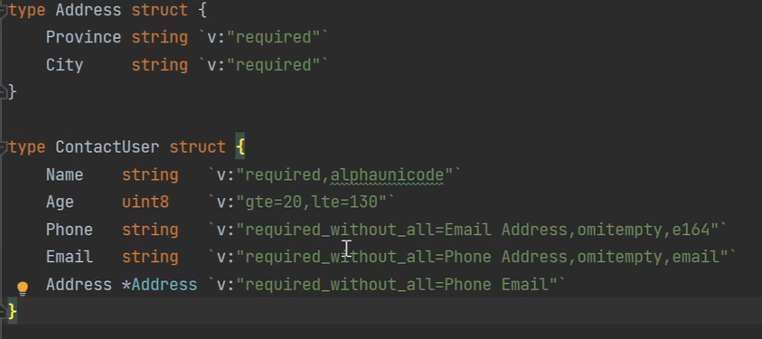

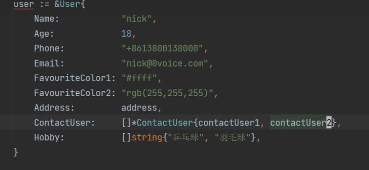

### dive继续下一层校验

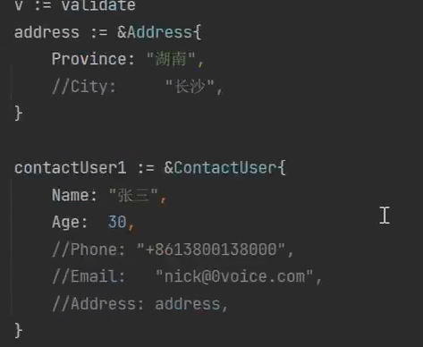

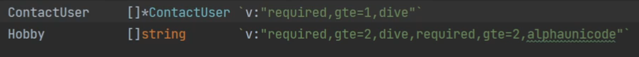

#### div2

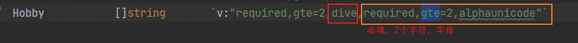

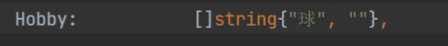

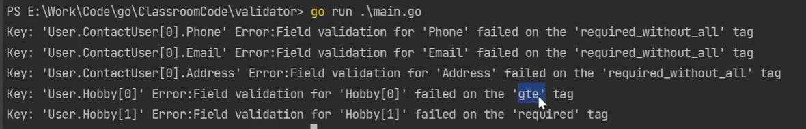

## 切片和集合内元素

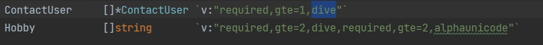

dive后跟每一个元素的校验

### 切片

#### 一维切片

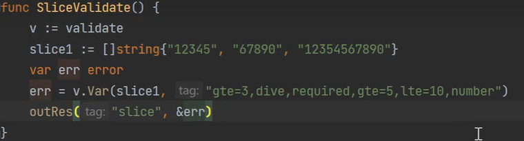

#### 二维切片

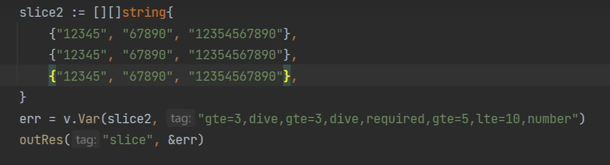

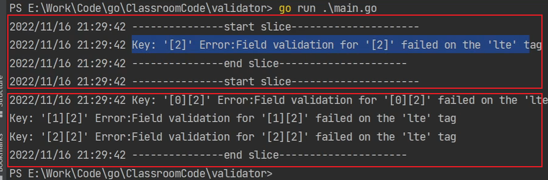

#### 结构体切片

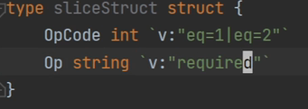

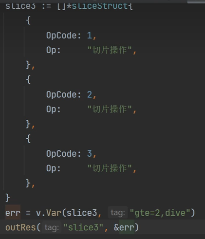

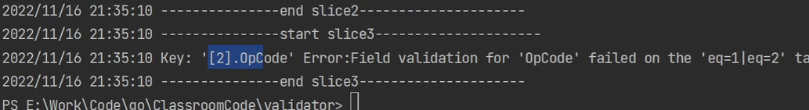

### map

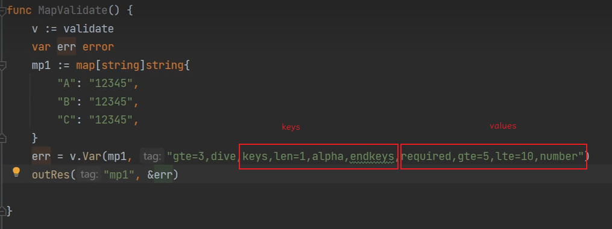

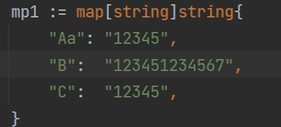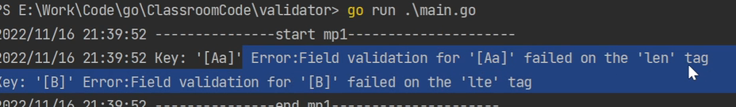

#### map嵌套

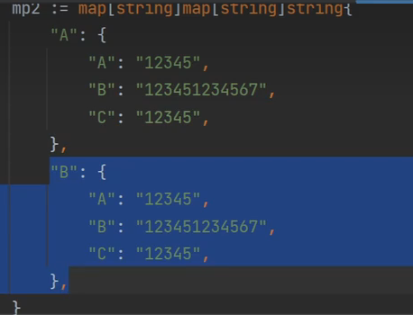

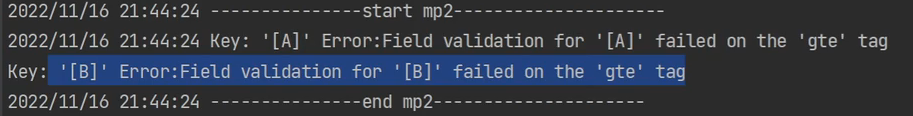

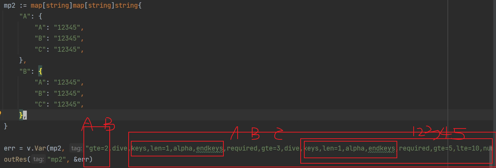