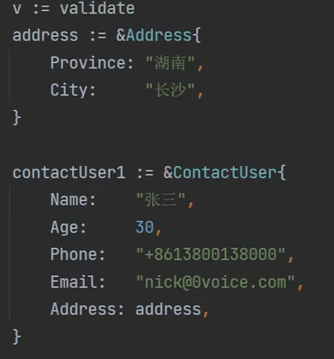
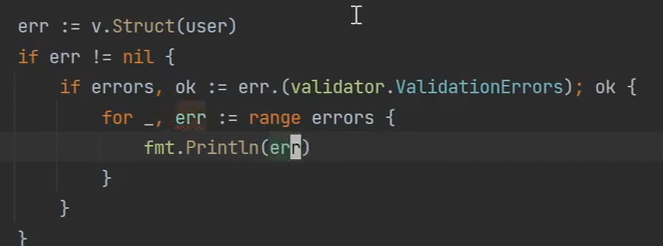
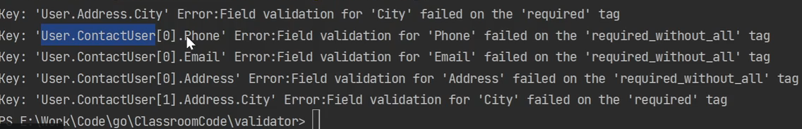

# golang 开源验证框架validator

[toc]

QQ：2041993283

https://yuque.com/yinian-cpwpp/veangt/qi6mgo

## 必会的三个操作

1. validator单个字段格式验证
2. validator结构绑定格式验证
3. 切片与集合内元素格式验证

## go-playground/validator

string

format\other\

## 单个字段验证

numeric 校验小数

map

time

字段对比

## 结构体验证

### dive继续下一层校验

#### div2

## 切片和集合内元素

dive后跟每一个元素的校验

### 切片

#### 一维切片

#### 二维切片

#### 结构体切片

### map

#### map嵌套

