# cobra命令行框架

[toc]

```bash
go get -u github.com/spf13/cobra@latest
```
## cobra命令行项目基本结构
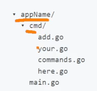

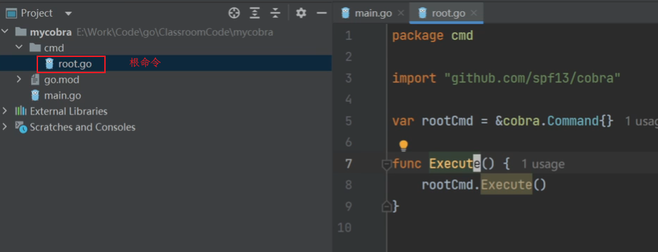

命令定义方式

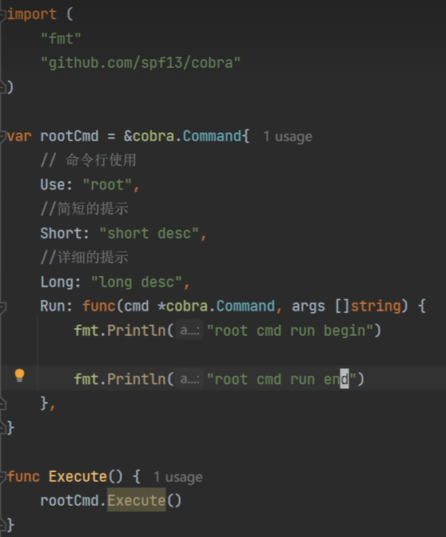

## cobra命令行本地标志和持久标志

只有命令本身可以用的叫本地标志，自己及其子命令都可以使用的叫持久标志

rootCmd.Flags()本地标志

rootCmd.PersistentFlags() 持久标志

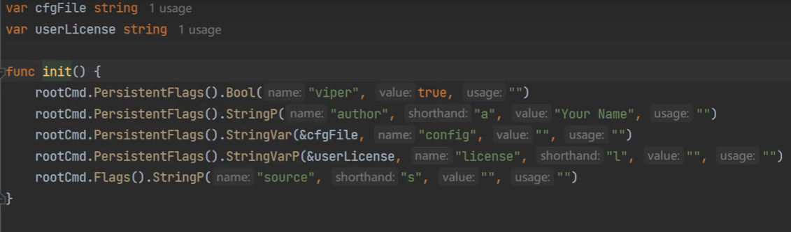

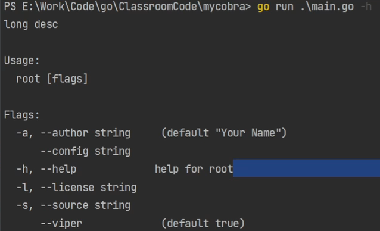

参数使用

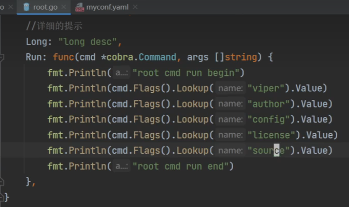

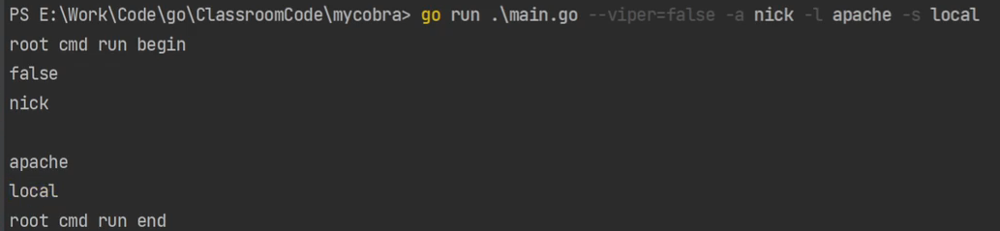


### 定义配置文件：viper

```bash
go get -u github.com/spf13/viper@latest
```

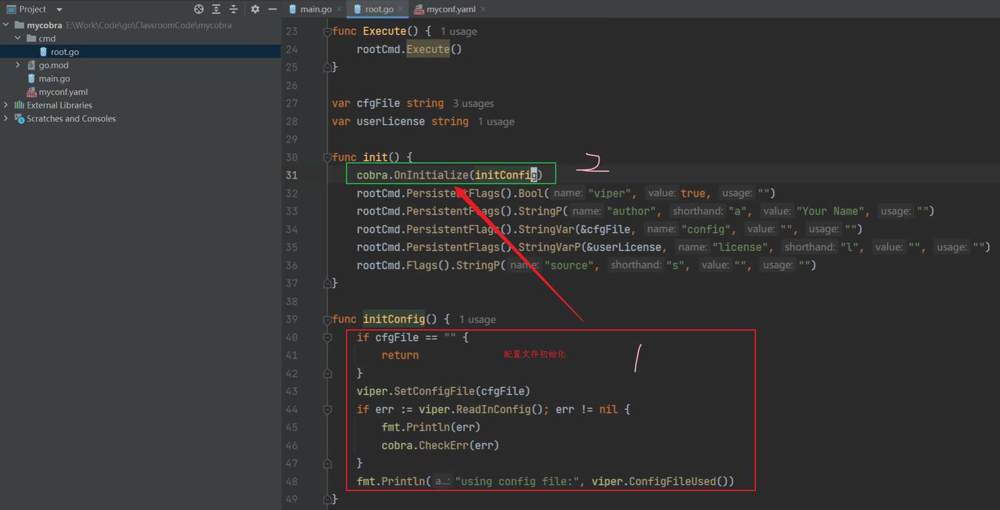

#### config参数使用

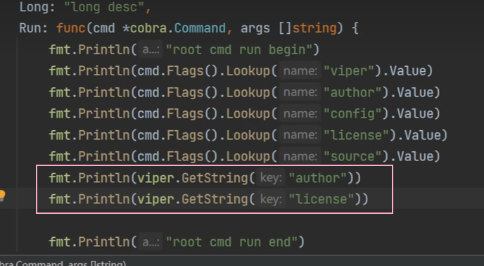

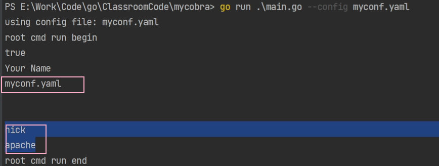

#### viper绑定flags

绑定就是通过命令行参数修改viper对象中的对应值

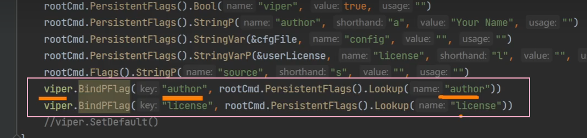

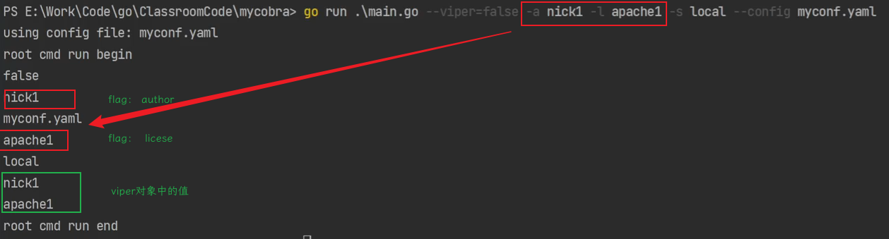

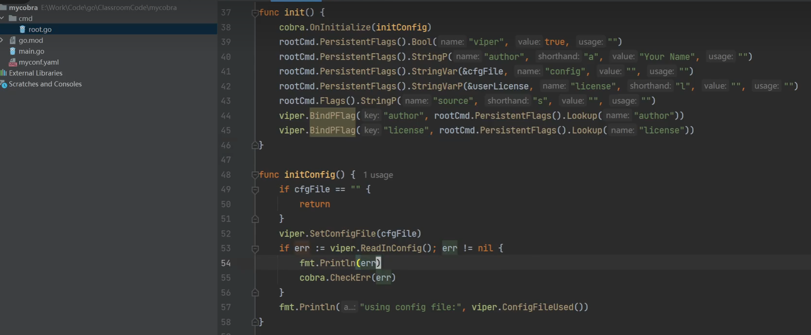


### 定义子命令

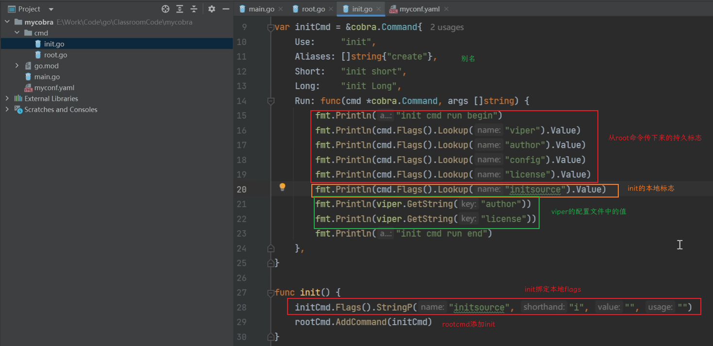


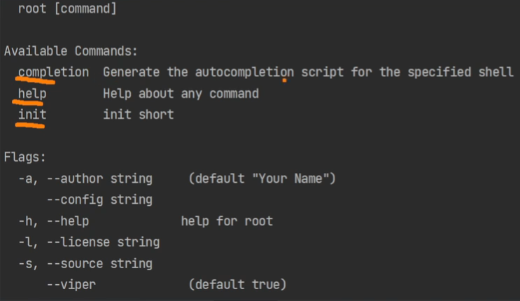

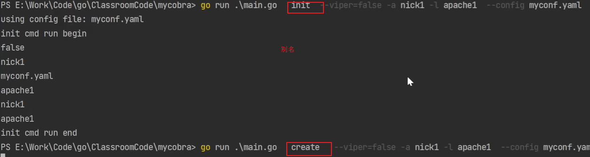

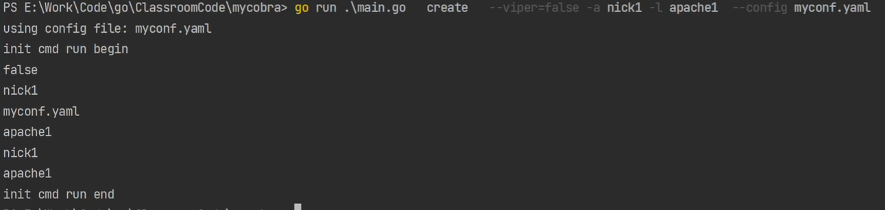

### 多级命令

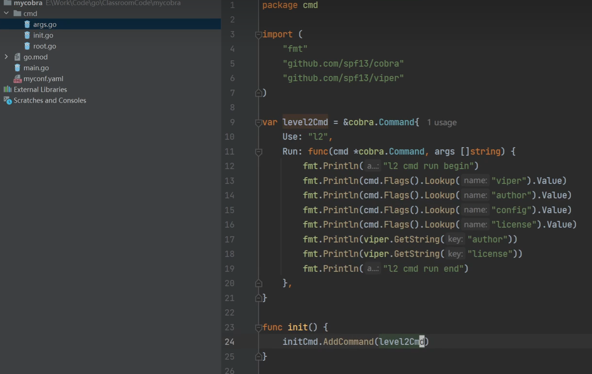

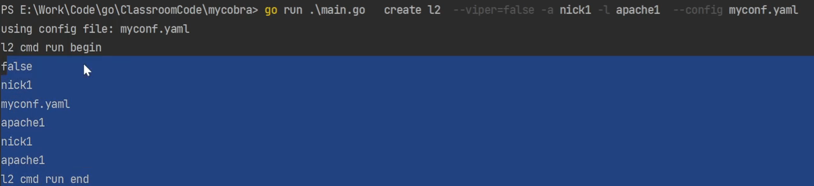
## cobra命令行参数及参数验证

### 自定义参数检查：数量检查

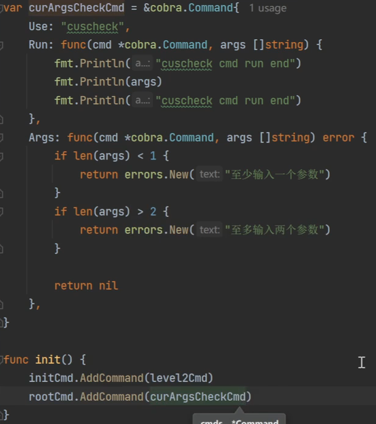

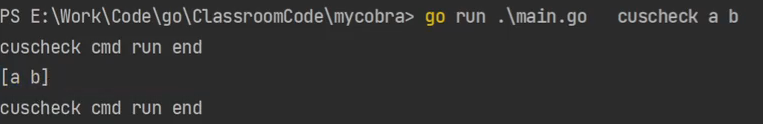

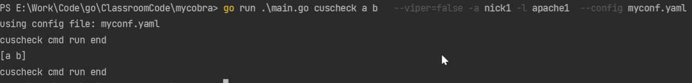

### 内置参数检查

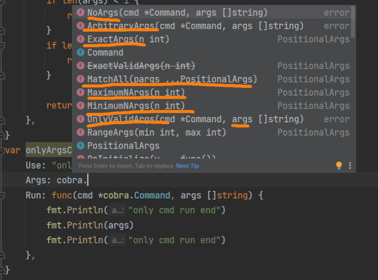

#### onlyargs：只能是某些值

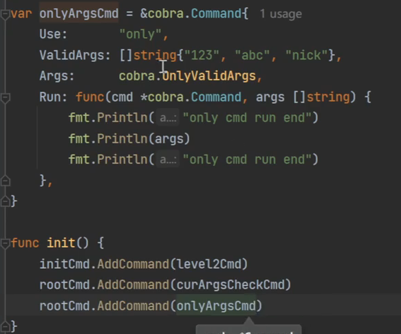

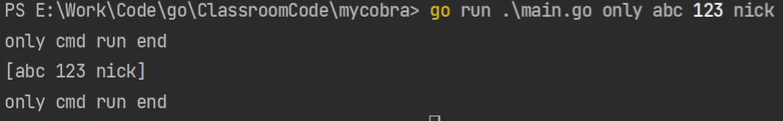

#### rangeArgs：参数个数 1-10个


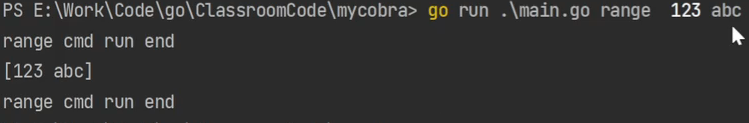

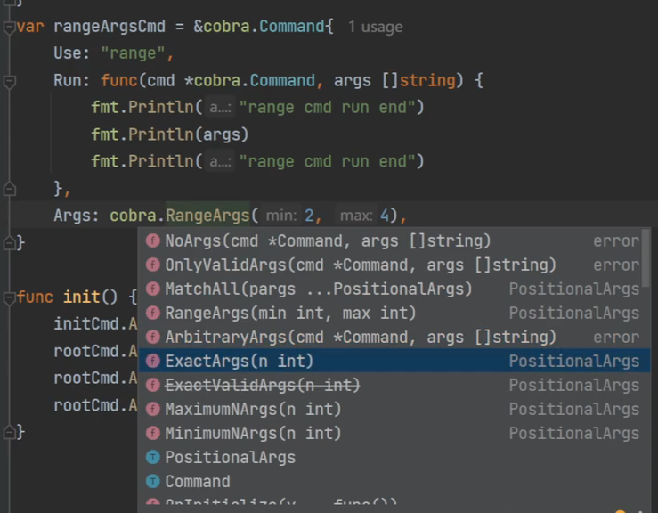