# gorm框架   数据库---对象关系模型

[toc]


## 4个优势

1. 规范一致代码工整
2. 减少一定的工作量
3. 对于一些通用系统部署更方便
4. 解耦数据库与数据访问层，更加方便数据库引擎

## 4个弊端

1. 数据访问层并不会因为使用ORM而显著减少
2. 大量使用反射，导致程序性能不佳
3. 一个没有SQL基础的开发人员，大概率不能通过orm构建正确的sql
4. orm提供的大量关系接口，数据流大情况下会导致i查询性能显著下降

## gorm的基本使用和推荐使用

```bash
https://gorm.io/zh_CN/docs
```

约定


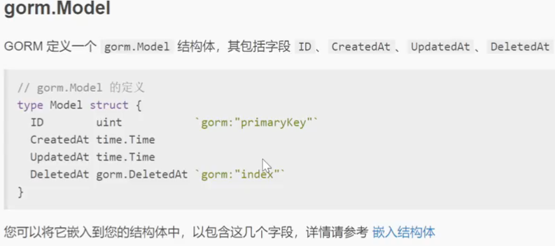

复杂字段

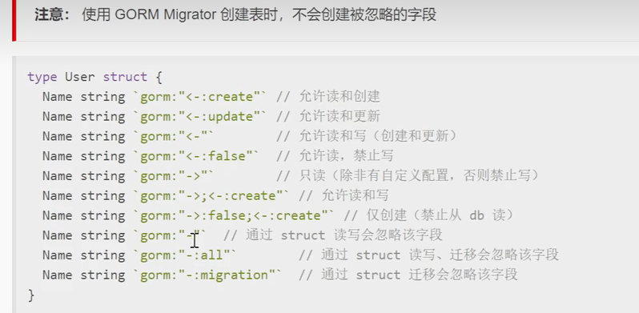

时间

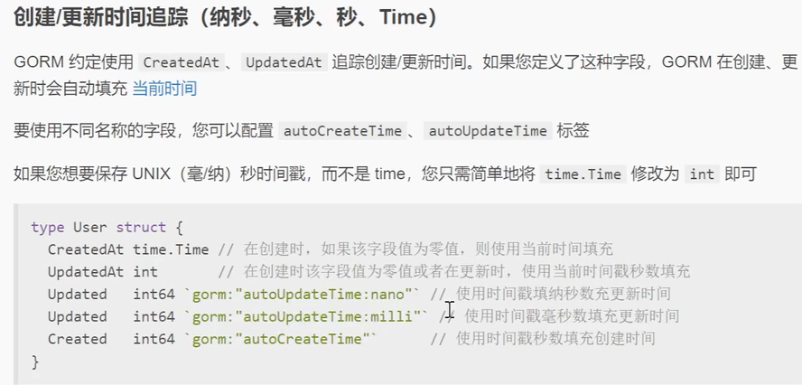

结构体

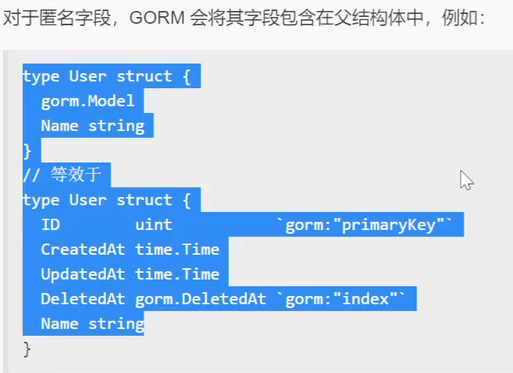


字段标签

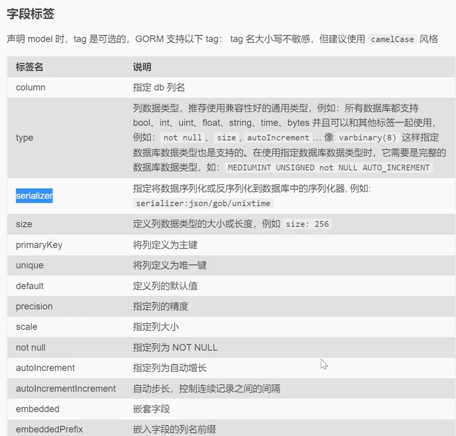

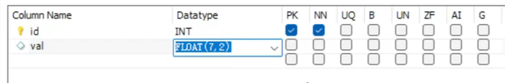

##   代码

```bash
go get -u gorm.io/gorm   // gorm
go get -u gorm.io/driver/mysql   // mysql
```

### 创建数据库连接

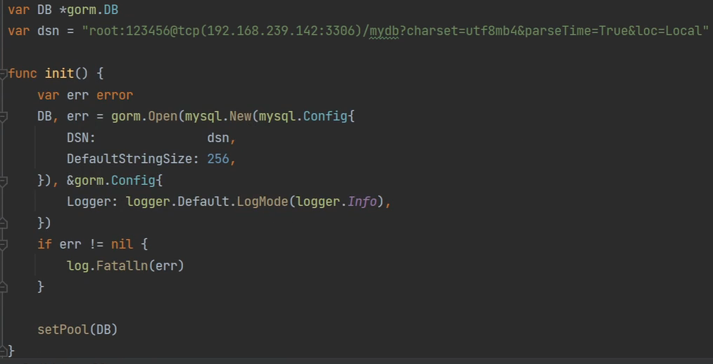

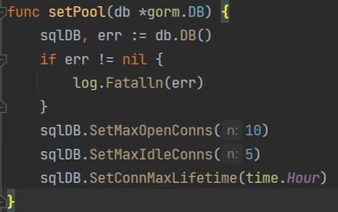

### model定义：表格字段

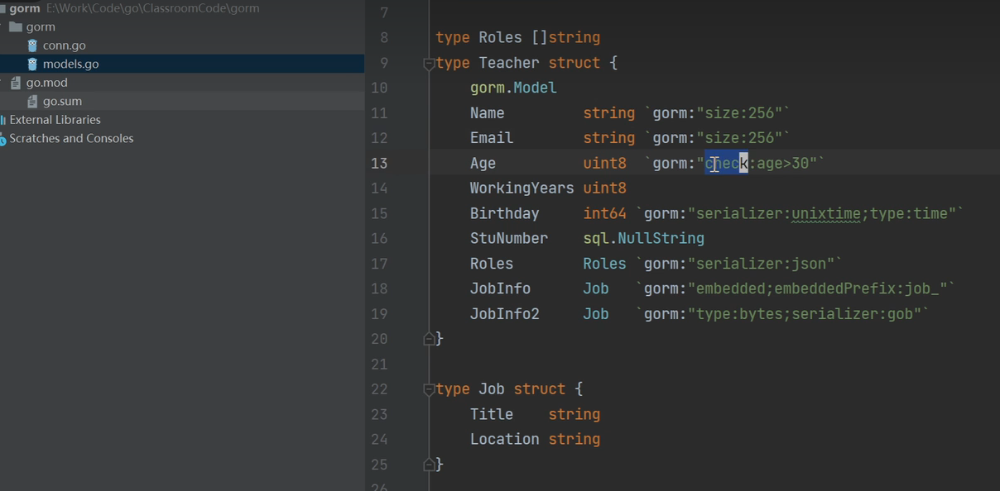

### 迁移migration：建表 修改表

自动迁移

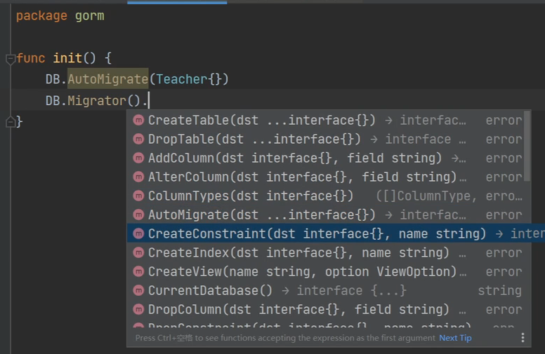

## 数据库操作

### 入库操作

==create.go==

1. 指定表或者model
2. 正向选择或者反向选择哪些字段入库
3. 单条记录或披露，披露可以指定每批次处理记录条数

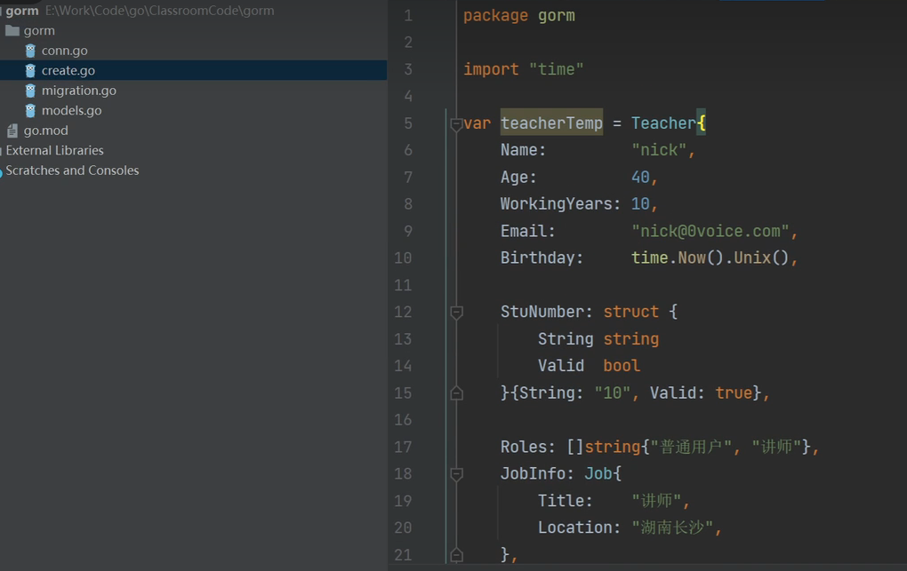 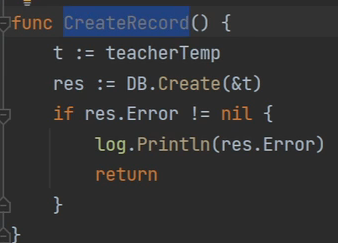

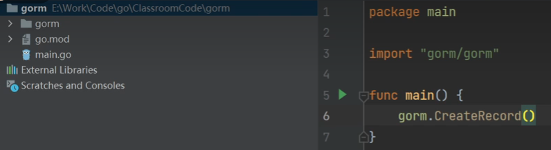

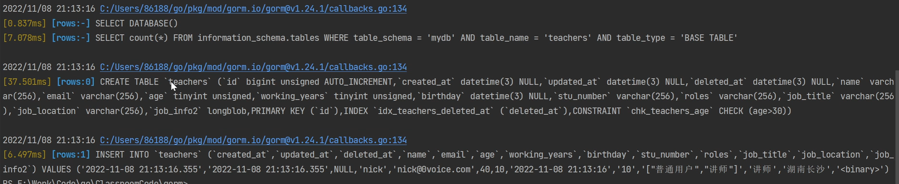

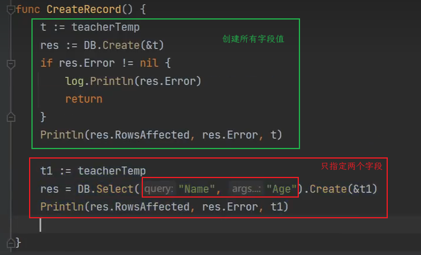

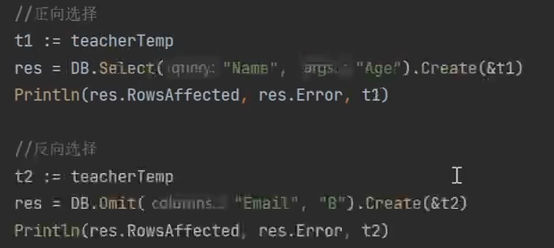

批量插入

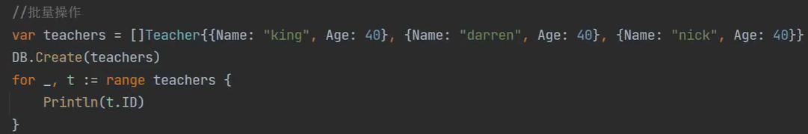

批量分批操作，每次2条记录入库

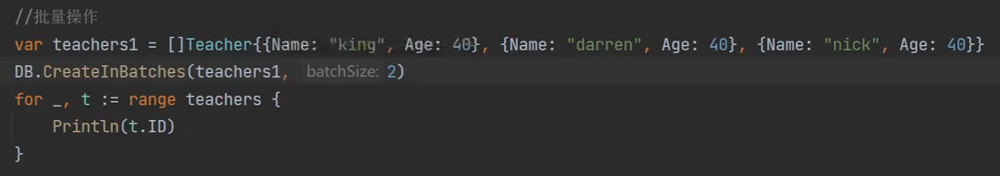

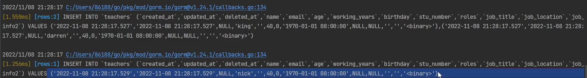

### 数据查询

1. 指定表或者model
   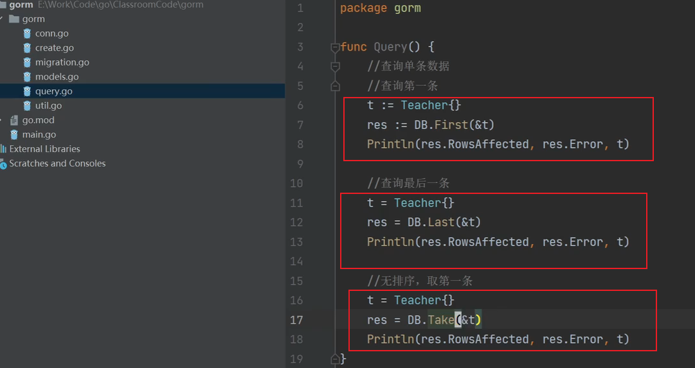
2. 正向选择或反向选择查询字段
3. where子句构建（and or in not等）
4. orderby 子句
5. group having子句
6. limit offset 子句
7. 查询条目，一条或多条
8. 结果填充，填充到对象 、集合 、切片

map： model first last

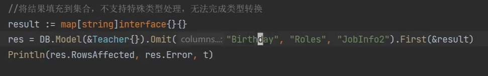


take： map

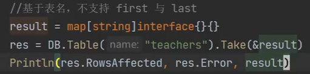

查询多条记录

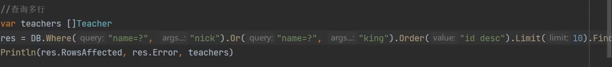

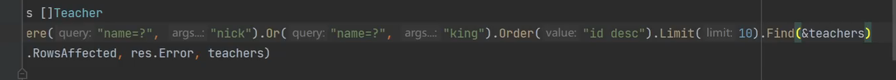

### 数据更新

1. 指定表或者model
2. 选择更新字段
3. where子句

### 删除

1. 指定表或者model
2. where子句

### 事务

1. 普通事务

   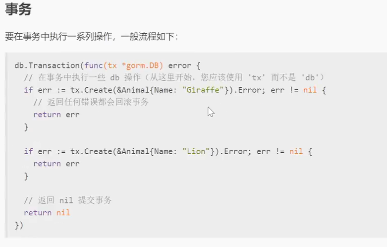

   只需要return error会自动回滚

   return new就会自动提交

   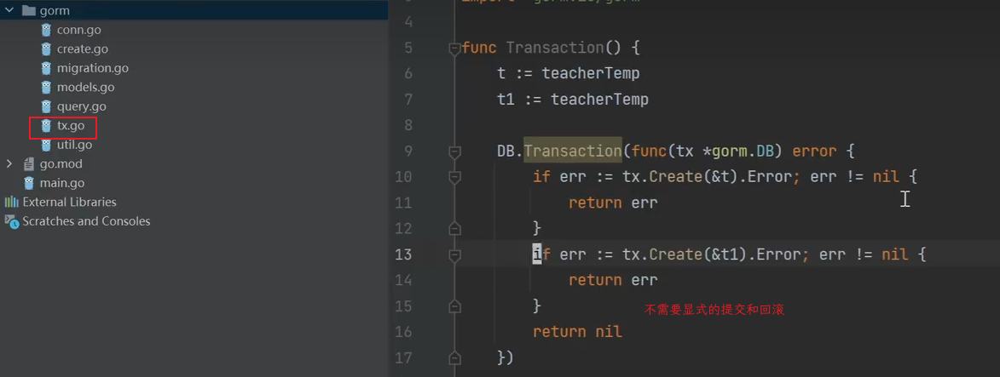
2. 嵌套事务

   

   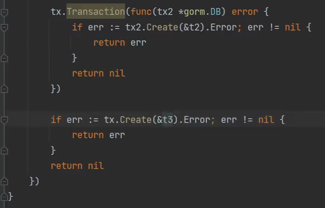

   
3. 手动事务

   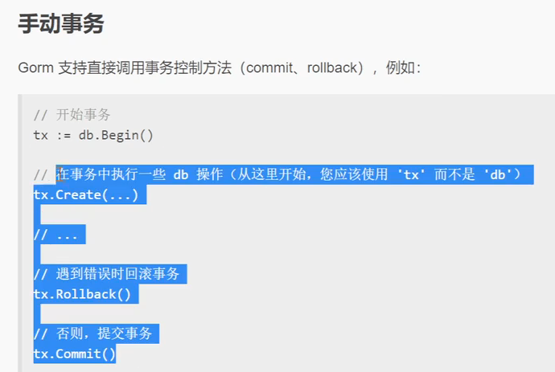
4. savepoint 和 rollback

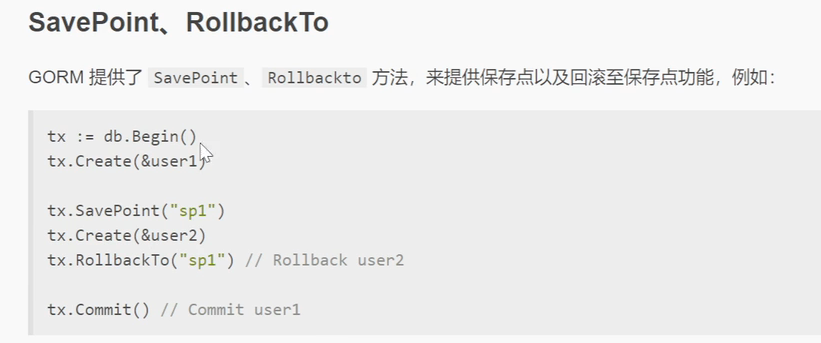

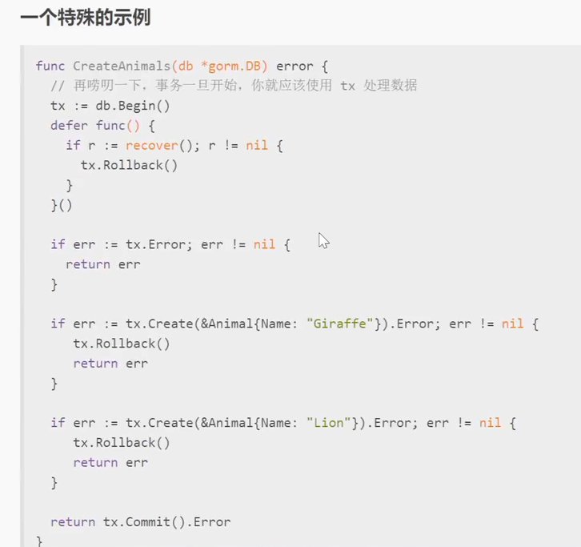

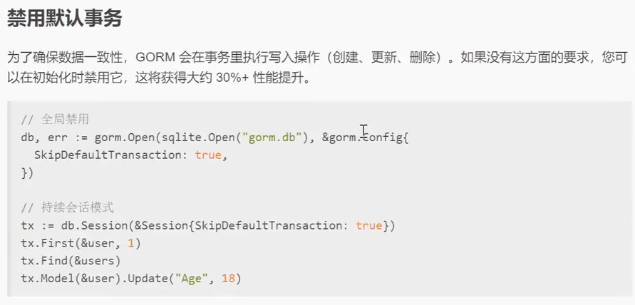