# golang常犯的错误

[toc]

## 变量定义

 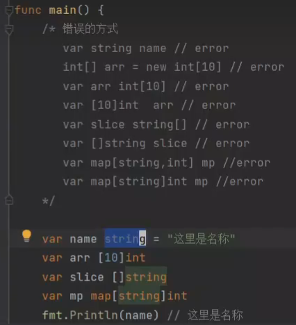

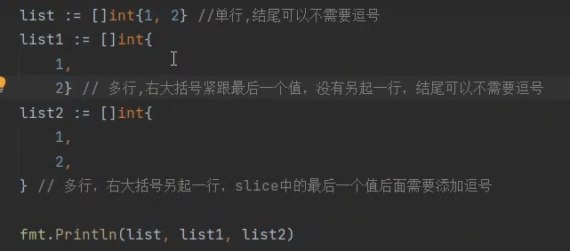

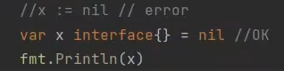

## 类型转换

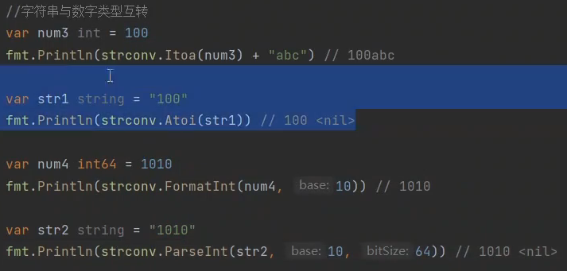

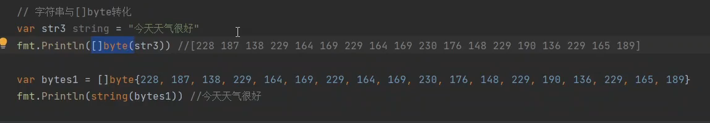

### 接口类型转换

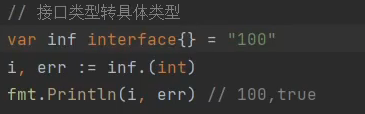

## 包的错误使用

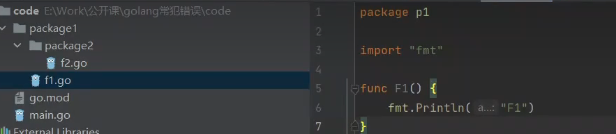

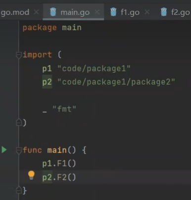

## 字符串的utf8验证

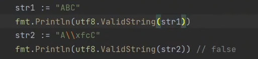

## make

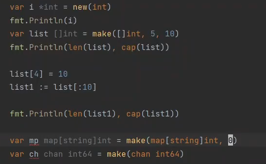

new 返回指针类型

make 返回切片类型

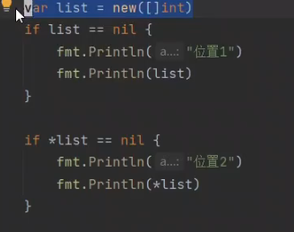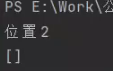

## 值传递和址传递

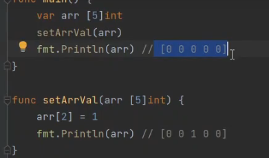

## 错误使用引用类型

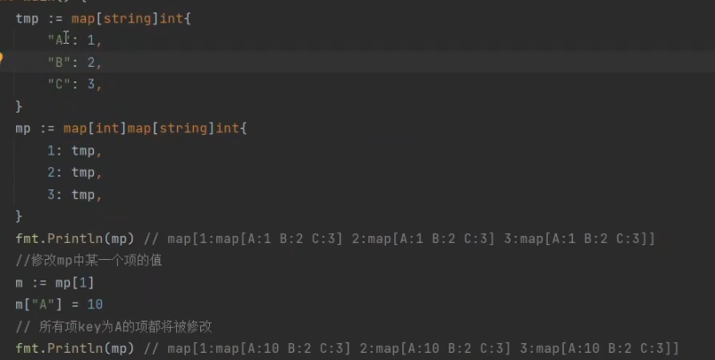

引用类型作为值类型使用

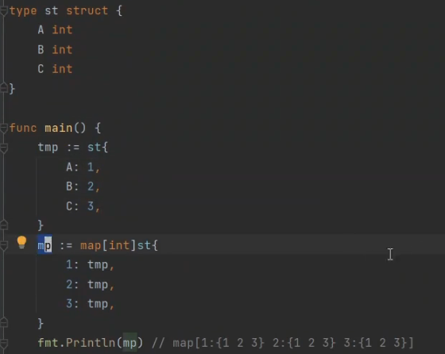

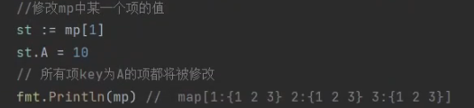

st是复制了一份，所以未修改

## go get & go install

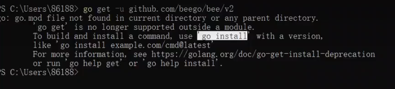

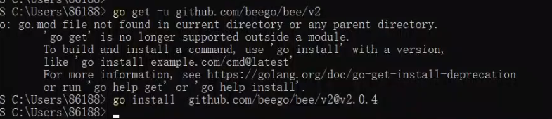

## go map无序

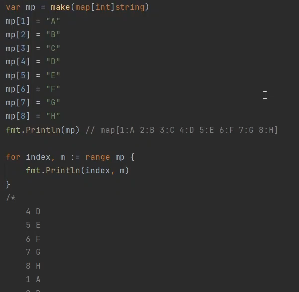

##  range 键值对

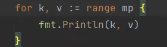

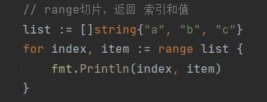

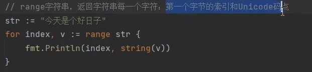

## 不存在的值

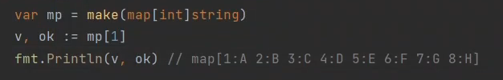

## 协程

改造

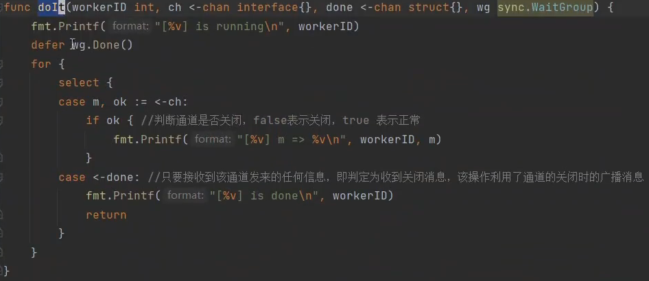

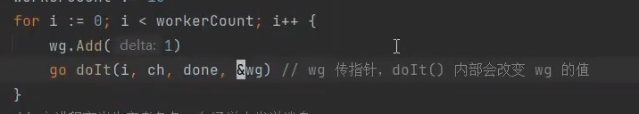

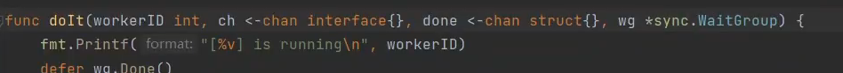

## 占位符

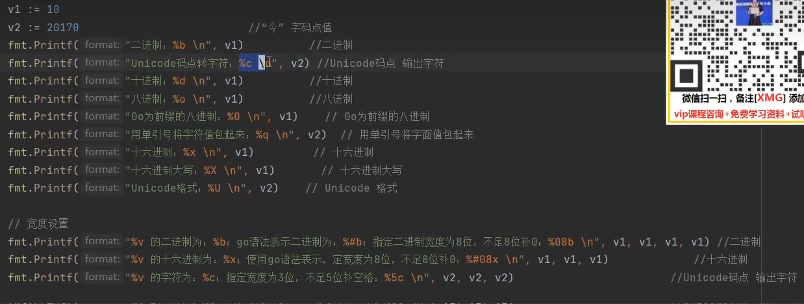

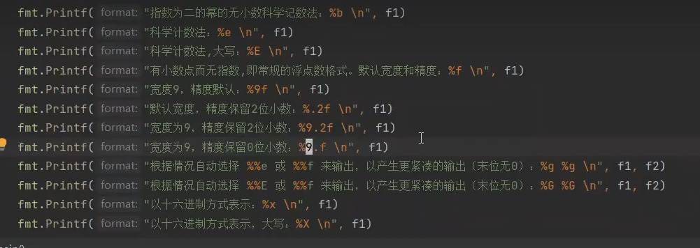

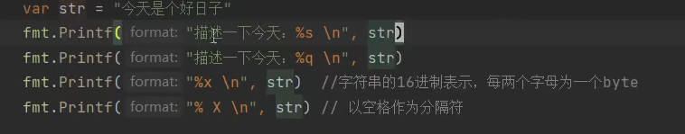

