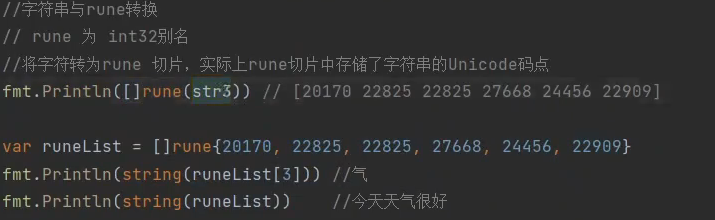
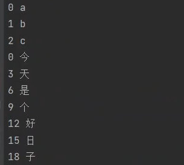
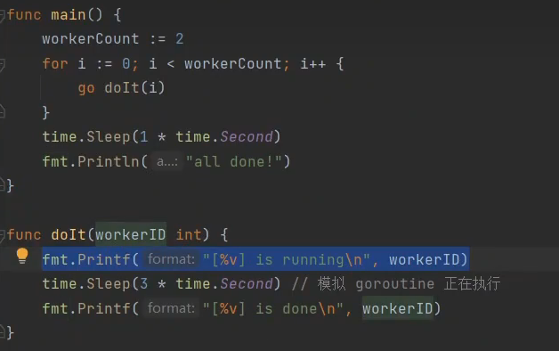
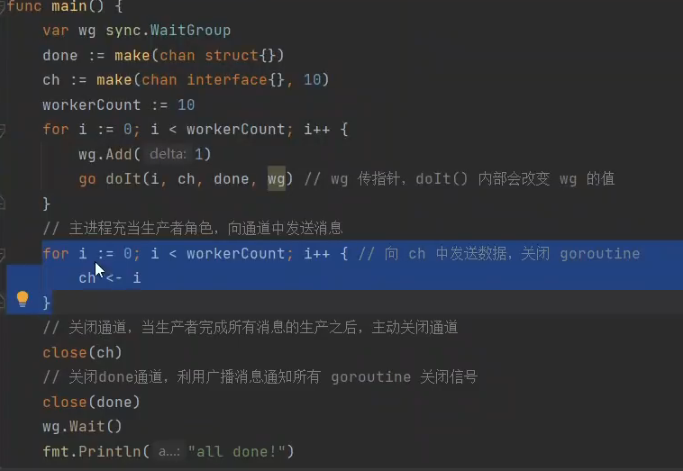
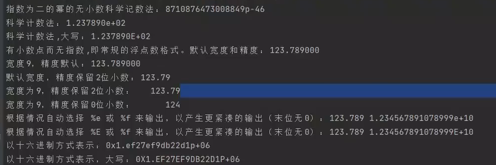

# golang常犯的错误

[toc]

## 变量定义

 

## 类型转换

### 接口类型转换

## 包的错误使用

## 字符串的utf8验证

## make

new 返回指针类型

make 返回切片类型

## 值传递和址传递

## 错误使用引用类型

引用类型作为值类型使用

st是复制了一份，所以未修改

## go get & go install

## go map无序

##  range 键值对

## 不存在的值

## 协程

改造

## 占位符

