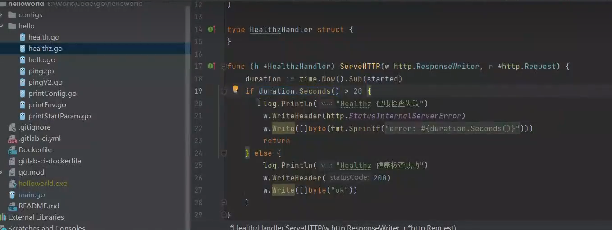
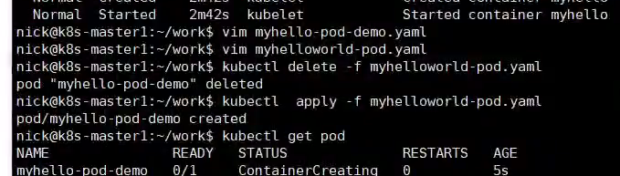

# 云原生部署

[toc]
## 部署基本步骤


### 应用程序容器镜像制作


#### 镜像构建

```bash
# 下载代码
git clone ...
cd dir
# 使用Dockerfile 构建镜像
docker build --no-cache -t helloword:1.0.0
```


https://hub.docker.com 注册登录

####  ==镜像推送== `docker tag helloworld:1.0.0 xlhmzch/helloworld:1.0.0`


`docker push xlhmzch/helloworld:1.0.0` 


### 定义k8s应用程序载体Pod

#### Pod配置文件编写


api资源


```bash
# 1. restartPolicy：
	Always：除了正常退出以外，都会重启我们的容器
	Never：任何情况下，容器关闭都不会重启
	OnFailure：程序异常退出，健康检查失败
	
# 2 容器重启策略：10s 20s 40s 80s 300s
	计时10分钟，没有任何问题，重置重启时间为10s
	
# 3 imagePullPolicy：镜像拉取策略
	Always：每次部署重新拉取镜像（推荐）
	Never：只使用本地镜像
	IfNotPresent:如果本地存在，则不拉取

1cpu=1000m  #cpu: 100m 为10% cpu

deployment：
1. 副本管理：replicaSet 做副本管理
2. 版本管理：发布、回滚
```

#### 单独pob部署：

```bash
cd ~/work/
vim myhelloworld-pod.yaml
kubectl create -f myheloworld-pod.yaml  # 创建pod
kubectl get pod # 查看所有pod
kubectl describe pod/myhello-pod-demo  # 查看具体某一个pod
```


#### deploy模式pod部署（推荐）


### 为应用程序配置健康检查机制

1. 存活检查

2. 就绪检查

3. 启动检查

#### 检查方式：

```bash
 exec 退出码
 httpGet status [200 400]一下都是正常
 tcpSocket 端口打开即为成功，redis端口
 grpc 属于开发中 alpha-beta-std（不推荐）
```

/healthz  超时检查

/health  健康检查

#### 代码演示




#### pod配置文件中进行设置健康检查【存活检查】：livenessProbe

pod缩进为2个空格


重新制作镜像： 修改代码后，提交，然后git pull, 重新build





#### 就绪检查 readinessProbe


  

20s后检查失败，就绪检查失败，不会影响容器存活，不会重启容器，存活检查不通过，会直接重启容器

修改为存活检查时/healthz  ，20s后检查失败，重启容器了


单独部署的pod删除后就不见了，所以推荐使用deploy


### 创建service对外公开应用程序接口

创建service的资源


