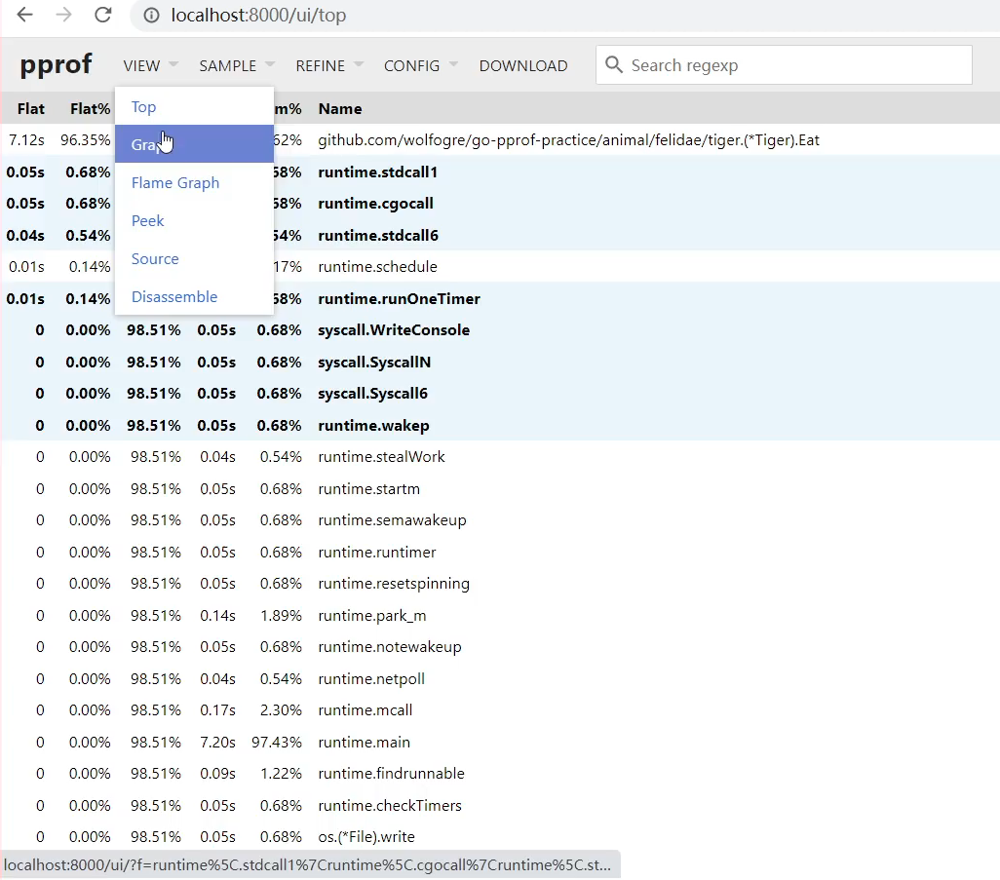

# 性能分析工具pprof的8个指标

[toc]

## 性能分析的5个方面

cpu、程序对cpu的使用情况

内存：程序对内存的使用

I/O：I/O使用情况

goroutine:协程使用情况，包括协程的泄漏检查

deadlock：死锁检测，数据竞争分析

## 三种程序性能采集指标

数据采集会影响业务

```bash
github开源代码仓：go-pprof-practive 
```


1.  ==第一种方式：wen采样推荐==

   _ ”net/http/pprof”  # 引入库

   

2. 基准测试来采集数据（不讲）
3. 硬编码采集数据（不讲）


内存、阻塞、命令行、goroutine、heap、mutex、profile、threadcreate、trace（每个一秒下载一次采样结果）

==去掉debug=1 会直接下载数据==

profile：每隔一分钟采样一次


## 交互式终端性能分析

```bash
go tool pprof -h
```


### allocs


top:列出最耗资源的前几项


list Steal:查看源码


web


### block


### goroutine


### heap


### mutex


### profile


### threadcreate


### 导出图片工具


## web网页性能分析


