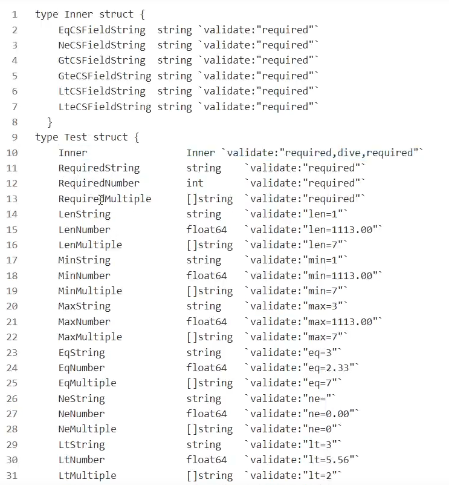
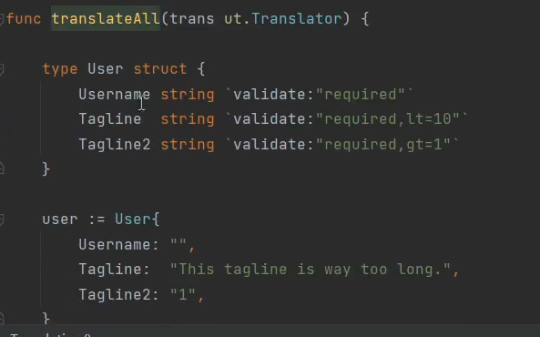

# Go语言验证框架Validator

[toc]

https://github.com/go-playround/validator

## 验证使用

### 符号

### tag

​	

tag案例

## 自定义字段类型验证

定义自定义字段验证方法

## 结构体级别的补充验证

## 自定义tag验证

## map集合和map规则验证

### 结构体

## 提示消息多语言翻译

### individual

遍历err

### override

### 中文：

