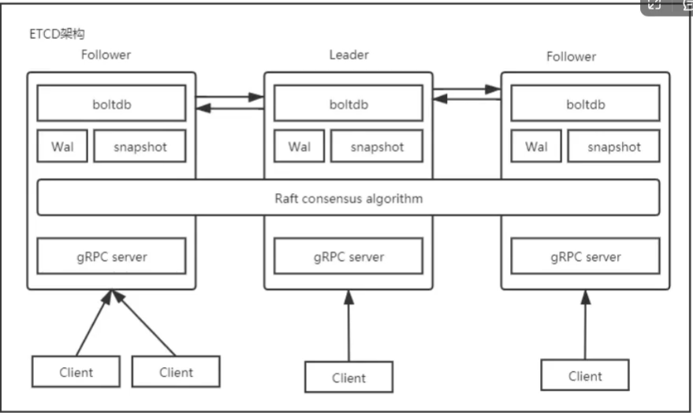
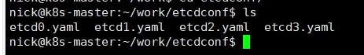
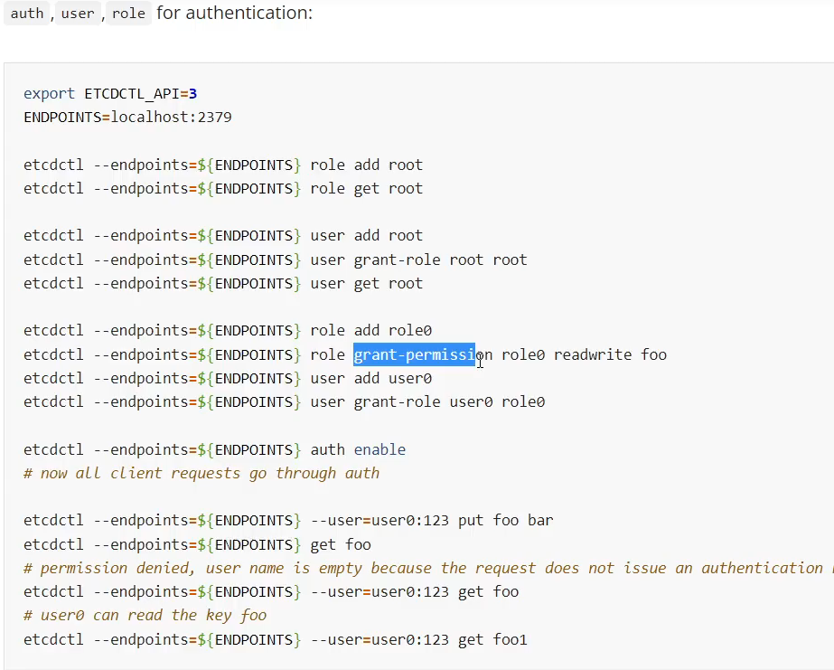
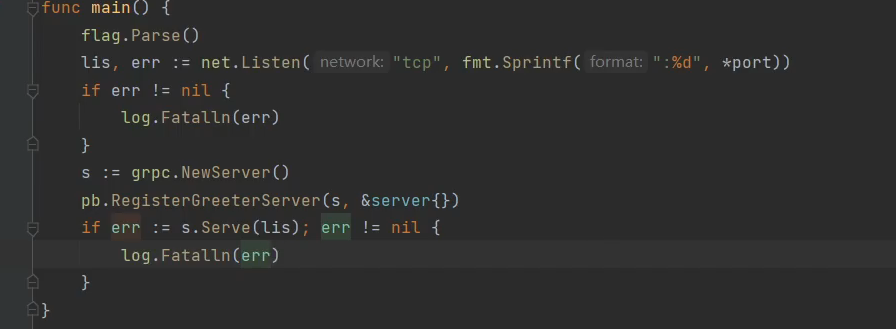
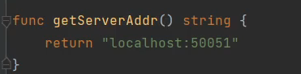
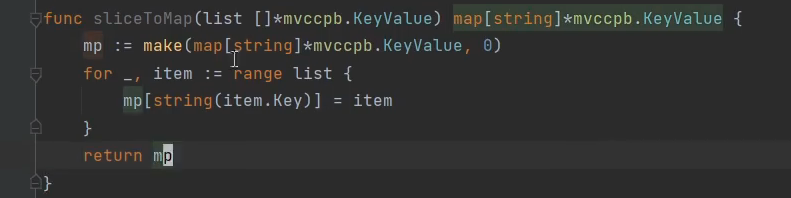
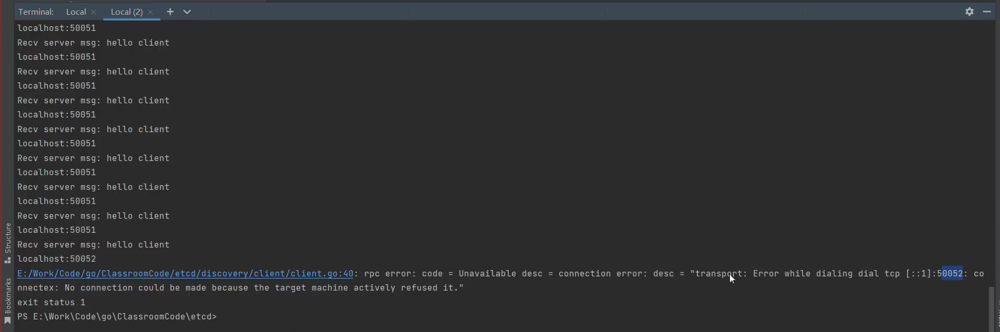
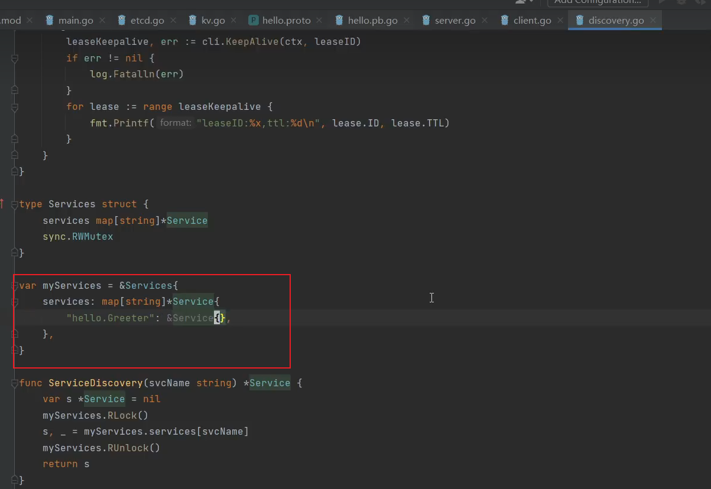

# Go语言Etcd实现服务注册和发现

[toc]

## go语言客户端etcd基本操作

docs https://etcd.io/docs/v3.5

源码 https://github.com/etcd-io/etcd

redhat etcd docker官方镜像 https://quay.io/repository/coreos/etcd?tab=tags&tag=latest

安全： https://play.etcd.io/install

客户端： https://github.com/etcd-id/etcd/tree/main/client/v3

### etcd架构

角色：leader  follower  候选  只读（不参与选举）

### 搭建etcd集群

模拟使用etcd客户端

添加etcd节点

### get put del操作

#### put

#### get

#### del

### 权限  Auth

## etcd消息发布订阅是什么逻辑

## 服务注册和服务发现的具体实现

#### proto

生成代码：

#### server：

#### client

#### client + server

### 服务注册

#### 服务端开启注册

server/server.go  注册需要开启协程

### 服务发现

discovery.go

#### dicovery ServiceRegister

	

etcd的事务

续约： 死循环

#### serviceDiscovery

#### watchservice

开始watch

​	

### client调用watchservice

首次不存在租约，get访问时会注册，然后重试后就会有创建租约

修改端口后client断开

