# golang 100行实现ping操作

[toc]

## 1 ping操作原理和ICMP协议

### 1.1 **位(bit)、字节(Byte)、KB、MB、GB ... 之间的关系**

位（比特位）：bit（binary digit）（简写：b），是计算机数据存储最小的单位，二进制中，0或者1就是一个位（比特位）bit。

**字节：**Byte（简写：B），是计算机信息技术用于计量存储容量的一种计量单位，通常情况下一字节等于八位，也就是 → 1Byte = 8bit = 1B = 8b

**字符：**Character，在计算机和电信技术中，一个字符是一个单位的字形、类字形单位或符号的基本信息。

字符与字节：

**ASCII码：**一个英文字母（不区分大小写）占一个字节的空间。如一个ASCII码就是一个字节。

**UTF-8编码：**一个英文字符等于一个字节，一个中文（含繁体）等于三个字节。中文标点占三个字节，英文标点占一个字节。

**Unicode编码：**一个英文等于两个字节，一个中文（含繁体）等于两个字节。中文标点占两个字节，英文标点占两个字节。

**1KB=1024B；1MB=1024KB=1024 x 1024B。其中1024=2^10。**

**1B**（byte，字节）= 8 bit；

**1KB**（Kibibyte，千字节）=1024B= 2^10 B；

**1MB**（Mebibyte，兆字节，百万字节，简称“兆”）=1024KB= 2^20 B；

**1GB**（Gibibyte，吉字节，十亿字节，又称“千兆”）=1024MB= 2^30 B；

**1TB**（Tebibyte，万亿字节，太字节）=1024GB= 2^40 B；

**1PB**（Pebibyte，千万亿字节，拍字节）=1024TB= 2^50 B；

**1EB**（Exbibyte，百亿亿字节，艾字节）=1024PB= 2^60 B；

**1ZB**（Zebibyte，十万亿亿字节，泽字节）= 1024EB= 2^70 B；

**1YB**（Yobibyte，一亿亿亿字节，尧字节）= 1024ZB= 2^80 B；

### 1.2 ICMP协议

ICMP（Internet Control Message Protocol）Internet控制[报文](https://baike.baidu.com/item/报文/3164352?fromModule=lemma_inlink)协议。它是[TCP/IP](https://baike.baidu.com/item/TCP%2FIP/214077?fromModule=lemma_inlink)协议簇的一个子协议，用于在IP[主机](https://baike.baidu.com/item/主机/455151?fromModule=lemma_inlink)、[路由器](https://baike.baidu.com/item/路由器/108294?fromModule=lemma_inlink)之间传递控制消息。控制消息是指网络通不通、[主机](https://baike.baidu.com/item/主机/455151?fromModule=lemma_inlink)是否可达、[路由](https://baike.baidu.com/item/路由/363497?fromModule=lemma_inlink)是否可用等网络本身的消息。这些控制消息虽然并不传输用户数据，但是对于用户数据的传递起着重要的作用。 [1] 

ICMP使用IP的基本支持，就像它是一个更高级别的协议，但是，ICMP实际上是IP的一个组成部分，必须由每个IP模块实现。 [2]

#### 1.2.1 ICMP原理

ICMP提供一致易懂的出错报告信息。发送的出错[报文](https://baike.baidu.com/item/报文?fromModule=lemma_inlink)返回到发送原数据的设备，因为只有发送设备才是出错报文的逻辑接受者。发送设备随后可根据ICMP报文确定发生错误的类型，并确定如何才能更好地重发失败的数据包。但是ICMP唯一的功能是报告问题而不是纠正错误，纠正错误的任务由发送方完成。

在网络中经常会使用到ICMP协议，比如经常使用的用于检查网络通不通的[Ping](https://baike.baidu.com/item/Ping?fromModule=lemma_inlink)命令（Linux和Windows中均有），这个“Ping”的过程实际上就是ICMP协议工作的过程。还有其他的网络命令如跟踪路由的Tracert命令也是基于ICMP协议的。

#### 1.2.2 全部消息类型

下表显示了完整的ICMP类型：

| TYPE | CODE | Description                                                  | Query | Error |
| ---- | ---- | ------------------------------------------------------------ | ----- | ----- |
| 0    | 0    | Echo Reply——回显应答（Ping应答）                             | x     |       |
| 3    | 0    | Network Unreachable——网络不可达                              |       | x     |
| 3    | 1    | Host Unreachable——主机不可达                                 |       | x     |
| 3    | 2    | Protocol Unreachable——协议不可达                             |       | x     |
| 3    | 3    | Port Unreachable——端口不可达                                 |       | x     |
| 3    | 4    | Fragmentation needed but no frag. bit set——需要进行分片但设置不分片比特 |       | x     |
| 3    | 5    | Source routing failed——源站选路失败                          |       | x     |
| 3    | 6    | Destination network unknown——目的网络未知                    |       | x     |
| 3    | 7    | Destination host unknown——目的主机未知                       |       | x     |
| 3    | 8    | Source host isolated (obsolete)——源主机被隔离（作废不用）    |       | x     |
| 3    | 9    | Destination network administratively prohibited——目的网络被强制禁止 |       | x     |
| 3    | 10   | Destination host administratively prohibited——目的主机被强制禁止 |       | x     |
| 3    | 11   | Network unreachable for TOS——由于服务类型TOS，网络不可达     |       | x     |
| 3    | 12   | Host unreachable for TOS——由于服务类型TOS，主机不可达        |       | x     |
| 3    | 13   | Communication administratively prohibited by filtering——由于过滤，通信被强制禁止 |       | x     |
| 3    | 14   | Host precedence violation——主机越权                          |       | x     |
| 3    | 15   | Precedence cutoff in effect——优先中止生效                    |       | x     |
| 4    | 0    | Source quench——源端被关闭（基本流控制）                      |       |       |
| 5    | 0    | Redirect for network——对网络重定向                           |       |       |
| 5    | 1    | Redirect for host——对主机重定向                              |       |       |
| 5    | 2    | Redirect for TOS and network——对服务类型和网络重定向         |       |       |
| 5    | 3    | Redirect for TOS and host——对服务类型和主机重定向            |       |       |
| 8    | 0    | ==Echo request——回显请求（Ping请求）==                       | x     |       |
| 9    | 0    | Router advertisement——路由器通告                             |       |       |
| 10   | 0    | Route solicitation——路由器请求                               |       |       |
| 11   | 0    | TTL equals 0 during transit——传输期间生存时间为0             |       | x     |
| 11   | 1    | TTL equals 0 during reassembly——在数据报组装期间生存时间为0  |       | x     |
| 12   | 0    | IP header bad (catchall error)——坏的IP首部（包括各种差错）   |       | x     |
| 12   | 1    | Required options missing——缺少必需的选项                     |       | x     |
| 13   | 0    | Timestamp request (obsolete)——时间戳请求（作废不用）         | x     |       |
| 14   |      | Timestamp reply (obsolete)——时间戳应答（作废不用）           | x     |       |
| 15   | 0    | Information request (obsolete)——信息请求（作废不用）         | x     |       |
| 16   | 0    | Information reply (obsolete)——信息应答（作废不用）           | x     |       |
| 17   | 0    | Address mask request——地址掩码请求                           | x     |       |
| 18   | 0    | Address mask reply——地址掩码应答                             |       |       |

#### 1.2.3 报文格式

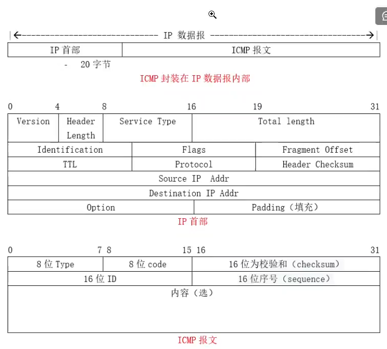

ICMP报文包含在IP数据报中，属于IP的一个用户，IP头部就在ICMP报文的前面，所以一个ICMP报文包括IP头部、ICMP头部和ICMP报文，IP头部的Protocol值为1就说明这是一个ICMP报文，ICMP头部中的类型（Type）域用于说明ICMP报文的作用及格式，此外还有一个代码（Code）域用于详细说明某种ICMP报文的类型，所有数据都在ICMP头部后面。 [3] 

ICMP报文格式具体由RFC 777 [4] ，RFC 792 [2] 规范。

#### 1.2.4 ICMP校验和算法

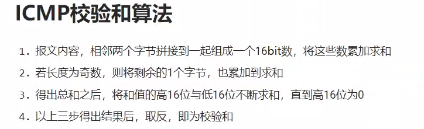

## 2 实现ping 操作的两个关键点

## 3 手把手实现ping操作

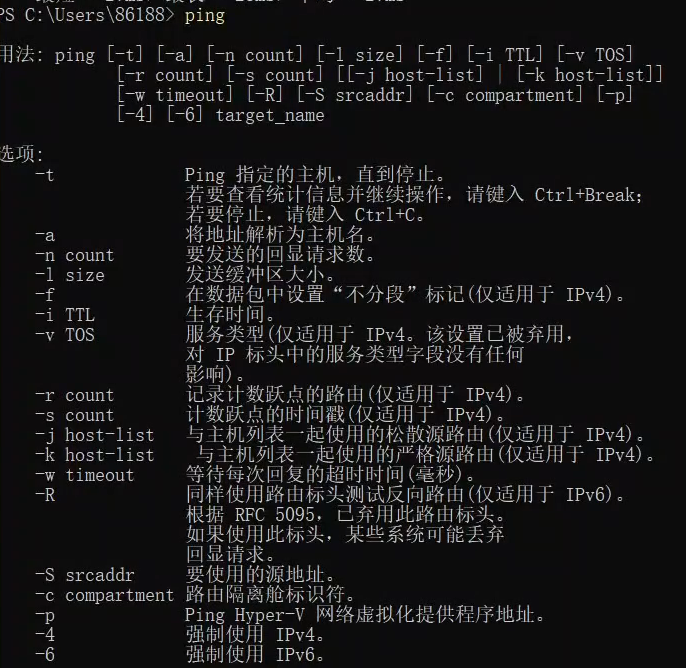

### 3.1 获取命令行参数

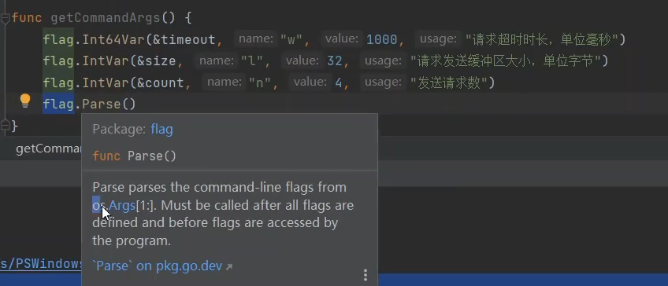	

### 3.2 构建ICMP连接

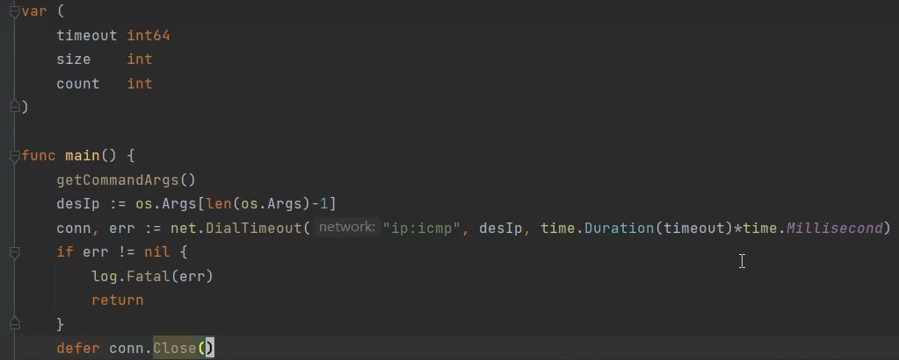

### 3.3 构建发送数据

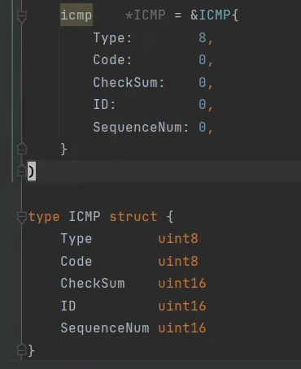

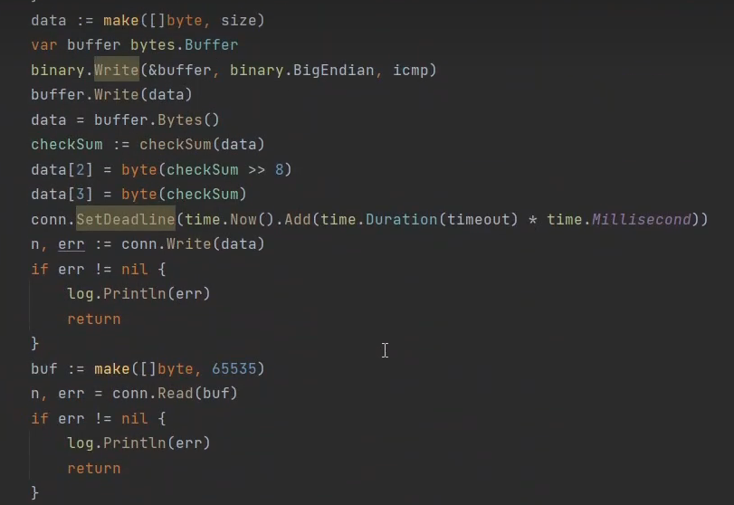

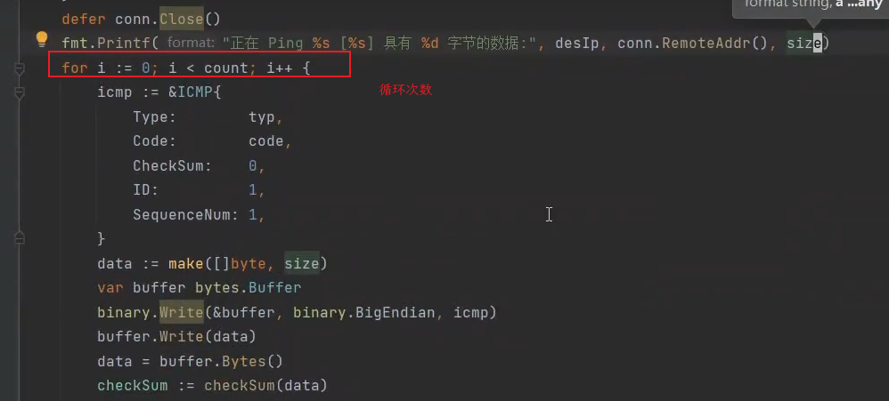

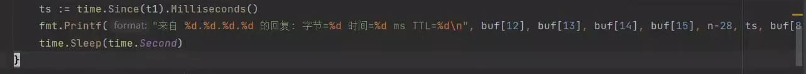

### 3.4 统计信息

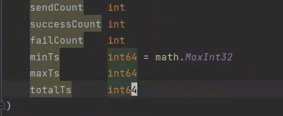

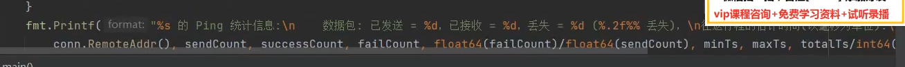

### 3.5 获取校验和

