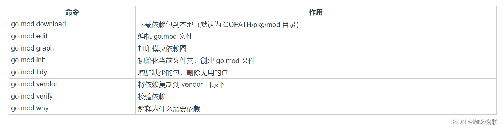

# Go语言安装及环境变量配置（Windows）


## 1 步骤一：Go语言SDK下载和安装

下载地址：https://golang.org/dl/

下载go1.*.windows-amd64 .zip文件后，点击安装。
## 2 步骤二：Go语言环境变量配置

安装Go语言需要配置的环境变量有GOROOT、GOPATH和Path
```bash
### 配置GOROOT: GO的安装目录
GOROOT  D:\software\go

### 配置GOPATH  存储Go语言项目的路径
GOPATH 	D:\software\go\gopath

### 配置Path
Path中有其他安装程序的配置信息，这里再增加一个GO的bin目录
D:\software\go\bin

go env -w GO111MODULE=on
go env -w GOPROXY=https://mirrors.aliyun.com/goproxy/,direct
go env -w GOPROXY=https://goproxy.cn,direct

# 启用 Go Modules 功能
$env:GO111MODULE="on"

# 配置 GOPROXY 环境变量，以下三选一

# 1. 七牛 CDN
$env:GOPROXY="https://goproxy.cn,direct"

# 2. 阿里云
$env:GOPROXY="https://mirrors.aliyun.com/goproxy/,direct"

# 3. 官方
$env:GOPROXY="https://goproxy.io,direct"
```
## 3 步骤三：验证是否配置成功
打开命令行工具，输入命令
```bash
go env
go version
```


