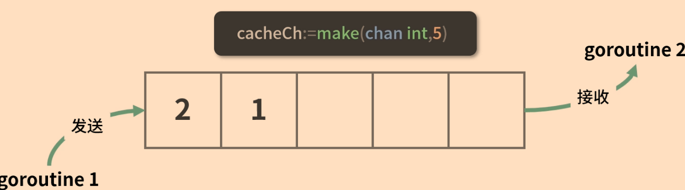

# go并发和同步

[toc]

## goroutine协程和channel通道

### 无缓冲通道

容量是0，不能存储任何数据，故只能传输数据，又称为同步通道

### 有缓冲通道

```go
cache:=make(chan int, 5)
```



1. 有缓冲通道内部有一个缓冲队列
2. 发送操作是向队列的尾部插入数据，如果队列已满则阻塞等待，直到另一个goroutine执行接收操作释放队列的空间
3. 接收操作是从队列的头部获取元素并把它从队列删除，如果队列为空则阻塞等待，直到另一个goroutine执行发送操作插入新的数据

```go
cache:=make(chan int, 5)
cache<-2
cache<-3
fmt.Printf("cache的容量为%v，元素个数为%v\n",cap(cache),len(cache))
```

### 关闭通道 close(cache)

### 单向通道

限制一个channnel只可以接收但不能发送或只能发送但不能接收，这种叫做单向通道

```go
onlySend:=make(chan<-int)
onlyReceive:=make(<-chan int)

//发送函数
func counter(out chan<-int){//只能发送}
```

### select+channel

例子：启动三个goroutine进行下载，并把结果发送到三个channel中，那个先下载好，就使用那个channel的结果

```go
func downloadFIle(chanName string)string{
    time.Sleep(time.Second*3)
    return chanName	+ ":filePath"
}
func main(){
    firstCh:=make(chan string)
    secondCh:=make(chan string)
    thirdCh:=make(chan string)
    go func(){
        firstCh<-downloadFile("firstCh")  
    }()
    go func(){
        secondCh<-downloadFile("secondCh")  
    }()
    go func(){
        thirdCh<-downloadFile("thirdCh")  
    }()
    select{
        case filepath:=<-firstCh:
        	fmt.Println(filepath)
        case filepath:=<-secondCh:
        	fmt.Println(filepath)
        case filepath:=<-thirdCh:
        	fmt.Println(filepath)
        default:
        	//todo   } }
```

提倡通过通信来共享内存，而不是通过共享内存来通信


