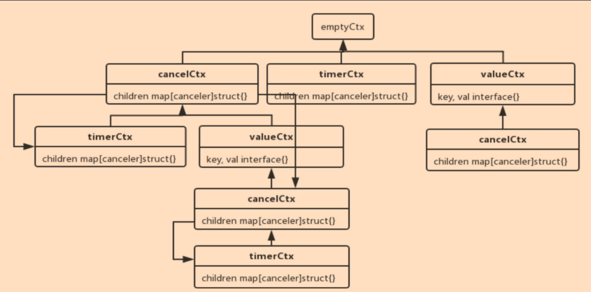

# 多线程并发控制神器

## 协程如何退出
```golang
func main(){
	var wg sync.WaitGroup
	wg.Add(1)
	go func(){
		defer wg.Done()
		watchDog("【监控狗1】")
	}()
	wg.Wait()
}
func watchDog(name string){
	for{
		select{
		default:
			fmt.Println(name,"正在监控...")
		}
		time.Sleep(1*time.Second)
	}
}
```
1. 如果需要让监控够停止监控，退出程序，一个办法是定义一个全局变量，其他地方可以通过修改这个变量发出停止监控狗的通知
```golang
func main(){
	var wg.sync.WaitGroup
	wg.Add(1)
	stopCh:=make(chan bool) //用来停止监控狗
	go func(){
		defer wg.Done()
		watchDog(stopCh,">>>1?")
	}()
	time.Sleep(5*time.Second)//先让监控狗监控5秒
	stopCh<-true //发停止指令
	wg.Wait()
}
func watchDog(stopCh chan bool,name string){
	//开启for select循环，一直后台监控
	for{
		select{
		case<-stopCh:
			fmt.Println(name,"停止指令已收到，马上停止")
			return
		default:
			fmt.Println(name,"正在监控......")
		}
		time.Sleep(1*time.Second)
	}
}
```
## context
context是一个接口，它具备手动、定时、超时发出取消信号，传值等功能，主要用于控制多个协程之间的协作，尤其是取消操作
```golang
type Context interface{
	Deadline() (deadline time.Time,ok bool) //截止时间
	Done()<-chan struct{} //返回只读的channel，类型为struct{}
	Err() error //返回取消的原因
	Value(key interface{}) interface{} //获取context绑定的键值对
}
```
1. 必须有一种可以跟着协程的方案
2. 只有跟踪到每个协程，才能更好的控制它们
```golang
func main(){
	var wg sync.WaitGroup
	wg.Add(1)
	ctx,stop:=contex.WithCancel(context.Background())
	go func(){
		defer wg.Done()
		watchDog(ctx,"【监控狗1】")
	}()
	time.Sleep(5*time.Second)//先让监控狗监控5秒
	stop()//发停止指令
	wg.Wait()
}
func watchDog(ctx context.Context,name string){
	//开启for select循环，一直后台监控
	for{
		select{
		case<-ctx.Done():
			fmt.Println(name,"停止指令已收到，马上停止")
			return
		default:
			fmt.Println(name,"正在监控......")
		}
		time.Sleep(1*time.Second)
	}
}
```

## Context树
go语言提供了函数帮助我们生成不同的Context，通过这些函数可以生成一颗Context树，这样Context才可以关联起来

1. 空Context
不可取消，没有截止时间，主要用于Context树的根节点
2. 可取消的Context
用于发出取消信号，当取消的时候，它的子context也会取消
3. 可定时取消的Context
多了定时的功能
4. 值Context
可以存储一个key-value键值对
### 生成Context树
WithCancel(parent Context) :生成可以取消的Context
WithDeadline(parent Context, d time.Time) :生成可以定时取消的Context
WithTimeout(parent Context, timeout time.Duration) :生成可以超时取消的Context，参数timeout用于设置多久后取消
WithValue(parent Context, key,val interface{}) :生成可以携带键值对的Context
### 使用Context取消多个协程
```golang
wg.Add(3)
go func(){
	defer wg.Done()
	watchDog(ctx,"监控狗2")
}()
go func(){
	defer wg.Done()
	watchDog(ctx,"监控狗3")
}
```


## Context传值
```golang

func main(){
	wg.Add(4)
	// ...
	valCtx:=context.WithValue(ctx,"userId",2)
	go func(){
		defer wg.Done()
		getUser(valCtx)
	}

}
func getUser(ctx context.Context){
	for{
		select{
		case <-ctx.Done():
			fmt.Println("获取用户，协程退出")
			return
		default:
			userId:=ctx.Value("userId")
			fmt.Println("获取用户：id为"，userId)
			time.Sleep(1*time.Second)
		}
	}
}
```
## Context的使用原则
1. Context不要放在结构体中，要以参数的方式传递
2. Context作为函数的参数时，要放在第一位，即第一个参数
3. 要使用context.Background函数生成根节点的Context，也就是最顶层的Context
4. Context传值要传递必须的值，而且要尽可能的少，不要什么都传
5. Context多协程安全，可以在多个协程中放心使用


> context通过With系列函数生成Context树，把相关的Context关联起来，这样就可以统一进行控制
> 你在定义函数的时候，如果想要外部给你的函数发送取消信号，就可以为这个函数添加一个Context参数
> 
> 
## 如何通过Context实现日志跟踪
必须有一个唯一的ID来标识这次请求，调用了那些函数，执行了那些代码，然后通过这个唯一的ID把日志串联起来
1. 在用户请求的入口点生成TraceID
2. 通过context.WithValue保存TraceID
3. 保存TraceID的Context作为参数在各个协程和函数间传递
4. 在需要记录日志的地方，通过Context的Value方法获取保存的TraceID，然后把它和其他日志信息记录下来
5. 这样具备同样TraceID的日志就可以被串联起来，达到跟踪日志的目的
