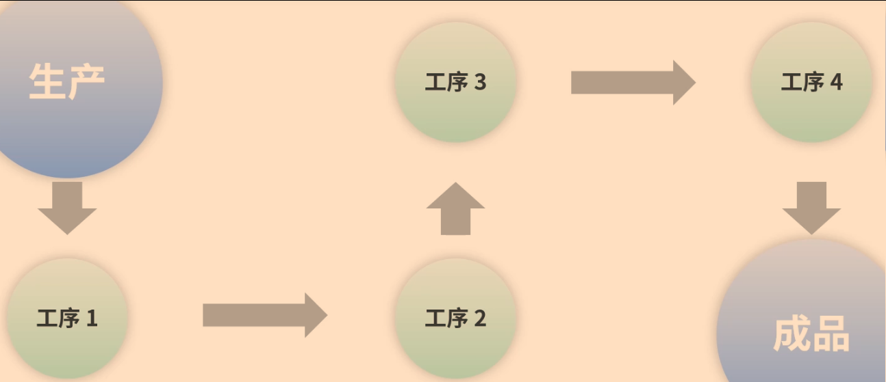
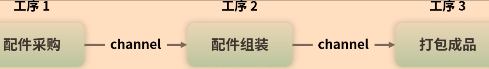
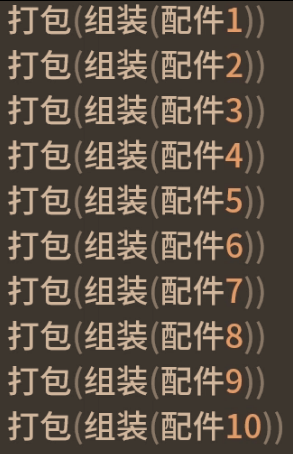
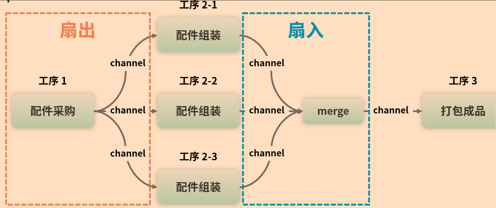

# 即学即用的高效并发模式
[toc]

## for select循环模式
```golang
for{
	select{
	case <-done:
		/* code */
	default:
		/* code */
	}
}

```
```golang
for _,s:=range []int{
	select{
	case <-done:
		return
	case resultCh<-s:
		return	
	default:
		/* code */
	}
}
```
## select timeout模式
```golang
func main(){
	result:=make(chan string)
	go func(){
		// 模拟网络访问
		time.Sleep(8*time.Second)
		result<-"服务端结果"
	}()

	select{
		case v:=<-result:
			fmt.Println(v)
		case <-time.After(5*time.Second):
			fmt.Println("超时了")
		default:
			/* code */
	}
}
```
## Pipeline模式
也成为流水线模式，模拟的是现实世界的流水线生成

1. 流水线由一道道工序组成，每道工序通过channel把数据传给下一个工序

2. 每道工序对应一个函数，函数里有协程和channel，协程一般用于处理数据并将它放入channel中，整个函数会返回这个channel以供下一道工序使用

3. 最终要由一个组织者把这些工序串联起来


```golang
// 工序1采购
func buy(i int)<-chan string{
	out:=make(chan string)
	go func(){
		defer close(out)
		for i := 0; i < n; i++ {
			out<-fmt.Sprintf("配件：%v",i)
		}
	}()
	return out
}
// 工序2组装
func build(in <-chan string)<-chan string{
	out:=make(chan string)
	go func(){
		defer close(out)
		for c := range in {
			out<-fmt.Sprintf("组装(%v)",i)
		}
	}()
	return out
}
// 工序2组装
func pack(in <-chan string)<-chan string{
	out:=make(chan string)
	go func(){
		defer close(out)
		for c := range in {
			out<-fmt.Sprintf("打包(%v)",i)
		}
	}()
	return out
}
```
```golang
func main(){
	coms:=buy(10) //采购10套配件
	phones:=build(coms) //组装10部手机
	packs:=pack(phones) //打包进行销售

	for p := range packs {
		fmt.Println(p)
	}
}
```
执行结果如下

## 扇出和扇入模式
经过一段时间，发现产能上不去：工序2过慢，导致上游工序1不得慢下来，工序3无事可做，不得不闲下来

merge函数非常小，而且和业务无关，不能当做一道工序，可以叫做组件

```golang
// 扇入函数，将多个channel中的数据发送到一个函数中
func merge(ins ...<-chan string) <-chan string{
	var wg sync.WaitGroup
	out:=make(chan string)

	p:=func(in <-chan string){
		defer wg.Done()
		for c := range in {
			out<-c
		}
	}
	wg.Add(len(ins))
	// 扇入，需要启动多个goroutine用于处理多个channel中数据
	for _,cs := range ins {
		/* code */
		go p(cs)
	}

	// 等待所有输入的数据ins处理完，再关闭输出out
	go func(){
		wg.Wait()
		close(out)
	}()
	return out
}
```

```golang
func main(){
	coms:=buy(100) //采购100套配件
	//三班人同时组装100部手机
	phones1:=build(coms) 
	phones2:=build(coms)
	phones3:=build(coms)
	phones:=merge(phones1,phones2.phones3) //汇聚三个channel成一个

	packs:=pack(phones) //打包进行销售

	for p := range packs {
		fmt.Println(p)
	}
}
```

## future模式
在实际需求中，有大量的任务之间相互独立，没有依赖，所以为了提高性能，这些独立的任务就可以并发执行

>做火锅 洗菜和烧水可以同时做，做好了就可以吃火锅了

```golang
// 洗菜
func washVegetables()<-chan string{
	vegetables:=make(chan string)
	go func(){
		time.Sleep(6*time.Second)
		vegetables<-"洗好的菜"
	}()
	return vegetables
}
// 烧水
func boilWater()<-chan string{
	waters:=make(chan string)
	go func(){
		time.Sleep(6*time.Second)
		waters<-"烧好的水"
	}()
	return waters
}
func main(){
	vegetablesCh:=washVegetables()
	watersCh:=boilWater()

	fmt.Println("已经安排洗菜和烧水了")
	time.Sleep(2*time.Second)

	fmt.Println("看菜和水好了没")
	vegetables:=<-vegetablesCh
	waters:=<-watersCh
	fmt.Println("都好了，可以吃火锅了::"，vegetables,water)

}
```
> 并发模式和设计模式都很相似，都是对现实场景的模拟，以便提供一个统一的解决方案，但和设计模式不同的是，并发模式更专注于**异步和并发**


