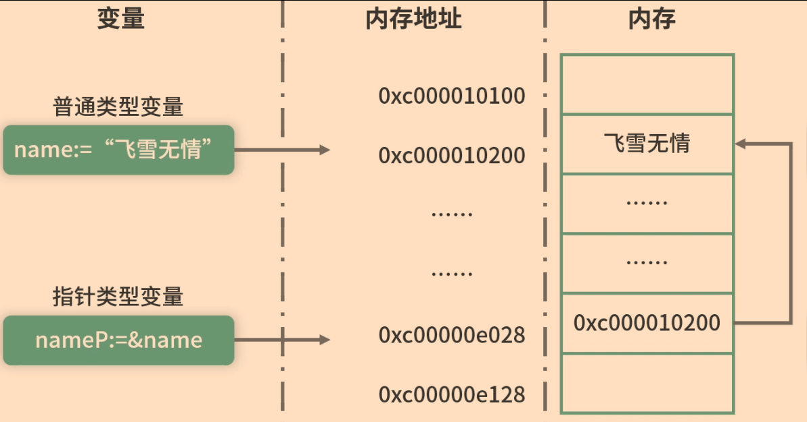
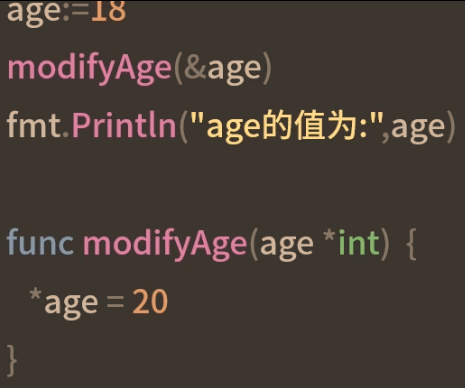
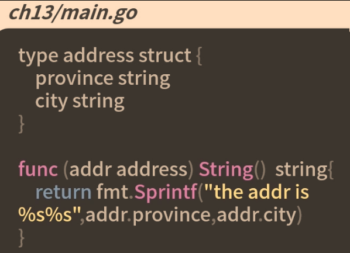
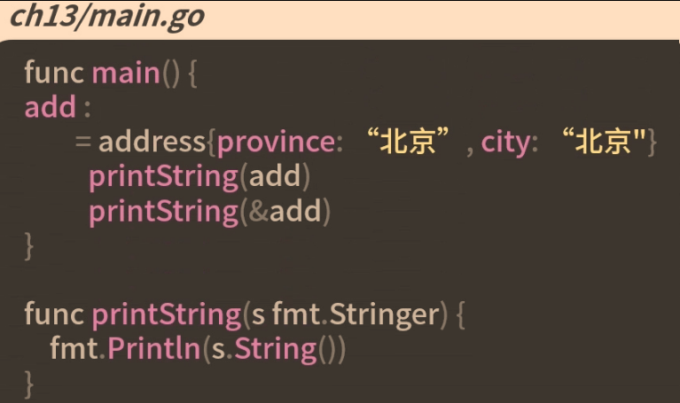
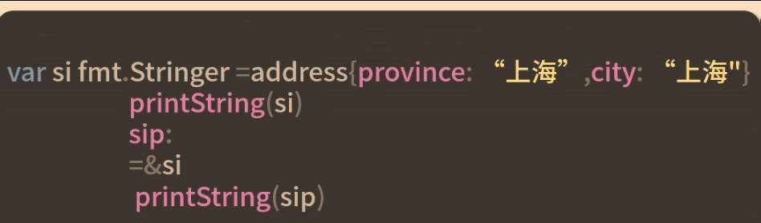
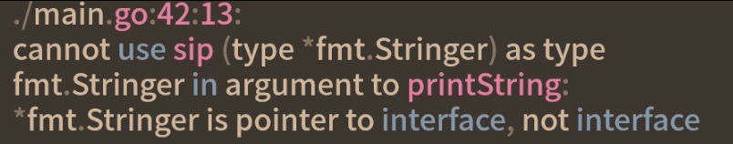

# 指针的使用场景

## 指针的声明和定义

1. 不同的指针类型是无法互相赋值的
```golang
var intP *int
intP=&name //指针类型不同，无法赋值(string类型的变量取地址赋值给*int类型的指针是不行的)
```
2. new关键字初始化： `intP1:=new(int)`
## 指针的操作
### 获取指针指向的值
```golang
nameV:=*nameP
fmt.Println("v:",nameV)
```
### 修改指针指向的值
```golang
*nameP="颠三倒四多"
fmt.Println("p指针指向的值为："，nameP) // "颠三倒四多"
fmt.Println("name变量的值为："，name) // "颠三倒四多"
```

```goalng
var intP *int=new(int)
intP:=new(int) //简短声明法(推荐)
```
## 指针参数

## 指针接受者
对于是否使用指针类型作为接受者
1. 如果类型为map slice channel引用类型，不使用指针
2. 如果需要修改接受者内部状态或数据时，或修改参数的值或内部数据时，使用指针
3. 接受者是比较大的类型如结构体，需要使用指针
4. int和bool这样的小数据类型没必要使用指针
5. 如果需要并发安全，尽可能不使用指针，使用指针一定要保证并发安全
6. 指针最好不要嵌套，即不要使用指向指针的指针

### 指针的好处
1. 可以修改指向数据的值
2. 变量赋值和参数传参时候可以节省内存


## 指向接口的指针，是否实现了该接口


是否可定义一个指向接口的指针，会报错


虽然指向具体类型的指针可以实现一个接口，但指向接口的指针永远不能实现该接口