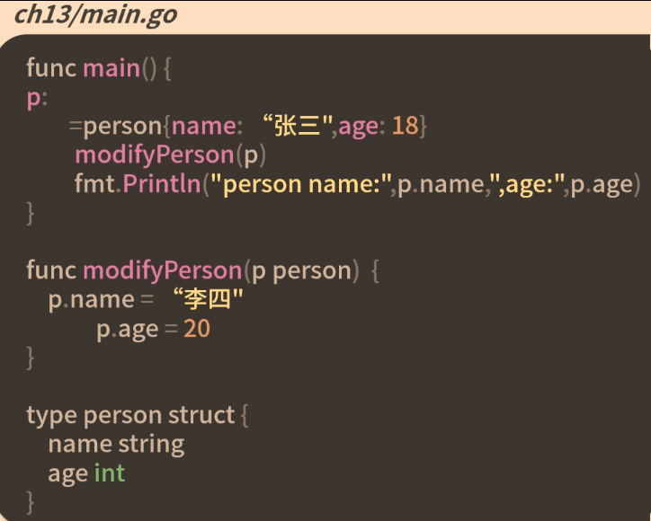
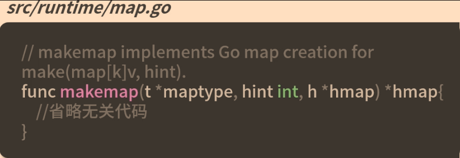
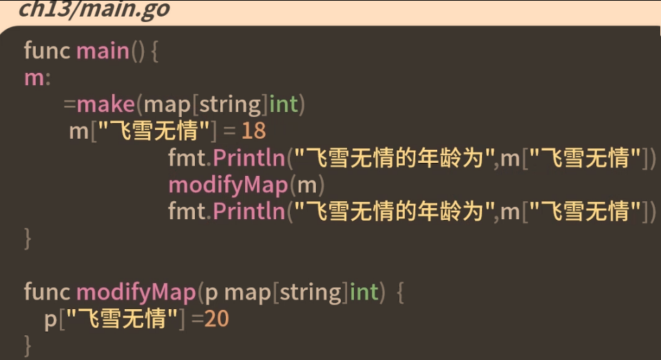
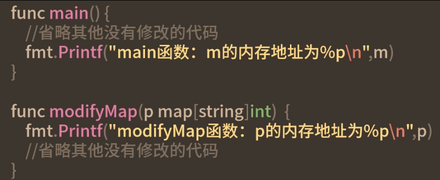
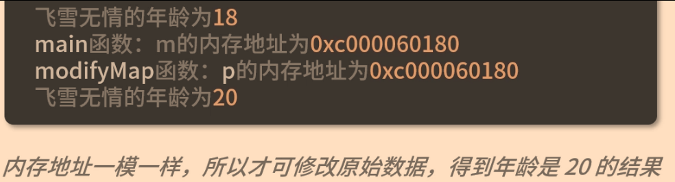
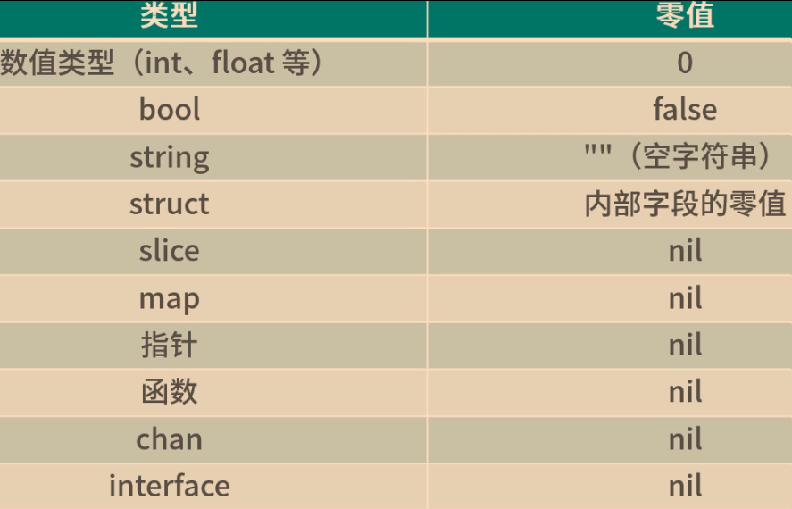

# 值、引用、指针的区别

## 修改参数


## map
go语言中任何创建map的代码，最终调用的都是runtime.makemap函数
> 使用字面量或make函数的方式创建map，会转换成makemap函数的调用
> 



go语言通过make函数或字面量的包装省了指针的操作，便可以更容易的使用map，就是语法糖
> 这里的map可以理解为引用类型，但他本质上指针只可叫做引用类型，在参数传递时，它还是值传递
## chan通道

```go
func makechan(t *chantype,size int64) *hchan{}
```
go语言没有引用类型，但可以把map、chan、函数、接口、slice切片称为引用类型


## 类型的0值
定义变量使用make或new属于显示声明并初始化
如果没有被显示声明并初始化，则该变量的默认值就是对应类型的零值


## 函数的参数传递只有值传递，且传递的实参都是原始数据的一份拷贝
1. 拷贝内容为值类型，在函数中无法修改原始数据
2. 拷贝内容为指针，可以修改原始数据

