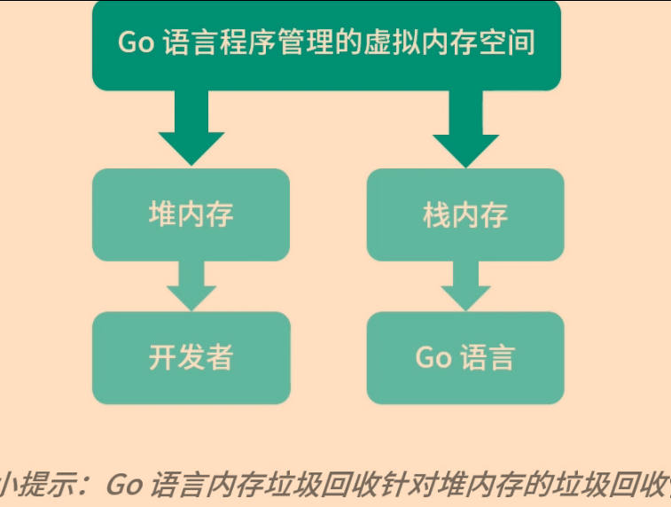
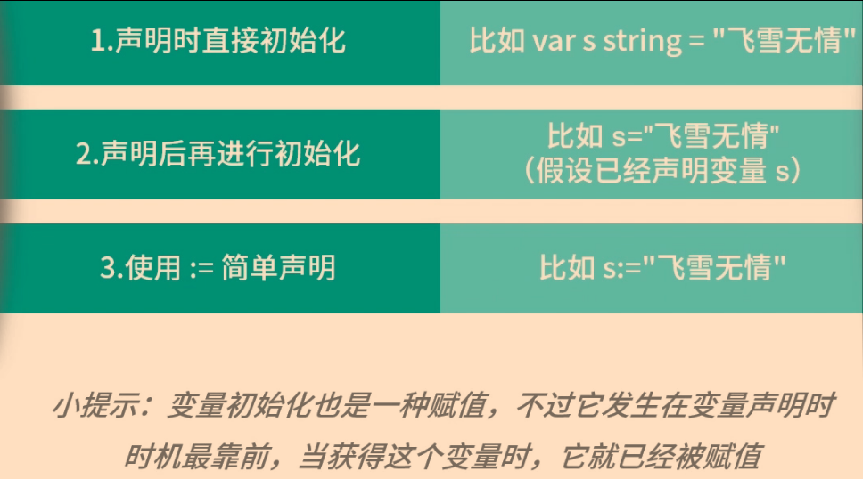
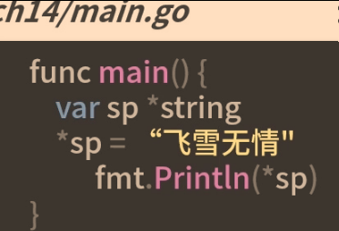
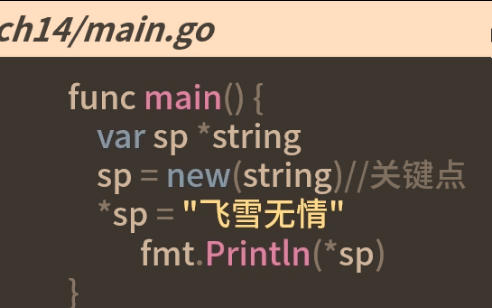
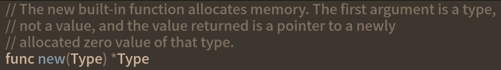
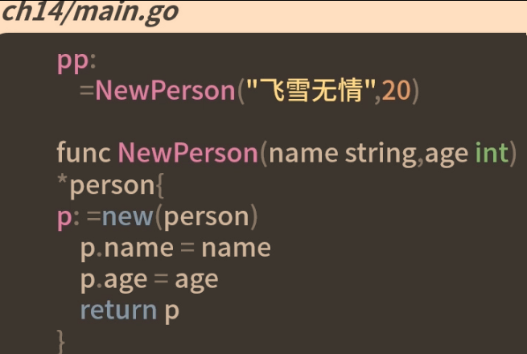
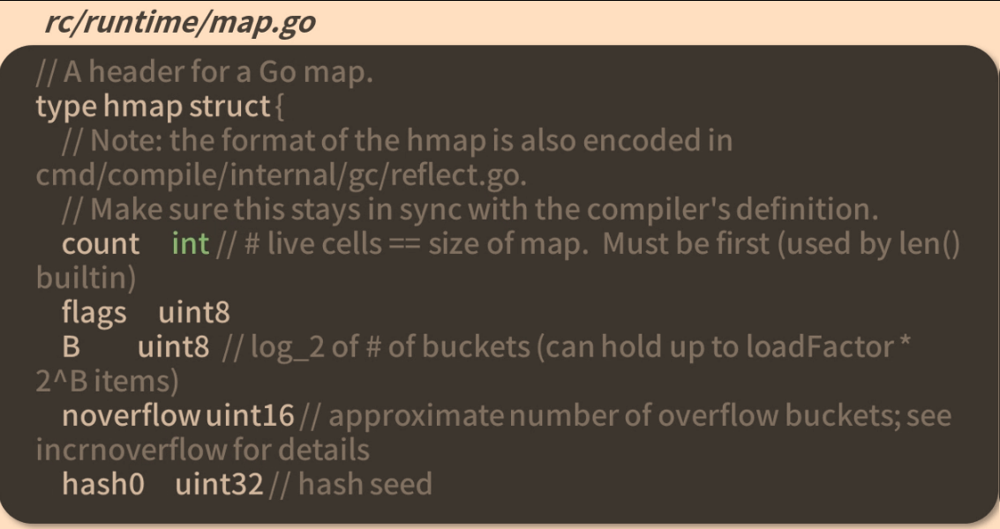

# 内存分配


## 变量的赋值
如果要对一个变量赋值，这个变量必须有对应分配好的内存


## new函数


```go
sp1=new(string)
fmt.Println(*sp1)//打印空字符串，即string的零值
```
## 变量初始化
声明一些类型的变量时，变量的零值无法满足要求，需要在声明同时赋值，称为变量的初始化
```golang
var s string = "123打的费"
s1:="dsdsa"

type person struct{
	name string
	age int
}
func main(){
	//字面量初始化
	p:=person{name:"张三",age:19}
}
```
### 指针变量初始化
```golang
// 工厂函数
func NewPerson()*person{
	p:=new(person)
	p.name="12asd"
	p.age=12
	return p
}
func main(){
	pp:=NewPerson()
	fmt.Printf("name:%v;age:%v\n",pp.name, pp.age)
}
```


## make函数
```go
func makemap(t *maptype,hint int,h *hmap)*hmap{}
```

`m:=make(map[int]int,10)`
make函数就是map类型的工厂函数，可根据传递k-v键值对类型，创建不同类型的map的同时，可初始化map的大小
> make函数不只是map的工厂函数，还是chan、slice的工厂函数，同时可用于slice、chan、map三种类型的初始化


## 总结
### new函数
new函数只用于分配内存，且把内存清零，并返回一个指向对应类型零值的指针
new函数一般用于需要显示返回指针的情况
### make函数
make函数只用于map、chan、slice三种内置类型的创建和初始化，因为这三种类型的结构比较复杂