# reflect

基于字符串和结构体之间的转换
在运行时操作任意类型对象的能力
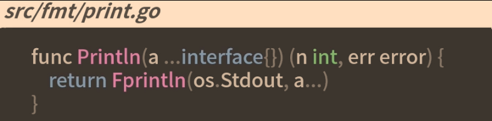

## refect.Value和reflect.Type
go语言反射定义中，任何接口都由两部分组成：接口的具体类型和具体类型对应的值
> interface\{\}是空接口，可表示任意类型，可以把任何类型转为空接口，常用于反射、类型断言、以减少重复代码，简化编程
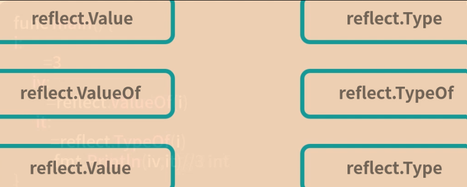
```golang
func main(){
	i:=3
	iv:=reflect.ValueOf(i) // 3
	it:=reflect.TypeOf(i) // int
}
```
### reflect.Value
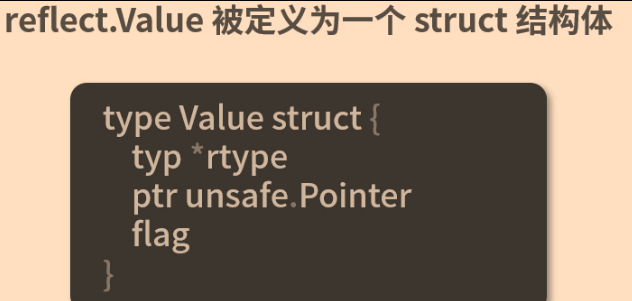
结构体定义：
1. 获取和修改对应值
2. 和struct类型字段有关用于获取对应字段
3. 类型上方法集有关用于获取对应方法
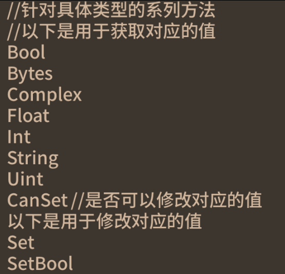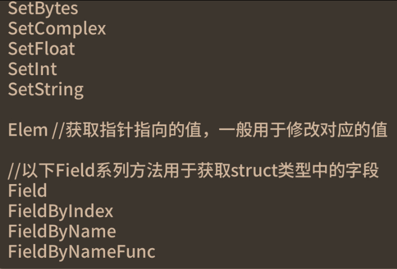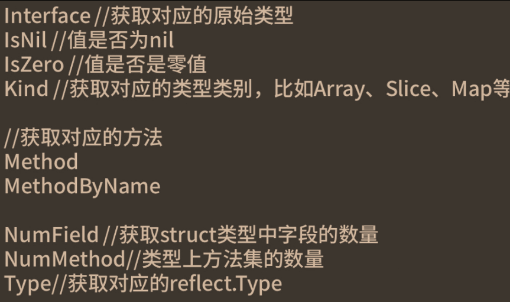
#### 获取原始类型
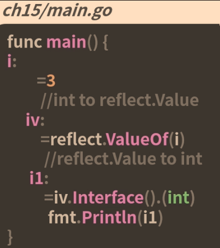
#### 修改对应的值
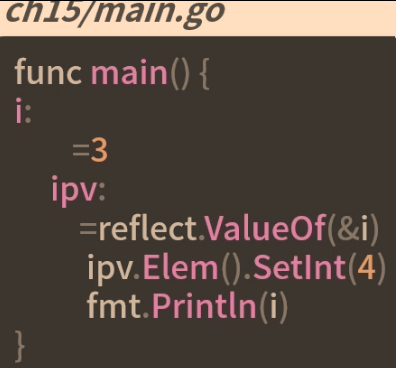

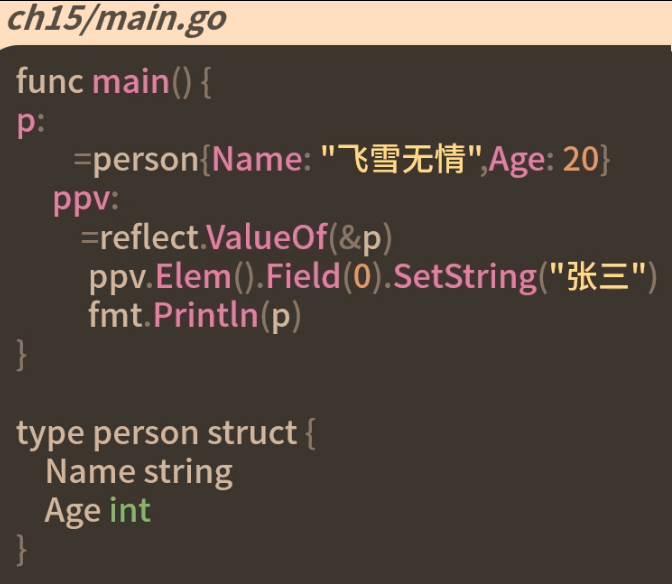
规则总结
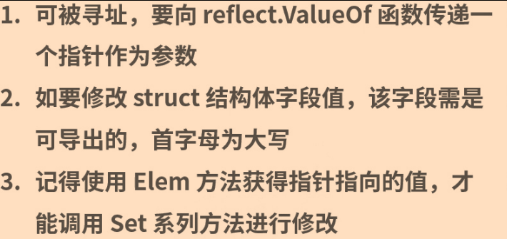
#### 获取对应的底层类型 Kind
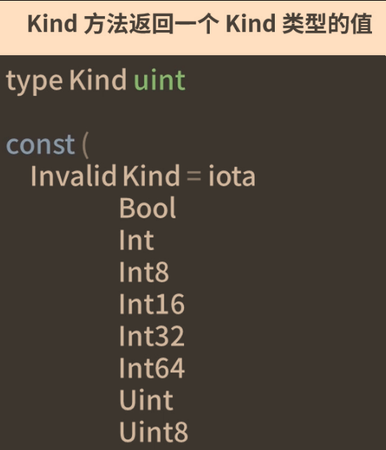
ptr struct
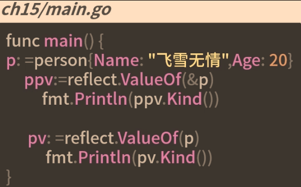 

### reflect.Type
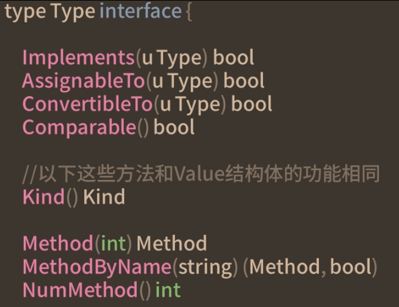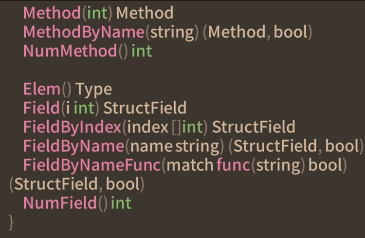
特殊的接口定义
1. Implements方法用于判断是否实现了接口U
2. AssignableTo用于判断是否可以赋值给类型u
3. ConvertibleTo用于判断是否可以转换为类型u
4. Comparable判断该类型是否可比较的
#### 遍历结构体的字段和方法
```golang
func (p person)String()string{
	return fmt.Sprintf("name:%v,age:%v",p.Name,p.Age)
}
```
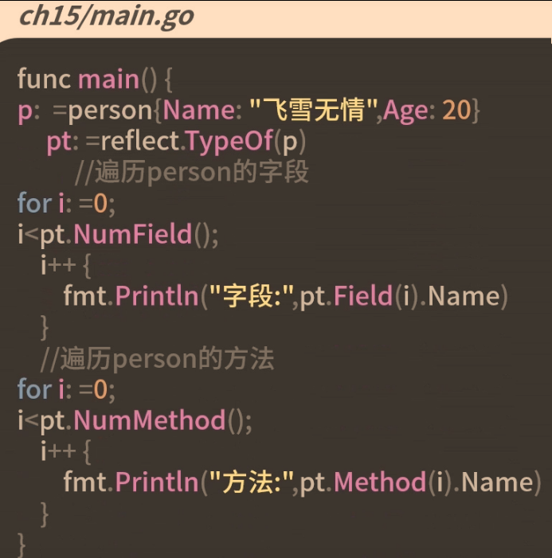

#### 是否实现某接口
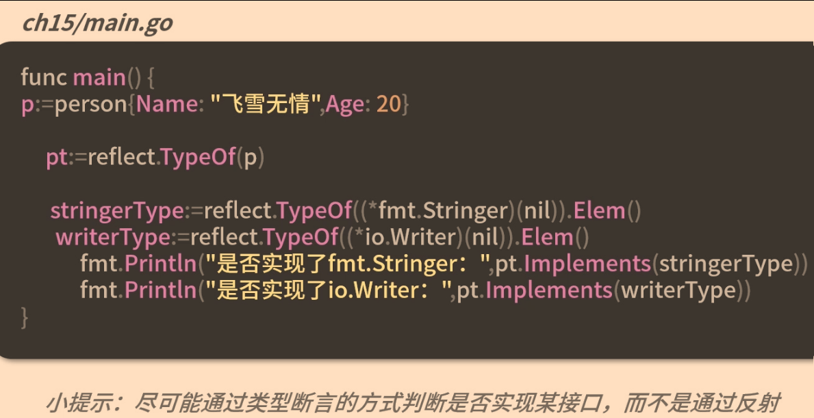

## 字符串和结构体互相转换（json和struct)
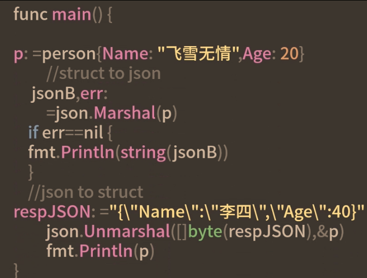
### stuct tag
stuct tag是一个添加在struct字段上的标记，进行辅助，可完成一些额外操作，如json和struct互转


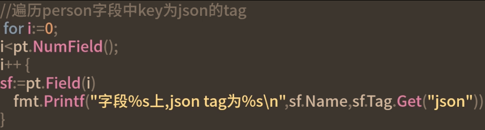

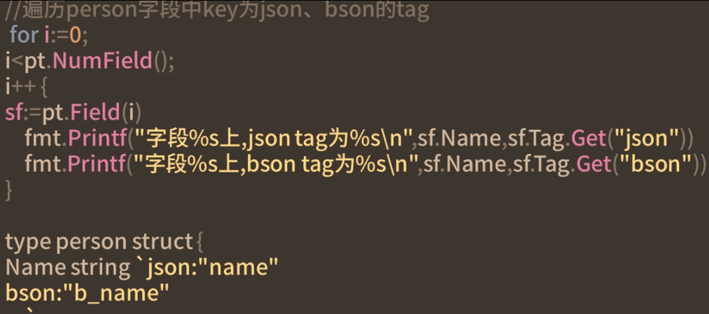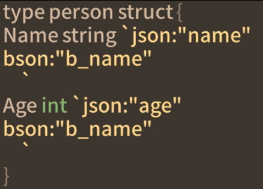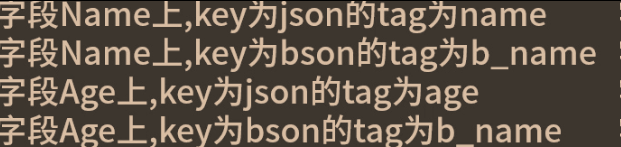

结构体转json，自定义实现
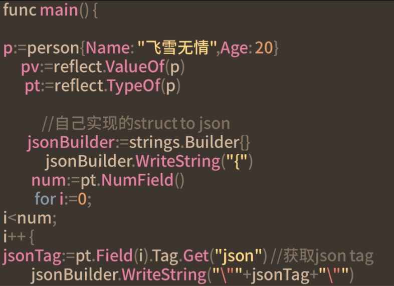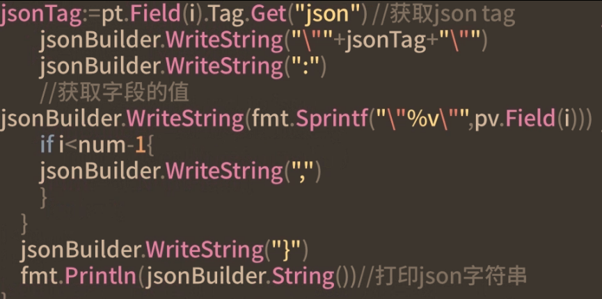

## 反射定律
1. 任何接口值interface{}都可反射出反射对象
2. 反射对象也可还原成interface{}变量
3. 要修改反射的对象，该值必须可设置，可寻址
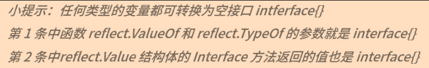

## 总结
反射中，reflect.Value对应的是变量的值，如需进行和变量值相关的操作，优先使用reflect.Value
reflect.Type对应的是变量类型，执行变量类型本身有关的操作，优先使用reflect.Type


## 如何使用反射调用方法
```golang
func (p person) Print(prefix string){
	fmt.Printf("%s Name is %s,Age is %d\n",prefix,p.Name,p.Age)
}
func main(){
	p:=person{"飞雪无情"，20}
	pv:=reflect.ValueOf(p)
	//反射调用person的Print方法
	mPrint:=pv.MethodByName("Print")
	args:=[]reflect.Value{reflect.ValueOf("登录")}
	mPrint.Call(args)
}
```
