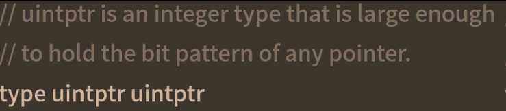

# unsafe使用


## 前言
unsafe 是不安全的，尽可能不要使用
【优势】：可绕过go语言的内存安全机制，直接对内存进行读写

## 指针类型转换
go设计中为编写方便，提高效率且降低复杂度，将其设计为**强类型**的静态语言
1. 强类型意味着定义了就不能改变，静态意味着类型检查在运行前就做了，go语言不允许两个指针类型进行转换
\*T作为一个指针类型，表示一个指向类型T变量的指针，为安全考虑，两个不同的指针类型不能互相转换

```golang
func main(){
	i:=10
	ip:=&i 
	var fp *float64=(*float64)(ip)
	fmt.Println(fp)
}
// 会编译错误
```
## unsafe.Pointer
`一种特殊的指针，可以表示任意类型的地址，类似C语言的void*指针，全能型的`
```golang
var fp *float64=(*float64)(unsafe,=.Pointer(ip))
*fp=*fp*3
fmt.Println(i) //30
```

## uintptr
uintptr也是一种指针类型，足够大，可以表示任意指针

uintptr可以对指针偏移进行计算，这样就可以访问特定的内存，达到对特定的内存读写的目的，实现真正内存级别的操作

```golang
type person struct{
	Name string
	Age int
}
func main(){
	p:=new(person)
	// Name是person的第一个字段不用偏移，可通过指针进行修改
	pName:=(*string)(unsafe.Pointer(p))
	*pName="飞雪无情"
	// Age并不是person的第一个字段，需要进行偏移，这样才能真正定位到Age字段这块内存，才可以正确修改
	pAge:=(*int)(unsafe.Pointer(uintptr(unsafe.Pointer(p))+unsafe.Offsetof(p.Age)))
	fmt.Println(*p)
}
```
1. 先使用new函数声明一个\*person类型的指针变量p
2. 把*person类型指针变量p通过unsafe.Pointer转换为*string类型的指针变量pName
3. person结构体第一个字段是string类型的Name,pName指向Name字段，对pName进行修改
4. 因为Age字段不是person的第一字段，要修改必须进行偏移，先将指针p通过unsafe.Pointer转换为uintptr才能进行地址运算，偏移量可通过函数unsafe.Offsetof计算，该函数返回一个uintptr类型的偏移量
5. 进行指针运算，先通过unsafe.Pointer转为uintptr类型指针，还要通过unsafe.Pointer转换为真实的指针类型
6. 有了指向Age指针变量pAge就可以对其进行赋值操作，修改字段Age的值了

```golang
func main(){
	p:=new(person)
	p.Name="反反复复"
	p.Age=20
	fmt.Println(*p)
}  //{反反复复 20}
```
## 指针转换规则
```golang
*T <=> unsafe.Pointer <=> unsafe.uintptr
```
## unsafe.Sizeof
Sizeof函数返回一个类型所占用的内存大小，大小与类型有关，和类型对应变量存储内容大小无关
```golang
fmt.Println(unsafe.Sizeof(true))
fmt.Println(unsafe.Sizeof(int8(0)))
fmt.Println(unsafe.Sizeof(int16(10)))
fmt.Println(unsafe.Sizeof(int32(10000000)))
fmt.Println(unsafe.Sizeof(int64(10000000000000)))
fmt.Println(unsafe.Sizeof(int(10000000000000000)))
fmt.Println(unsafe.Sizeof(true))
fmt.Println(unsafe.Sizeof(string("sdcds")))
fmt.Println(unsafe.Sizeof([]string{"阿萨德","真正"}))
```
一个结构体的内存占用大小==它包含的字段类型内存占用大小之和


