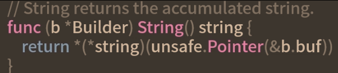

# slice高效处理数据

## 数组

```golang
a1:=[1]string{"a"}
a2:=[2]string{"a","b"}
```
一个数组由数组的大小和数组内的元素类型构成
```golang
// 数组结构伪代码表示
array{
	len
	item type
}
```
### 数组的限制
1. 一旦一个数组被声明，它的大小和内部元素的类型就不能改变
2. go语言中，函数间传参是值传递的，数组作为参数在各函数间被传递时，内容会被一遍遍赋值，就造成大量内存浪费

## slice
为解决数组的限制，go创造了slice切片
切片是对数组的抽象和封装，底层是一个数组存储所有的元素，可以把slice理解为动态数组
### 动态扩容
使用append方法，向一个切片添加任意多个元素，可解决**数组的第一个限制**
```golang
func main(){
	ss:=[]string{"a阿萨德","bsad"}
	fmt.Println(len(ss),cap(ss))
	ss=append(ss,"asdf","asdf")
	fmt.Println(len(ss),cap(ss))
	fmt.Println(ss)
}
```

append自动扩容原理是新建一个底层数组，把原来的切片内的元素拷贝到新数组中，再返回一个指向新数组的切片
## 数组结构
```golang
type SliceHeader stuct{
	Data uintptr
	Len int
	Cap int
}
```

```golang
func main(){
	a1:=[]string{"阿萨德"}
	s1:=a1[0:1]
	s2:=a1[:]
	fmt.Println((*reflect.SliceHeader)(unsafe.Pointer(&s1)).Data)
	fmt.Println((*reflect.SliceHeader)(unsafe.Pointer(&s2).Data)
} //两个切片data是一样的
```
unsafe.Pointer将它们转换为*reflect.SliceHeader指针，就可打印出Data的值
> 多个切片公用一个底层数据，虽然可以减少内存占用，但如果有一个切片修改内部的元素，其他切片也会受影响，所以在切片作为参数在函数间传递时要小心，尽可能不改元切片内的元素

切片的本质是SliceHeader，又因函数的参数是值传递，所以传递的是SliceHeader副本，副本内存占用非常少，这解决了大数组在传参时内存浪费
> SliceHeader三个字段uintptr int int在64位机器上，这三个字段最多也就是int64类型，一个int64占8个字节，三个占24个字节内存
### 自定义slice

但是还是尽可能使用SliceHeader,这是go语言提供的标准，可以保持统一，便于理解

## 高效的原因
数组和切片的取值和赋值都比较高效，因为都是连续的内存操作，通过索引快速找到元素存储的地址

> map的价值非常大，他的key可以是很多类型int、int64、string等，但数组和切片的索引只能是整数

```golang
func arrayF(a []string){
	fmt.Printf("函数arrayF数组指针：%p\n",&a)
}
func sliceF(s []string){
	fmt.Printf("函数sliceF Data %d\n",(*reflect.SliceHeader)(unsafe.Pointer(&s)).Data)
}
func main(){
	a1:=[2]string{"阿萨德","super_admin"}
	fmt.Printf("%p\n",&a1)
	arrayF(a1)
	s1:=a1[0:1]
	fmt.Println((*reflect.SliceHeader)(unsafe.Pointer(&s1)).Data)
	sliceF(s1)
}
```

> 切片的高效还体现在for range循环中，因为循环得到的临时变量也是个值拷贝，所以在遍历大的数组时，切片的效率更高
> 切片基于指针的封装是它效率高的根本原因，因为可减少内存的占用，以及减少内存复制时的时间消耗
## string和[]byte互转
```golang
s:="asds"
b:=[]byte(s)
s2:=string(b)
fmt.Println(s,string(b),s3)
```
go语言通过先分配一个内存，在复制内容的方式，实现string和[]byte的强制转换
```golang
s:="asdfasd"
fmt.Printf("s.内存地址：%d\n",(*reflect.StringHeader)(unsafe.Pointer(&s)).Data)
b:=[]byte(s)
fmt.Printf("b.内存地址：%d\n",(*reflect.SliceHeader)(unsafe.Pointer(&b)).Data)
s3:=string(b)
fmt.Printf("s.内存地址：%d\n",(*reflect.StringHeader)(unsafe.Pointer(&s3)).Data)
```
可以通过查看runtime.stringtoslicebyte和runtime.slicebytetostring两函数的源代码，了解关于string和[]byte类型互转的具体实现


> []byte(s)和string(b)强制转换会重新拷贝一份字符串，字符串过大，内存开销大，对高性能要求的程序来说就无法满足了，需性能优化


```golang
// 强制转换
s:="飞行无线"
b:=[]byte(s)
s4:=*(*string)(unsafe.Pointer(&b))
```
```golang
s:="飞行无线"
sh:=(*reflect.SliceHeader)(unsafe.Pointer(&s))
sh.Cap=sh.Len
b1:=*(*[]byte)(unsafe.Pointer(sh))
```
通过unsafe.Pointer将string转为[]byte后，不能对[]byte进行修改，如不可进行b1[0]=12这种操作，会报异常，导致程序奔溃，这是因为在go语言中，string内存是只读的
> 通过unsafe.Pointer进行类型转换，避免内存拷贝来提升性能的方法，在go标准库中也有使用


## slice是对底层的指针和数组进行封装，提供一个切片的概念给开发者，即可方便使用，提高开发效率，又可提高程序的性能

