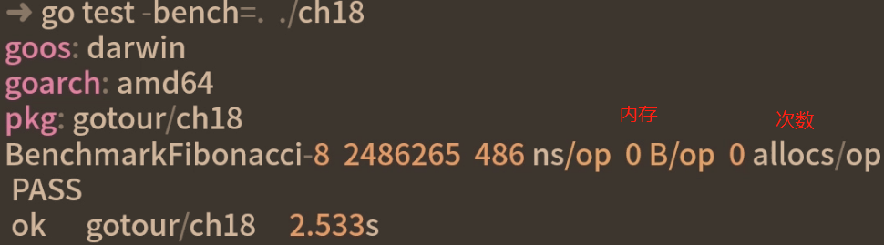

# go单元测试

[toc]

## 测试对象

```go
# myfunc.go
package myfunc
func Febonacci(n int)int{
    if n<0 {return 0}
    if n==0 {return 0}
    if n==1 {return 1}
    return Febonacci(n-1)+Febonacci(n-2)
}
```

## 单元测试
go语言单元测试规范
1. 单元测试代码的go文件：`[被测函数所在文件名]_test.go结尾`
2. 单元测试函数：func Test[被测函数名] (t *Testing.T){}
```go
# go_demo/main_test.go
func TestFebonacci(t *Testing.T){
    fsMap:=map[int]int
    fsMao[-1]=0
    fsMap[0]=0
    fsMap[1]=1
    fsMap[9]=34
    for k,v in range fsMap{
        fib:=Febonacci(k)
        if v==fib{
            t.Logf("结果正确：n为%v 值为%v",k,fib)
        } else {
            t.Errorf("结果错误：预期为%v 实际为%v",v,fib)
     }}}
```

### 运行单元测试

`go test -v ./go_demo`  运行目录下的所有单元测试


### 单元测试覆盖率

```go
go test -v --coverprofile=go_demo.cover ./go_demo
```


#### html报告（单元测试覆盖率）

```go
go tool cover -html=demo.cover -o=demo.html
```

打开demo.html


## 基准测试

go语言基准测试规范

1. 基准测试代码的go文件：`[被测函数所在文件名]_test.go结尾`
2. 基准测试函数：func Benchmark[被测函数名] (t *Testing.T){}

```go
func BenchmarkFibonacci(b *Testing.B){
    //b.N是测试框架提供的循环次数
    for i:=0;i<b.N;i++{
        Fibonacci(10)
    }}
```

### 执行基准测试`go test -bench=. ./go_demo`


#### 设置执行时长benchtime

`go test -bench=. -benchtime=3s ./go_demo`

### 计时方法

#### ResetTimer重置计时器


#### StartTimer开始计时

#### StopTimer停止计时

### 内存统计

每次操作分配内存的次数和每次操作分配的字节数，作为代码优化的参考




### 并发基准测试


## 代码优化（使用缓存机制）

```go
var cache=map[int]int

func Fibonacci(n int)int{
    if v,ok:=cache[n];ok{
        return v
    }
    result:=0
    switch{
        case n<0:
        	result=0
        case n==0:
        	result=0
        case n==1:
        	result=1
        Default:
        result=Fibonacci(n-1)+Fibonacci(n-2)
    }
    cache[n]=result
    return result
}
```

