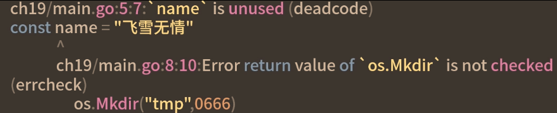
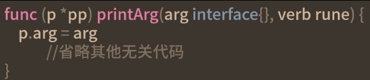

# 代码检查和优化

## 代码规范检查
对单元测试的一种补充，他可以从非业务层面检查代码是否有优化的空间，如变量是否被使用，是否是死代码等
**go语言规范进行静态检查**
1. 拼写问题
2. 死代码
3. 代码简化检测
4. 命名中带下划线
5. 冗余代码
> 代码静态分享是不会运行代码的
### golangci-lint
golangci-lint是一个集成工具，集成了很多静态代码分析工具，便于使用通过配置这一个工具，可以灵活启用需要的代码规范检查
golint 、gofmt、misspell
#### 安装
```go
go get github.com/golangci/golangci-lint/cmd/golangci-lint@v1.32.2
golangci-lint version //检查是否安装成功
```
#### 使用
```golang
golangci-lint run ch19/
```

#### 配置
golangci-lint支持更多的linter，可以golangci-lint linters命令查看，且可以看到每个linter的说明

如果要修改默认启用的linter，可以在项目根目录建一个文件`.golangci.yml`，即为它的配置文件


例子：


#### 集成golangci-lint到CI
代码检查要集成到CI流程中，效果才会更好，这样开发提交代码时，CI就会自动检查代码并进行纠正(Jenkins、Gitlab CI、Github Action都可通过makefile方式运行golangci-lint)

`make verifiers`

## 性能优化
通过基准测试衡量的，这样才知道优化部分是否真的提升了程序的性能
为了让程序更好、更快的运行，但它不是必要的，在程序开始时，不必刻意追求性能优化，**写正确的代码是性能优化的前提**
### 堆分配还是栈

手动分配
1. 好处：需要多少就申请多谢，可最大化利用内存
2. 坏处：忘记释放内存就会导致内存泄漏
为让程序员更好专注于业务代码的实现，go语言增加垃圾回收机制，自动回收不在使用的内存
#### 栈内存
由编译器自动分配和释放，开发者无法控制，一般存储函数中的局部变量、参数等，函数创建时，这些内存会被自动创建，函数返回时，这些内存会被自动释放
#### 堆内存
生命周期比栈内存长，如果函数返回值还在其他地方使用，那这个值会自动分配到堆上，不能自动被编译器释放，只能通过垃圾回收器释放，所以栈内存效率会很高
### 逃逸分析
 **go语言如何分析内存分配到哪里的？**
```golang
func newString()*string{
	s:=new(string)
	*s="是的发送到"
	return s
}
```
逃逸分析: -m打印逃逸信息，-l 禁止内联
`go build -gcflags="-m -l" ./ch19/main.go`

1. 指针作为函数返回值的时候，一定会发生逃逸
逃逸到堆内存的变量只能通过垃圾回收标记清除，增加垃圾回收压力，要尽可能避免逃逸，让变量分配在栈内存上，这样函数返回时，就可以回收资源，提升效率
优化：优化后没有逃逸了
```golang
func newString()string{
	s:=new(string)
	*s="是的发送到"
	return *s
}
```

**第二个例子**
`fmt.Println("feixuewu请")`

因为字符串被其他引用了，

2. 被已经逃逸的指针引用的变量也会发生逃逸
3. 被切片slice、map、chan三种类型引用的指针一定会逃逸


## 逃逸分析
逃逸分析是判断变量是分配在堆上还是栈上的方法，在实际项目中要尽可能避免逃逸，从而提升效率
> 从逃逸分析看，指针虽然可以减少内存的拷贝，但同样也会引起逃逸，所以要根据实际情况选择是否使用指针
### 优化技巧
1. 尽可能避免逃逸，因为栈内存效率更高还不用GC，如小对象的传参array比slice效果好
2. 如避免不了逃逸，还在堆上分配了内存，那对于频繁内存申请操作要学会重用内存，如使用sync.Pool
3. 选用合适的算法，达到高性能的目的，如空间换时间
> 1. 性能优化的时候，要结合基准测试，判断性能是否有提升
> 2. 要尽可能避免使用锁，并发加锁的范围要尽可能小，使用StringBuilder做string和[]byte直接的转换，defer不要嵌套太多
4. go语言自带的性能剖析工具pprof
可以查看CPU分析、内存分析、阻塞分析、互斥锁分析
## 总结

