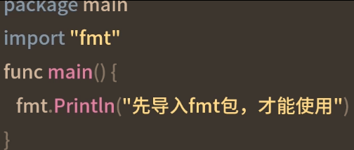
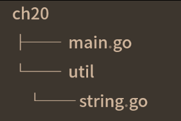
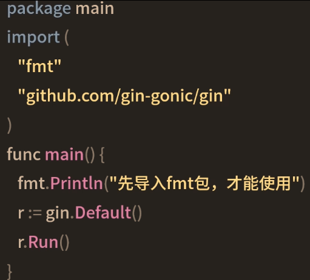

 # 模块化管理
 
 ## 包
 
 一个包就是一个独立空间，你可以在这个包里定义函数，结构体等
 ### 包使用
 1. 导入后在使用：
 
 2. 导入多个包
 ```golang
 import (
 	"fmt"
 	"os"
 )
 ```
 ### 作用域

1. 首字母大写，才可以在别的包中使用
2. 首字母小写，只能在本包中使用，不能跨包使用
go语言中所有的定义，比如函数、变量、结构体等，如果首字母大写，就可以被其他包使用
如果首字母是小写的，就只能在同一个包内使用
## go语言中的包


### init函数
```golang
func init(){
	fmt.Println("init in main.go")
}
```
在导入一个包时，对这个包做一些必要的初始化操作，比如数据库连接和一些数据的检查，确保我们可以正确地使用这个包
## go语言中的模块
在go语言中一个模块可以包含多个包，所以模块是相关包的集合
1. 一个模块通常是一个项目
2. 也可以是一个框架，如常用的web框架gin
## go mod init 项目名
go.mod文件记录了项目所有的依赖信息，

## 使用第三方模块
模块化为什么可以提高开发效率？
最重要的是**复用了现有的模块**

### 设置代理

1. 我们自己的模块

### 使用第三方模块
```bash
go get -u github.com/gin-gonic/gin
```

#### go mod tidy 同步依赖

## 总结
包是同一目录下，编译在一起的源文件的集合
模块是相关包的集合，包含了很多实现该模块的包
====================
模块=>包=>函数类型
====================
不要重复造轮子，使用现成的论证，可以提高开发效率，降低BUG率