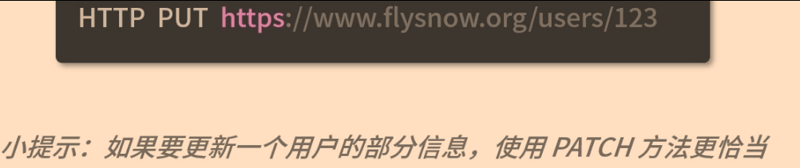
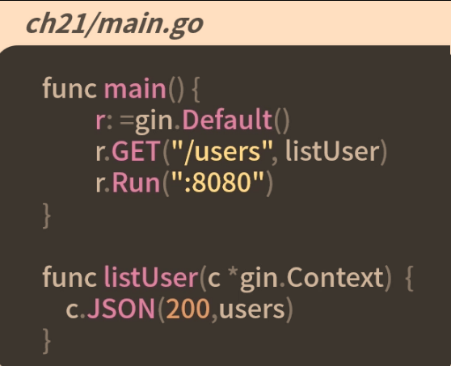
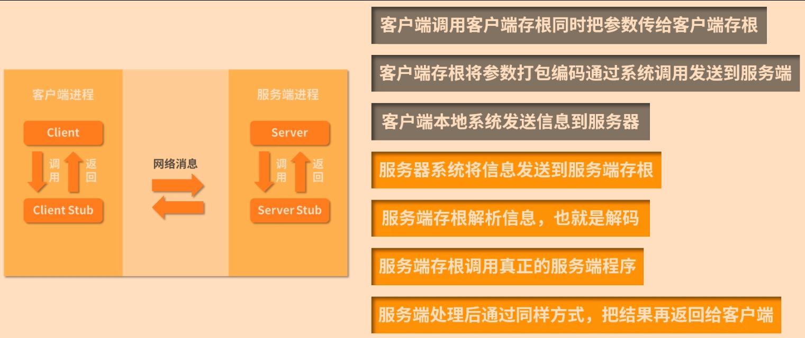
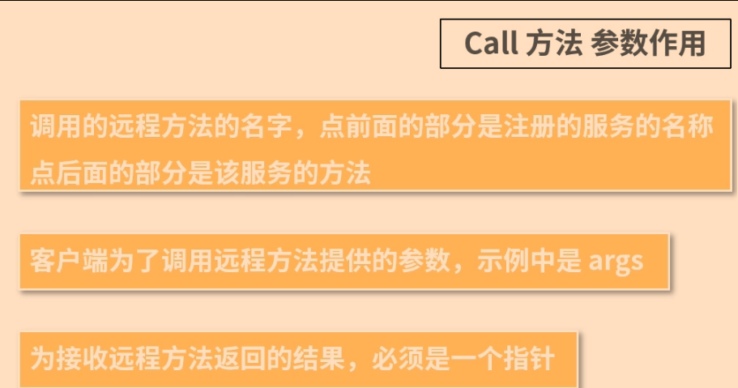
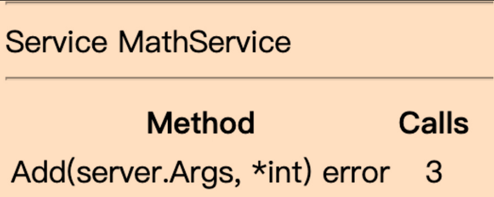
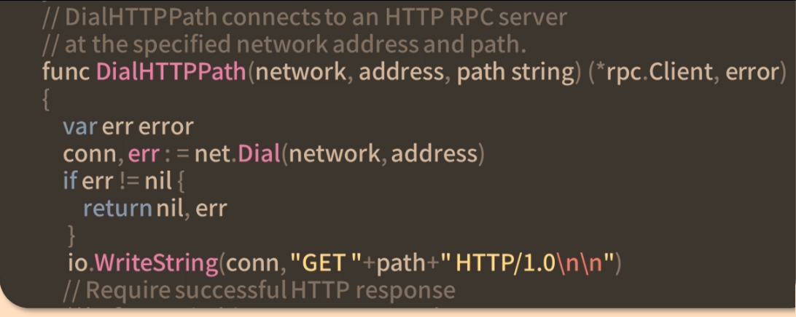
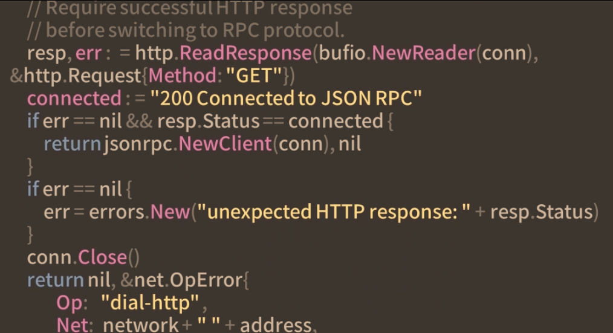
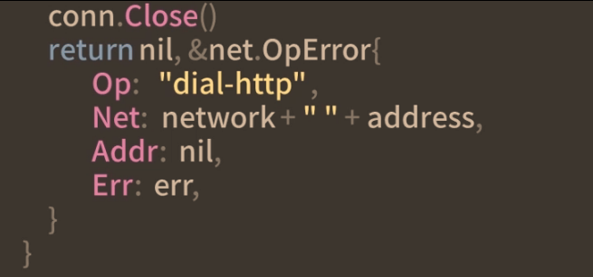
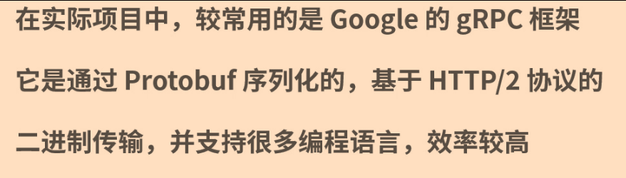

# 网络编程-Restful API

## RESTful API
RESTful API是一套规范，规范我们如何对服务器上资源进行操作
### HTTP Method
1. 最常见的是POST和GET方法，最早在http 0.9版本上只有一个GET方法，该方法是一个幂等方法，用于获取服务器上的资源，也就是在浏览器上输入网址回车请求的方法
2. 在http 1.0中增加了HEAD和POST方法，最常用的是POST方法，一般用于给服务端提交一个资源，导致服务器的资源发生变化
3. http1.1新增了9个方法
```bash
GET:请求指定资源，只用于获取数据
HEAD：请求一个与GET请求的响应相同的响应，但没有响应体
PSOT:将实体提交到指定的资源，通常导致服务器上的状态变化或副作用
PUT：请求有效载荷替换目标资源的所有当前表示
DELETE：删除指定的资源
CONNECT：建立一个到由目标资源标识的服务器的隧道
OPTIONS：描述目标资源的通信选项
TRACE:沿着到目标资源的路径执行一个消息环回测试
PATCH：对资源应用部分修改
```
### RESTful API规范
基于这些HTTP方法规范我们对服务器资源的操作，同时规范了URL的样式和HTTP Status Code
1. GET 读取服务器上的资源

2. POST 在服务器上创建资源

3. PUT 更新或替换服务器上的资源

4. DELETE 删除服务器上的资源

5. PATCH 更新/修改资源的一部分

## go RESTful API
go语言一个很大的优势就是可以很容易开发网络后台服务，而且性能快，效率高
### http包
简单实例
```golang
type User struct{
	ID int
	Name stirng
}
var users=[]User{
	{ID:1;Name:"张三"},
	{ID:2;Name:"张三1"},
	{ID:3;Name:"张三2"},
}
func main(){
	http.HandleFunc("/users",handleUsers)
	http.ListenAndServe(":8080",nil)
}
func handleUsers(w http.ResponseWriter,r *http.Request){
	switch r.Method{
		case "GET":
			users,err:=json.Marshal(users)
			if err !=nil{
				w.WriteHeader(http.StatusInternalServerError)
				fmt.Fprint(w,"{\"message\":\""+err.Error()+"\"}")
			}else{
				w.WriteHeader(http.StatusOK)
				w.Write(users)
			}
		default:
			w.WriteHeader(http.StatusNotFound)
			fmt.Fprint(w,"{\"message\":\"not found\"}")
	}
}
```
## gin框架
### http的缺点
1. 不能单独对请求方法注册特定的处理函数
2. 不支持Path变量参数
3. 不能自动对Path进行校准
4. 性能一般，扩展性不足
### gin框架
gin框架是一个github开源web框架，封装了很多web开发需要的通用功能，性能非常高，可以容易的写出RESTful API
```bash
go get -u github.com/gin-gonic/gin
```

```golang
func main(){
	r:=gin.Default()
	r.GET("/users/:id",getUser)
	r.POST("/users",createUser)
	r.DELETE("/users/:id",deleteUser)
	r.UPDATE("/users/:id",updateUser)
	r.Run(":8080")
}
func getUser(c *gin.Context){
	id:=c.Param("id")
	var user user
	found := false
	// 数据库查询
	users:=...
	for _, u := range users {
		if strings.EqualFold(id,strconv.Itoa(u.ID)){
			user=u
			found=true
			break
		}
	}
	if found{
		c.JSON(200,user)
	}else{
		c.JSON(404,ging.H{
			"message":"用户不存在"
		})
	}
}
```
```golang
// 新增用户
func createUser(c *gin.Context){
	name:=c.DefaultPostForm("name","")
	if name !=""{
		u:=User{ID:len(users)+1,Name:name}
		users.append(users,u)
		c.JSON(http.StatusCreated,u)
	}else{
		c.JSON(http.StatusOK,gin.H{
			"message":"请输入用户名称"
		})
	}
}
```

```golang
// 删除用户
func deleteUser(c *gin.Context){
	id:=c.Param("id")
	i:=-1
	// 数据库查询
	for index, u := range users {
		if strings.EqualFold(id,strconv.Itoa(u.ID)){
			i=index
			break
		}
	}
	if i>0{
		users=append(users[:i],users[i+1:]...)
		c.JSON(http.StatusNoContent,"")
	}else{
		c.JSON(http.StatusNotFound,ging.H{
			"message":"用户不存在"
		})
	}

}
```
```golang
// 修改用户
func updateUser(c *gin.Context){
	id:=c.Param("id")
	i:=-1
	// 数据库查询
	for index, u := range users {
		if strings.EqualFold(id,strconv.Itoa(u.ID)){
			i=index
			break
		}
	}
	if i>0{
		users[i].Name=c.DefaultPostForm("name",users[i].Name)
		c.JSON(http.StatusOK,users[i])
	}else{
		c.JSON(http.StatusNotFound,ging.H{
			"message":"用户不存在"
		})
	}

}
```


>go语言已经提供了比较强大的SDK，可以很容易的开发网络服务的应用，而借助第三方的web框架，可以让这件事情更容易、更高效。

## RPC 服务
RPC即远程过程调用，是分布式系统中不同节点调用的方式，属于C/S模式，RPC由客户端发起，调用服务端的方法进行通信，然后服务端把结果返回给客户端
### RPC的核心
1. 通信协议
2. 序列化： 序列化和反序列化是一种把传输内容编码和解码的方式，常见的编解码方式由JSON、Protobuf等


RPC调用常用于大型项目，也就是我们现在常说的微服务，而且还会包含服务注册、治理、监控等功能，是一套完整的体系

在go SDK中，已经内置了net/rpc包来帮助开发者实现RPC，net/rpc包提供了通过网络访问服务器端对象方法的能力
```golang
// server.go
pack server
type MathService struct{}
type Args struct{
	A,B int
}
func (m *MathService)Add (args Args,reply *int)error{
	*reply = args.A + args.B
	return nil
}
```
go语言中，注册一个RPC服务对象还是比较简单的，通过RegisterName即可
```golang
package main
import (
	"gotour/ch22/server"
	"log"
	"net"
	"net/rpc"
)
func main(){
	rpc.RegisterName("MathService",new(server.MathService))
	l,e:=net.Listen("tcp",":1234")
	if e!=nil{
		log.Fatal("listen error:",e)
	}
	rpc.Accept(l)
}
```
## RPC简单入门
任何一个框架都有自己的规则，net/rpc这个go语言提供的RPC框架也不例外，要想把一个对象注册为RPC服务，可以让客户端远程访问
1. 方法的类型是可导出的
2. 方法本身也是可导出的
3. 方法必须有2个参数且参数类型是可导出或内建的
4. 方法必须返回一个error类型

```golang
func (t *T)MethodName(argType T1,replyType *T2)error
```
1. 第一个参数argType是调用者（客户端）提供的
2. 第二个参数replyType是返回给调用者结果，必须是指针类型

```golang
// client_main.go
import(
	"fmt"
	"gotour/ch22/server"
	"log"
	"net/rpc"
)
func main(){
	client,err:=rpc.Dial("tcp","localhost:1234")
	if err!=nil{
		log.Fatal("dialing:",err)
	}
	args:=server.Args{A:7,B:8}
	var reply int
	err=client.Call("MathService.Add",args,&reply)
	if err!=nil{
		log.Fatal("MathService.Add error:",err)
	}
	fmt.Printf("MathService.Add:%d+%d=%d",args.A,args.B,reply)
}
```

1. 启动服务端的代码，提供RPC服务：`go run ch22/server_main.go`
2. 运行客户端代码，测试调用RPC结果`go run ch22/client_main.go`

## 基于HTTP的RPC
RPC除了可通过TCP协议调用外，还可以通过HTTP协议进行调用，且内置的net/rpc包已经支持
```golang
// ch22/server_main.go
default:func main(){
	rpc.RegisterName("MathService",new(server.MathService))
	rpc.HandleHTTP()//新增的
	l,e:=net.Listen("tcp",":1234")
	if e!=nil{
		log.Fatal("listen error:",e)
	}
	http.Serve(l,nil)//换成http的服务
}
```
```golang
// ch22/client_main.go
client,err:=rpc.DialHTTP("tcp","localhost:1234")
...其他没有修改的代码
```
go语言net/rpc提供的HTTP协议的RPC还有一个调试的URL，运行服务器代码后，浏览器中输入`http://localhost:1234/debug/rpc`,回车即可看到服务端注册的RPC服务及每个服务方法

## JSON RPC跨平台通信
当前在微服务架构中，RPC服务实现者和调用者都可能是不同的编程语言，因此实现的RPC服务要支持多语言的调用
实现跨语言RPC服务的核心在于**选择一个通用的编码**
### 基于TCP的JSON RPC
在go语言中，实现一个JSON RPC服务非常简单，只需使用net/rpc/jsonrpc包即可
```golang
// ch22/server_main.go
func main(){
	rpc.RegisterName("MathService",new(server.MathService))
	l,e:=net.Listen("tcp",":1234")
	if e!=nil{
		log.Fatal("listen error:",e)
	}
	for{
		conne,err:=l.Accept()
		if err!=nil{
			log.Println("jsonrpc.Serve:accept",err.Error())
			return
		}
		// json rpc
		go jsonrpc.ServeConn(conn)
	}
}
```
```golang
// ch22/client_main.go
func main(){
	client,err:=jsonrpc.Dial("tcp","localhost:1234")
	...//其他没有修改的代码
}
```
### 基于HTTP的JSON RPC
相比基于TCP调用的RPC来说，使用HTTP肯定会更方便，也更通用
这里参看gob编码的HTTP RPC实现方式，实现基于HTTP的JSON RPC服务
```golang
// ch22/server_main.go
func main(){
	rpc.RegisterName("MathService",new(server.MathService))
	// 注册一个path,用于提供基于http的json rpc服务
	http.HandleFunc(rpc.DefaultRPCPath,func(rw http.ResponseWriter,r *http.Request){
		conn,_,err:=rw.(http.Hijacker).Hijack()
		if err!=nil{
			log.Print("rpc hijacking",r.RemoteAddr,":",err.Error())
			return
		}
		var connected="200 Connected to JSON RPC"
		io.WriteString(conn,"HTTP/1.0"+connected+"\n\n")
		jsonrpc.ServeConn(conn)
	})
	l,e:=net.Listen("tcp",":1234")
	if err != nil {
		log.Fatal("listen error:",e)
	}
	http.Serve(l,nil)//换成http的服务
}
```

```golang
// ch22/client_main.go
func main(){
	client,err:=DialHTTP("tcp","localhost:1234")
	if err != nil {
		log.Fatal("dialing:",err)
		args:=server.Args{A:7,N:8}
		var reply int
		err=client.Call("MathService.Add",args,&reply)
		if err != nil {
			log.Fatal("MathService.Add error:",err)
		}
		fmt.Printf("MathService.Add:%d+%d=%d",args.A,args.B,reply)
	}
}
func DialHTTP(network,address string)(*rpc.CLient,error){
	return DialHTTPPath(network,address,DefaultRPCPath)
}

```




## 总结
基于go语言自带的RPC框架，讲解了RPC服务是实现和调用



