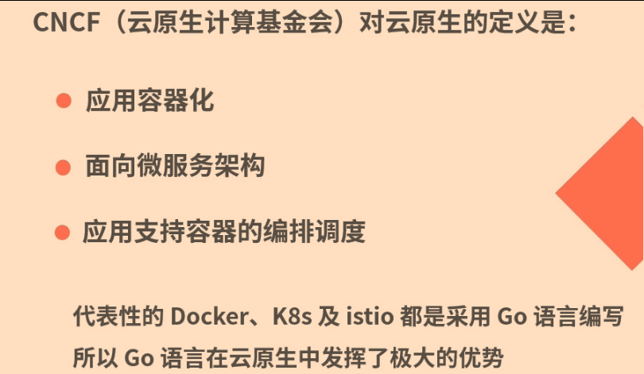

# 发展前景

## 云原生

在涉及网络通信、对象存储、协议等领域的工作中，go语言展现出的优势，比Python、c\c++更大，许多公司在业务层也采用go语言开发微服务从而提高开发和运行效率

## 学习建议
1. 官方文档

2. 第三方大牛写的相关书籍： 阅读不同人写的go语言书籍，可以融会贯通更好理解go语言
学习有系统性，而非零散的
通过碎片化的时间，系统性的学习才是正确的方式
3. 练习，写代码
 
4. 实战类书籍、文章和视频，这样不只是学会go语言，还能做项目，；了解如何编码、分库、微服务、自动化部署等
5. 阅读源代码：了解底层的实现原理及学习他人优秀的代码设计，进而提升自己在go语言上的技术能力
## 不止于编程语言

## 总结
具备自我驱动力和学习能力的人，在职场中的竞争力不会差

