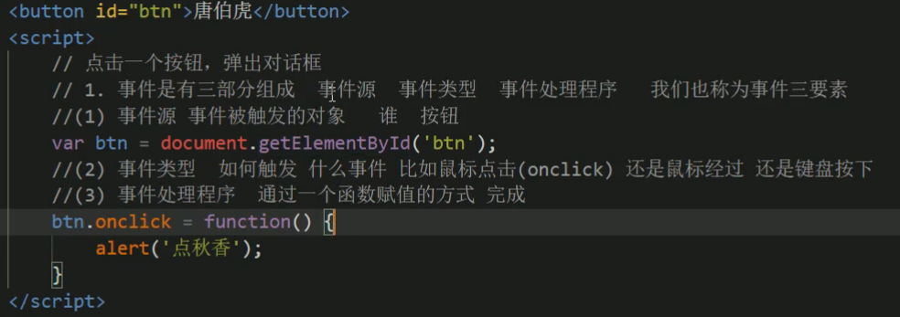
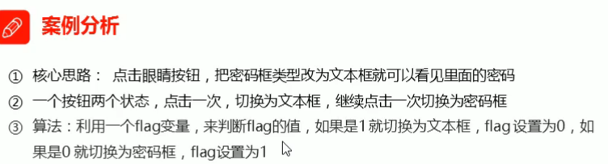

## DOM简介

## 获取元素

* id获取
document.getElementById(‘’)

* 标签名获取 document.getElementsByTagName(‘’)

	

* html5新增的方法获取

1. document.getElementsByClassName(‘类名’)
2. document.querySelector(‘选择器)   第一个(选择器需要加符号)
3. document.querySelectorAll(‘选择器)  所有的(选择器需要加符号)
4. 

* 特殊元素获取

## 事件基础

## 操作元素

javascript的DOM曹祖哦可以改变网页内容,结构.样式.我们可以利用操作DOM元素来改变元素里面的内容属性等

### 改变元素内容

==element.innerText==: 从起始位置到终止位置的内容,去除html标签,且去掉空格和换行,不识别HTML标签

==element.innerHtml==: 从起始位置到终止位置的内容,包括html标签,也保留空格和换行,识别HTML标签 W3c标准

### 修改属性

src href  id  alt  title

### 表单元素的属性操作

type value checked selected disabled

### 样式属性操作

元素的大小颜色位置

## 节点操作

百度换肤

表格隔行换色:

表单全选和取消全选

## 自定义属性的操作

### tab栏切换

