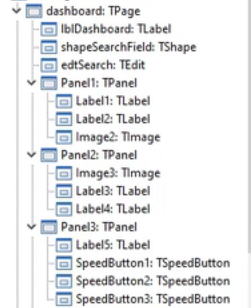
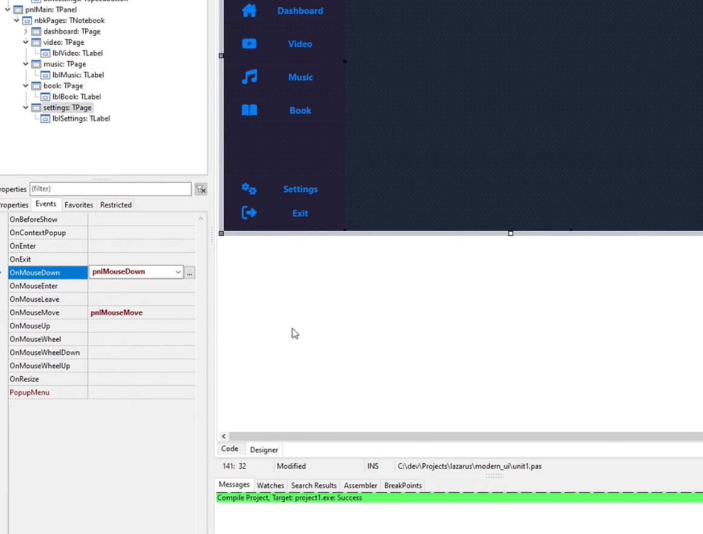

# Lazarus 案例
## 1 成品视图

## 2 lazyrus安装在线包BGRAControls

## 3 MainForm 设置

### 3.1 pnlNav 设置

#### 3.1.1 PnlUser

#### 3.1.2 PnlNavButtons

### 3.2 pnlMain 设置

#### 3.2.1 nbkPages

##### 3.2.1.1 Dashboard

###### 3.2.1.1.1 Dashboard. Panel 1

###### 3.2.1.1.2 Dashboard. Panel 2

###### 3.2.1.1.3 Dashboard. Panel 3

###### 3.2.1.1.4 Dashboard. Panel 4

###### 3.2.1.1.5 Dashboard. Panel 5

###### 3.2.1.1.6 Dashboard. Panel 6

##### 3.2.1.2 Video
	Index=1
	

	

##### 3.2.1.3 Music

##### 3.2.1.4 Book

##### 3.2.1.5 Settings

## 4 pages 切换
修改 pnlNavButtons 中每个按钮的 tag 值
根据 tag 值进行切换 pages

除了 exit 其他都绑定 btnNavClick 函数

exit 绑定

formcreate formshow

##### 4.1.1.1 dashboard 鼠标事件
鼠标拖拽事件绑定，全局的

##### 4.1.1.2 page 的鼠标拖拽
进度条事件
