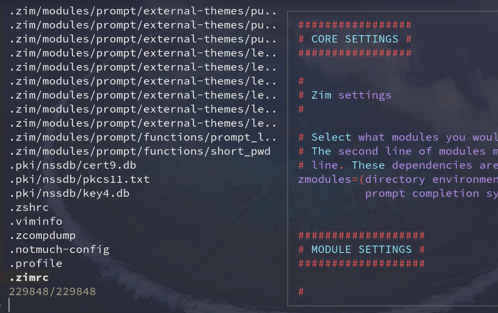
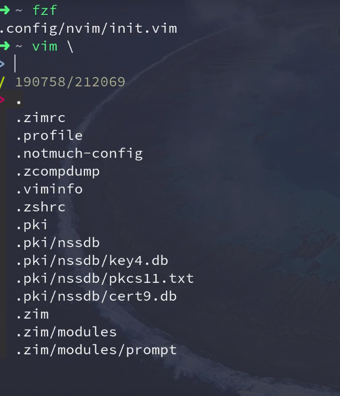
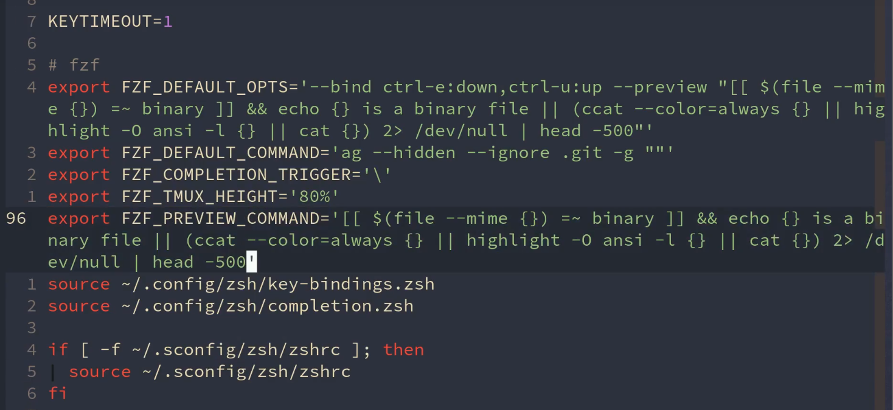
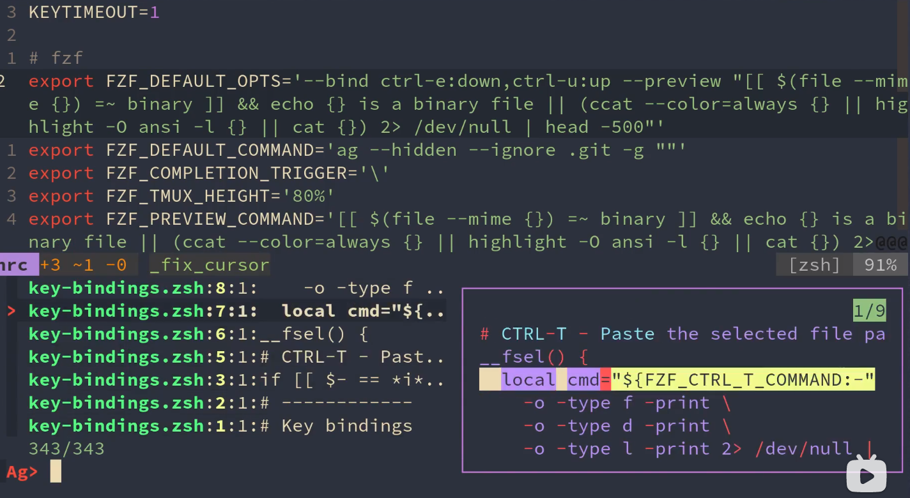
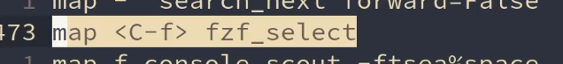
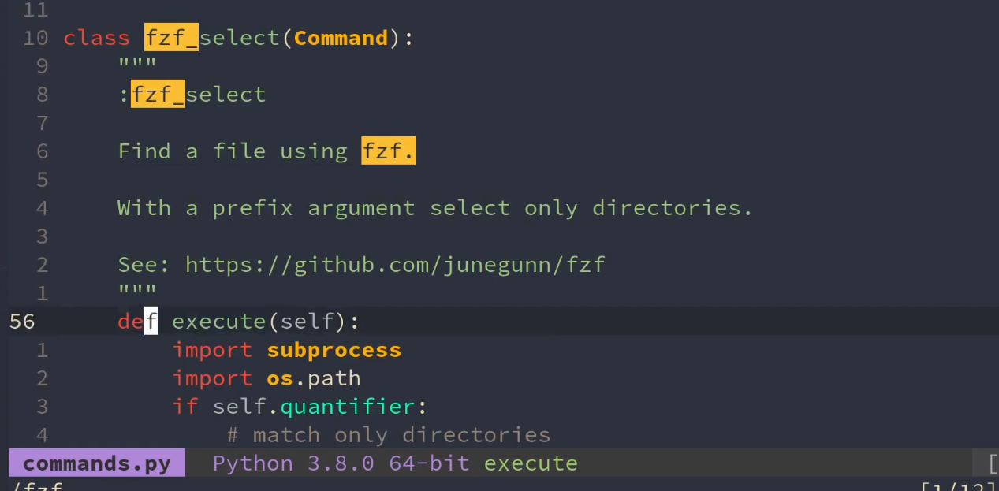
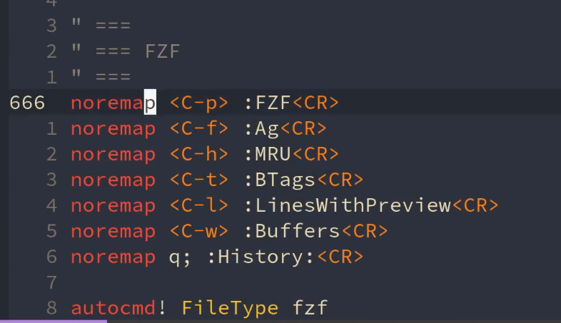

# FZF文件查找器

FZF（Fuzzy Finder）：又快速又方便的文件查找工具 https://github.com/junegunn/fzf FZF的Vim插件：https://github.com/junegunn/fzf.vim 我的Vim配置：https://github.com/theniceboy/nvim 我的配置文件夹：https://github.com/theniceboy/.config （zsh和ranger两个文件夹里有fzf的配置）

收起

## 和终端对接

## install

## zsh中配置

vim \ + tab 打开终端

## ranger配置

## vim配置

cat ccat有颜色和高亮