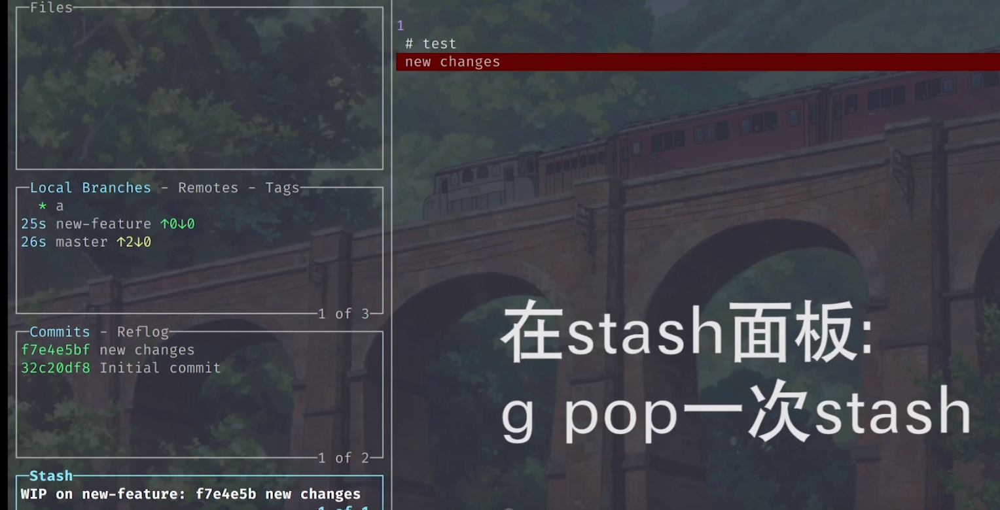
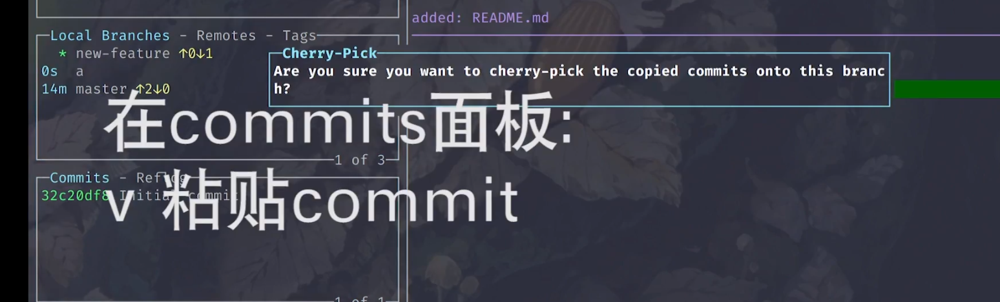
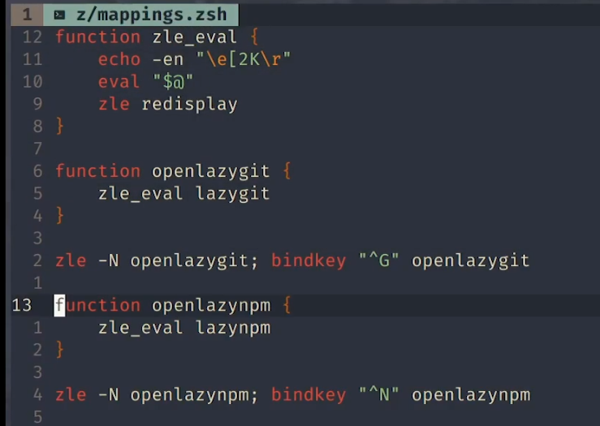

# lazygit

[toc]

## lazygit下载（delta）和配置：

```bash
#下载lazygit https://github.com/jesseduffield/lazygit
lazygit_0.31.4_Linux_x86_64.tar.gz
#下载delta：https://github.com/dandavison/delta#installation
delta-0.10.2-x86_64-unknown-linux-gnu.tar.gz 
```

## lazygit使用


## 文件面板
### x帮助信息


### A 这次提交内容添加到上次的提交中


### C 编辑器编写变更记录


### d删除更改


## 分支面板

### 创建新分支 n


### 空格切换分支


### 发布分支 P


### 合并其他分支

切换到分支,选中要合入的分支,M 就会合并到当前分支


### 本地 远端 标签跳转 []


## stash面板

### stash隐藏修改 s

### g pop并删除该隐藏的内容



### 空格 恢复隐藏的内容,并保留隐藏的记录

### d 删除该隐藏

## 提交面板

### d删除该项提交  回滚


###  ,.翻页  <> 到最顶/底端


### /搜索


### r 修改未push的commit message,R 在编辑器中修改

如果已经push,需要重新force push


### 空格选中一次提交就可以 checkout 提交


### 重置 g	


1. soft 提交会消失,修改的文件会保留


2. hard  删掉所有的之前的分支,不保留修改的文件

### reflog

选中要撤销的操作的之前的一条记录,回车


### 复制提交到另一个分支

c复制一个commit,切换到另一个分支, 进入commit面板 v粘贴复制的commit



### d 删除未push的提交 

### 一次修改的内容部分挪到上次的提交中


1. 进入错误的提交记录中,选中错误行,生成patch


2. 选中要加入的commits中 ctrl + p,选中第二项


### 压缩提交,两次提交合二为一

选中上一个, s 把下一个合入到当前commit中,修改信息也会合并


选中一个commit, f fixup,会合入到下一个commit中,提交信息不会保留,使用的是下面的commit信息


## 合并冲突

上下选择要那个, 空格选中, b都保留

左右冲突间跳转


## 查看文件历史


## 两次提交对比


查询文件历史中也可以使用


## 不同的位置打开lazygit

ranger


命令行


ctrl + G 打开lazygit



编辑器vim


## 配置lazygit


自定义预览窗口


