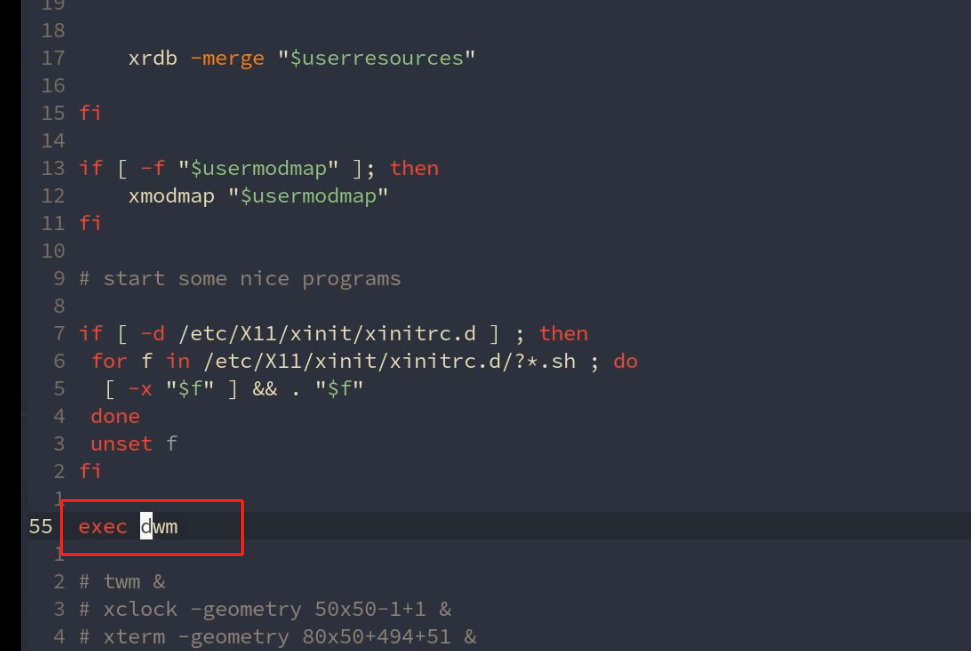
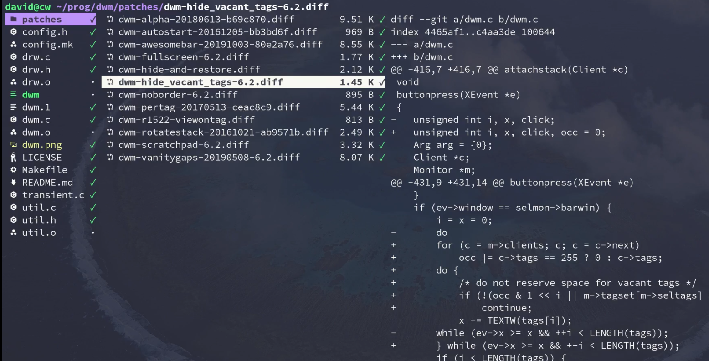
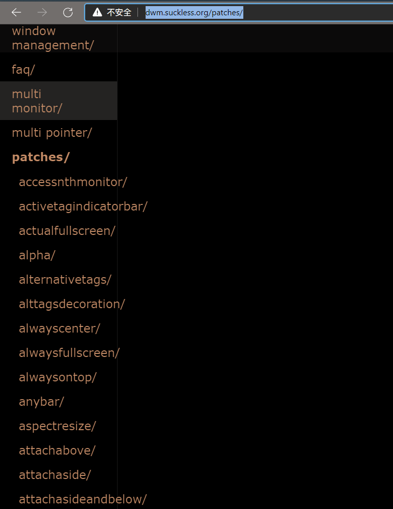
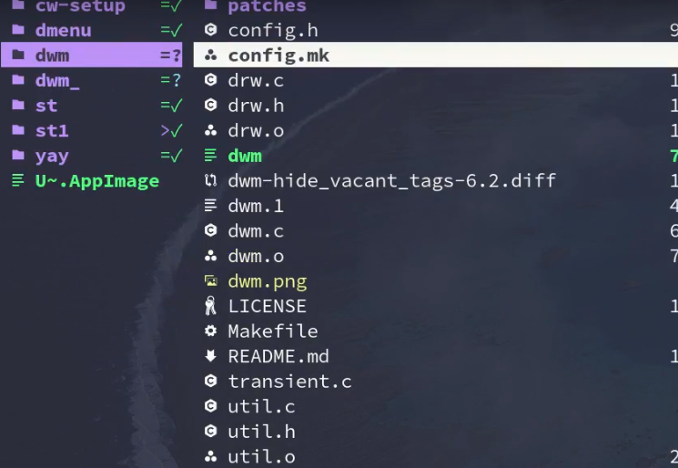
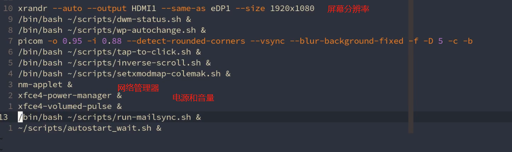
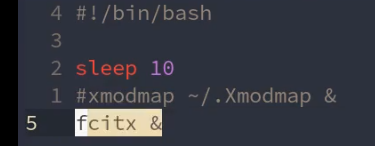
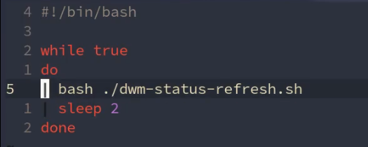
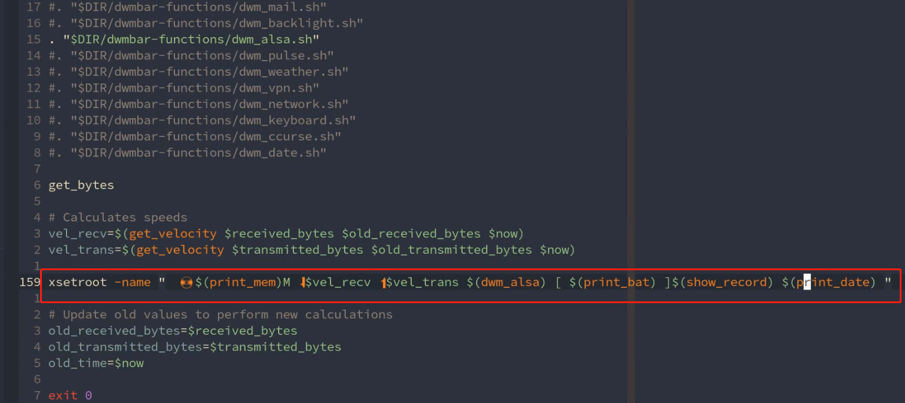
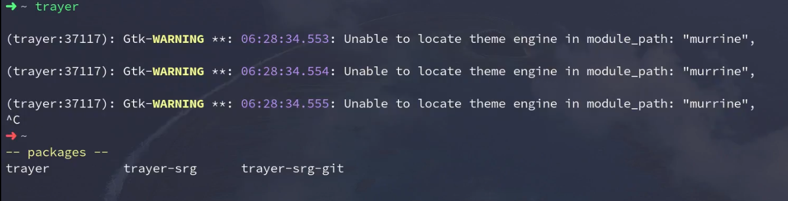
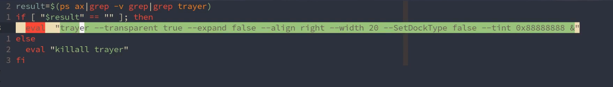

# dwm窗口管理器

[toc]

## 网址

dwm官网：http://dwm.suckless.org/

https://gitee.com/zpyg/dwm

我的dwm：https://github.com/theniceboy/dwm

## dwm

[dwm - dynamic window manager | suckless.org software that sucks less](http://dwm.suckless.org/)

‎dwm是X的动态窗口管理器。它以瓷砖、单体和浮动布局管理窗户。所有布局都可以动态应用，优化使用中的应用环境和执行的任务。‎

在平铺布局中，窗口管理在主区域和堆叠区域。主区域包含当前最需要注意的窗口，而堆叠区域包含所有其他窗口。在单片布局所有窗口都是最大限度的屏幕大小。在浮动布局窗口可以调整大小和自由移动。对话框窗口总是被管理为浮动的，与应用的布局无关。

Windows按标签分组。每个窗口可以用一个或多个标记进行标记。选择某些标记将显示带有这些标记的所有窗口。

每个屏幕都包含一个小的状态栏，它显示所有可用的标记、布局、可见窗口的数量、聚焦窗口的标题，以及从根窗口名称属性读取的文本(如果屏幕被聚焦的话)。一个浮动窗口用一个空的正方形表示，一个最大化的浮动窗口在窗口标题前用一个填充的正方形表示。所选标记用不同的颜色表示。聚焦窗口的标记在左上角用一个填充的正方形表示。应用于一个或多个窗口的标记在左上角用一个空的正方形表示。

DWM在Windows周围绘制一个小的可自定义边框来指示焦点状态。

## install

```
git clone https://github.com/LukeSmithxyz/dwm
cd dwm
sudo make install
```

## 启动

`/etc/X11/xinit/xinitrc`



## 插件和补丁

[dwm.suckless.org](http://dwm.suckless.org/patches/)





### 打补丁

将补丁拷贝到安装主目录



`patch < 补丁名`

## 大屏幕分辨率设置+ 电源和音量




启动后运行程序: 输入法



状态栏





## 系统托盘





