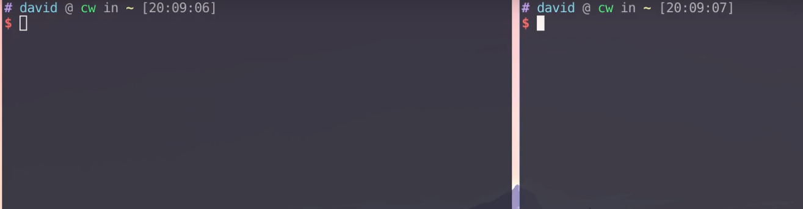
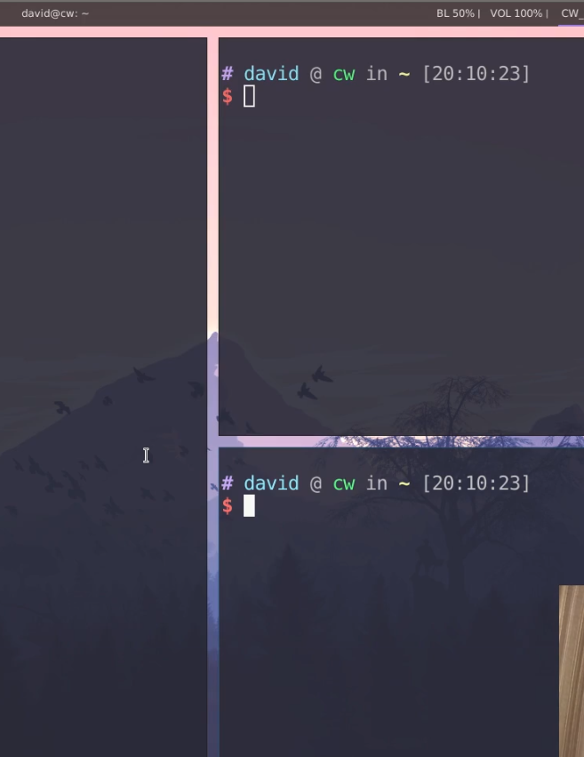
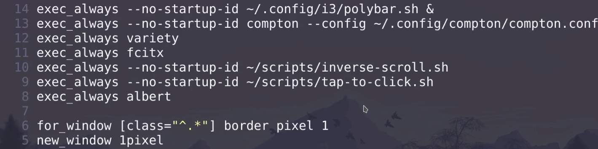
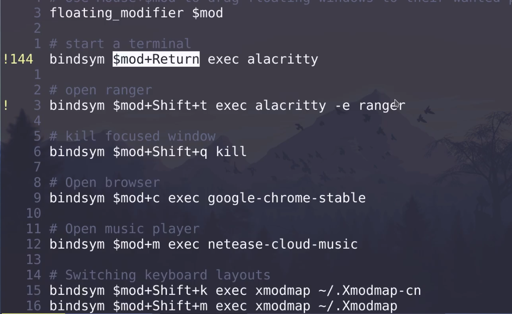
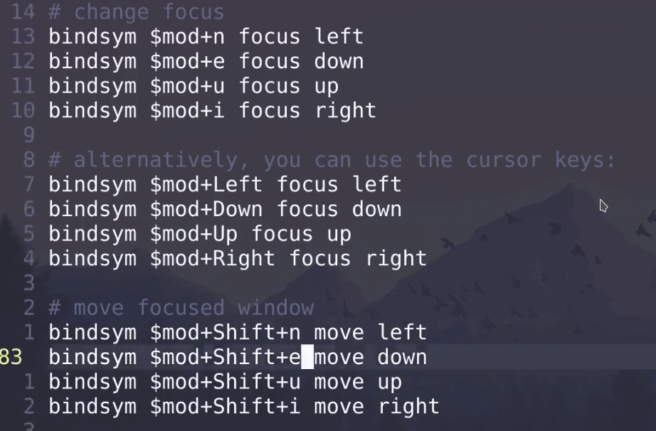
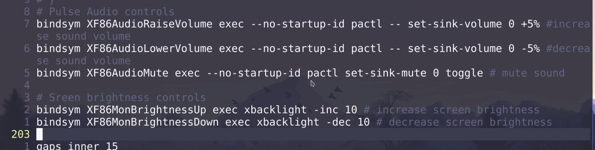
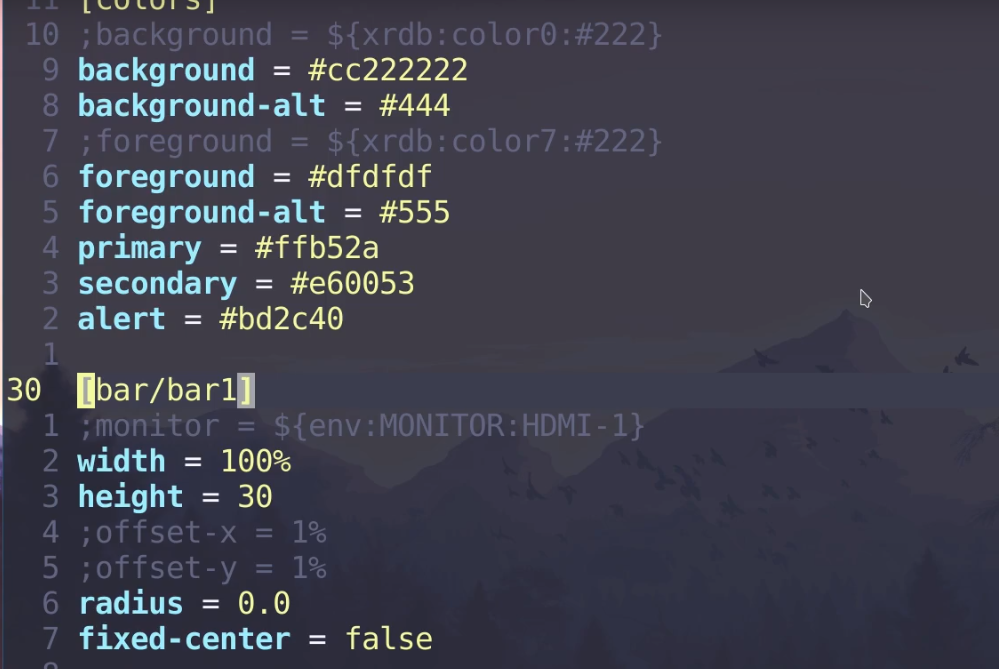
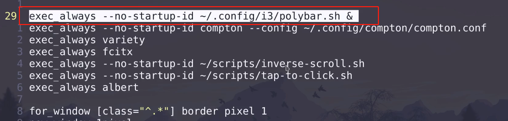
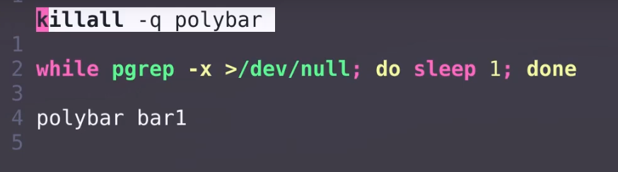

# i3wm的使用和配置

[toc]

## i3wm 安装

`sudo pacman -S i3`

登录时选中i3即可

### mod+<—- mod+—> 左右切换窗口



### mod + h/v 不同分屏



### mod + d 打开dmenu

### mod +t 全屏

## i3配置

`~/.config/i3/config`

### 设置mod键: win键


### 启动项

variety 壁纸



### 绑定按键



### 切换主窗口



### 控制音频大小



## polybar

```bash
# 卸载默认的i3-status
sudo pacman -R i3-status
# 安装polybar
sudo pacman -S polybar
```

### polybar配置

`./config/polybar/config`



### i3中启动polybar



### mod + shift + r 重新加载i3wm 配置

 