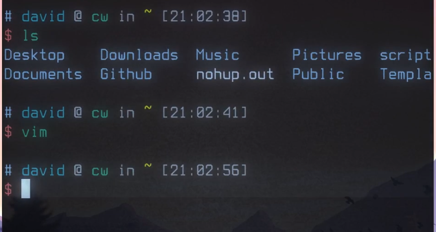

# linux 终端模拟器

[toc]

## alacritty 显卡渲染,速度比较快

显示图片较快,渲染较好

## 配置文件alacritty.yml

实时读取配置文件的.修改保存后立即生效


## 其他的终端cool-retro-term




## 为什么选择 Alacritty

Alacritty 将自己标榜为最快的终端模拟器。事实上它的确要比 iTerm2 流畅不少，这种情况尤其在使用 neovim 的时候明显。

## 安装

```text
# Mac 
brew cask install alacritty

# Ubuntu
sudo apt install alacritty

# Arch
sudo pacman -S alacritty

# Windows
choco install alacritty
```

## 配置

Alacritty 默认不会添加配置文件，需要自己手动添加。

- Linux & Mac

```text
~/.config/alacritty/alacritty.yml
```

- Windows

```text
%APPDATA%\alacritty\alacritty.yml
```

### 我的配置

```text
colors:

  primary:
    background: "#1e2127"
    # background: "#2E3440"
    foreground: "#D8DEE9"


  normal:
    black: "#3B4252"
    red: "#BF616A"
    green: "#A3BE8C"
    yellow: "#EBCB8B"
    blue: "#81A1C1"
    magenta: "#B48EAD"
    cyan: "#88C0D0"
    white: "#abb2bf"


  bright:
    black: "#5c6370"
    red: "#e06c75"
    green: "#98c379"
    yellow: "#d19a66"
    blue: "#61afef"
    magenta: "#c678dd"
    cyan: "#56b6c2"
    white: "#ECEFF4"

background_opacity: 1.0

# 设置字体
font:
  normal:
    family: "Hack Nerd Font"
    style: Regular
  bold:
    family: "Hack Nerd Font"
    style: Bold
  italic:
    family: "Hack Nerd Font"
    style: Italic
  bold_italic:
    family: "Hack Nerd Font"
    style: Bold Italic

  # 字大小
  size: 15.0 

  offset:
    x: 0
    y: 0
  glyph_offset:
    x: 0
    y: 0

window:
  padding:
    x: 2
    y: 2

scrolling:
# 回滚缓冲区中的最大行数,指定“0”将禁用滚动。
  history: 10000

  # 滚动行数 

  multiplier: 10

# 如果为‘true’，则使用亮色变体绘制粗体文本。
draw_bold_text_with_bright_colors: true

selection:
  semantic_escape_chars: ',│`|:"'' ()[]{}<>'
  save_to_clipboard: true

live_config_reload: true

key_bindings:
  - { key: V, mods: command, action: Paste }
  - { key: C, mods: command, action: Copy }
```