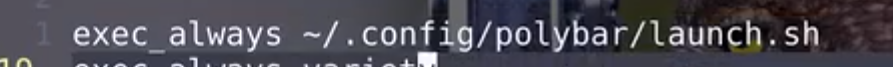

# manjaro安装app

[toc]

## manjaro美化


，之前用了好长时间arch，manjora，没错，自己电脑使用，安装输入法，邮件，QQ，微信，网易云音乐。美化。桌面用了gnome，dde，xface，mate，哎呀，记得那段时间真是脑壳疼，最后还是用了deepin，由于bug太多，最后又换到Windows了。恕我无能啊![[生病]](https://i0.hdslb.com/bfs/emote/0f25ce04ae1d7baf98650986454c634f6612cb76.png@100w_100h.webp)


## manjaro 命令

```bash
# 更新
sudo pacman -Syy # 更新软件源
sudo pacman -Su  # 更新软件
sudo pacman -Syyu # 更新软件源+更新软件
# 在开源仓中查询包
sudo pacman -Ss ^vim  # 查询软件以vim开头的软件	
# 删除缓存
sudo pacman -Sc # 删除下载的本地安装包缓存
# 安装和卸载
sudo pacman -S vlc # 安装vlc软件
sudo pacman -R $name  # 卸载软件
sudo pacman -Rs $name  # 卸载软件和它的依赖
sudo pacman -Rns $name  # 卸载软件和它的依赖+全局配置文件(推荐)
# 查询安装包
sudo pacman -Q # 查询已安装软件 显示版本号
sudo pacman -Qe # 查询你安装的软件
sudo pacman -Qeq # 查询你安装的软件,不显示版本号
sudo pacman -Qs vim # 查询你安装的软件中匹配关键字的包
# 查询未依赖包
sudo pacman -Qdt # 不再需要的包,带版本号,+q去掉版本号
sudo pacma -R $(pacman -Qdtq) # 卸载所有不再被依赖的包
```

## manjaro 配置文件

`sudo vim /etc/pacman.conf`


## 录屏软件simplescreenrecorder

## 捕捉按键screenkey

## vim/code

## fish/oh-my-fish

curl -L https://get.oh-my.fish | fish

### ==fish_config==打开浏览器进行配置fish


### omf 安装插件

omf install wttr 日历


### alias

alias l “ls -la”

funcsave l

alias sodu “sudo -E”

## i3安装后reboot


### i3初始化配置

```bash
## 修改字体大小
echo "Xft.dpi: 200" > ~/.Xresources
reboot


```

### 设置字体

安装alacritty/dmenu/
修改i3配置文件


### xorg

#### 修改键位映射xmodmap


#### xmod -pke 显示所有的键位


#### xev实时显示按键的键号


## lxappearance 主题修改


## feh 换桌面

variety 壁纸切换,+时钟

## 半透明效果 compton

## i3-gaps 窗口边距


## 中文输入法

fcitx-sogoupinyin

vi ~/.xprofile


reboot

## chromium

## 剪辑视频 kdenlive

## 修图gimp

## 邮件 thunderbird

## libreoffice

## vlc视频播放软件

## virtualbox


## electronic-wechat

## 下载工具transmission-* qbittorrent

## ranger

## polybar




