# ranger

[toc]

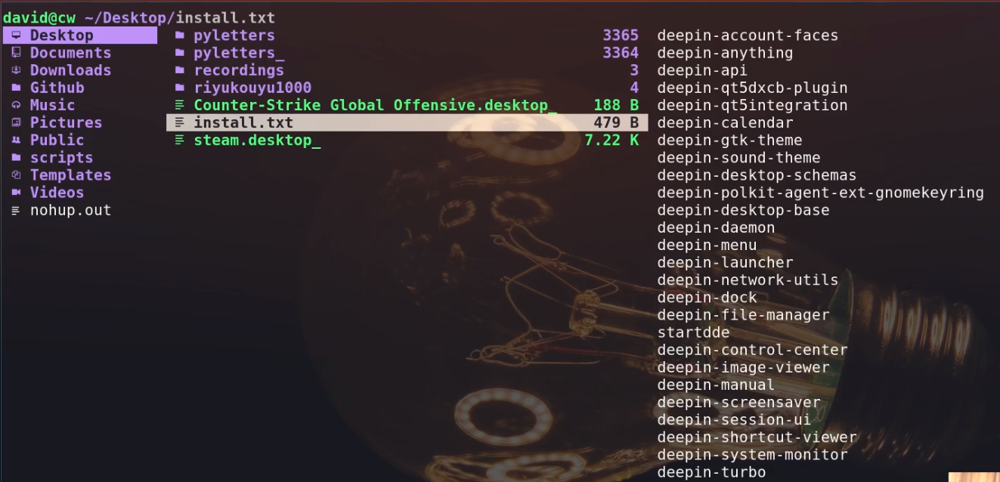

```bash

  - 介绍配置文件的作用 00:28:25
  - 安装 ranger 插件 00:30:35  https://github.com/alexanderjeurissen/ranger_devicons
  - 自定义 commands 00:31:55 https://github.com/ranger/ranger/wiki/Custom-Commands
  - 显示 git 状态 00:34:20
  - 预览图片 00:35:25
    - https://github.com/ranger/ranger/wiki/Image-Previews
    - 如果你使用 alacritty 终端并遇到了图片预览的问题
      - https://github.com/alacritty/alacritty/issues/1021#issuecomment-494718591
      - https://github.com/ranger/ranger/wiki/Image-Previews#with-ueberzug
  - 预览视频 00:37:00
  - 智能 cw 00:38:00 https://github.com/ranger/ranger/wiki/Keybindings
  - 内容查找 00:38:20
  - 下载油管视频 00:39:00
  - 解压缩 00:39:30
    - 需要配合修改 commands.py https://github.com/theniceboy/.config/blob/0d7af920a0c37cc23a7580682b566bd4d15358cb/ranger/commands.py#L53-L152
  - 修改 vim-like 绑定键 00:40:30
  - 结语 00:41:00

2020-10-05 23:1140回复

doublethink_
## 目录 1

- 视频制作动机 00:00:01
- 介绍 ranger 00:00:29
- 使用 ranger 的优势 00:01:00
- 配置 ranger 00:25:00
  - 生成配置文件 00:26:22
  ranger --copy-config=all
  - 禁用默认配置文件 00:26:50
   export RANGER_LOAD_DEFAULT_RC=FALSE
  - 在 ranger 中移动 00:01:22
  -  打开文件 00:05:00
  - 直接移动父目录栏 00:06:55
  - 历史记录跳转 00:07:40
  - 文件夹间跳转 00:07:55
  - 显示隐藏文件的方式 00:08:20
  - 文件排序 00:08:35
  - 文件搜索 00:09:00
  - 退出 ranger 00:10:15
  - 在终端中进入当前 ranger 中的路径 00:10:40
  -  使用 fzf 进行文件搜索 00:11:00  更多请看 FZF：终端下的文件查找器【猛男必备233333】
  - 复制 ranger 当前路径到剪切板 00:12:10
  - 创建文件 00:13:10
  - 修改文件名 00:14:20
  - 批量修改文件名 00:15:10
  - 多选文件 00:15:30
  - 移动文件,删除文件,复制文件 00:16:50
  - 查看文件信息 00:19:50
  - ranger 任务管理 00:20:40
  - 压缩文件,预览压缩文件 00:21:45
  - md 转换为 pdf 00:22:50
  - 下载油管视频文件 00:23:50
```

## ranger插件安装

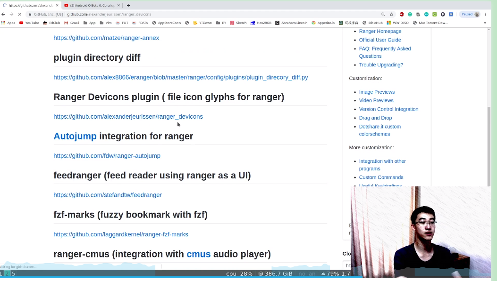

## yp复制当前文件的路径到另一个文件中粘贴

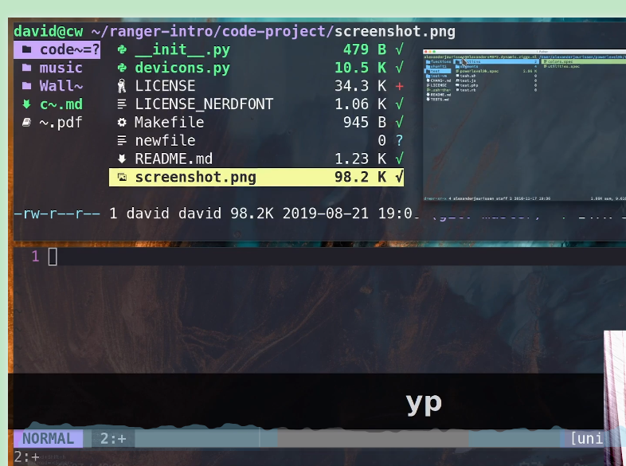

## ranger简介

[.config/rc.conf at master · theniceboy/.config (github.com)](https://github.com/theniceboy/.config/blob/master/ranger/rc.conf)

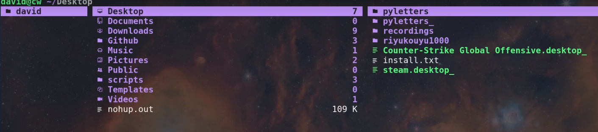

## dmenu 软件快速查找工具条

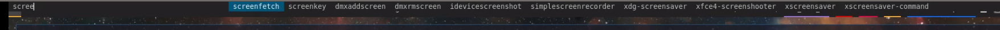

## FZF 文件查找利器

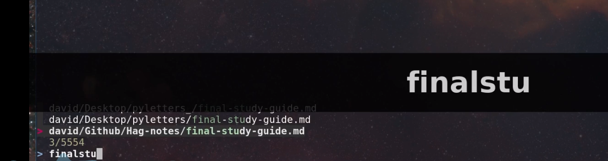

## ranger目录中 `s` 直接跳转至当前光标所在目录

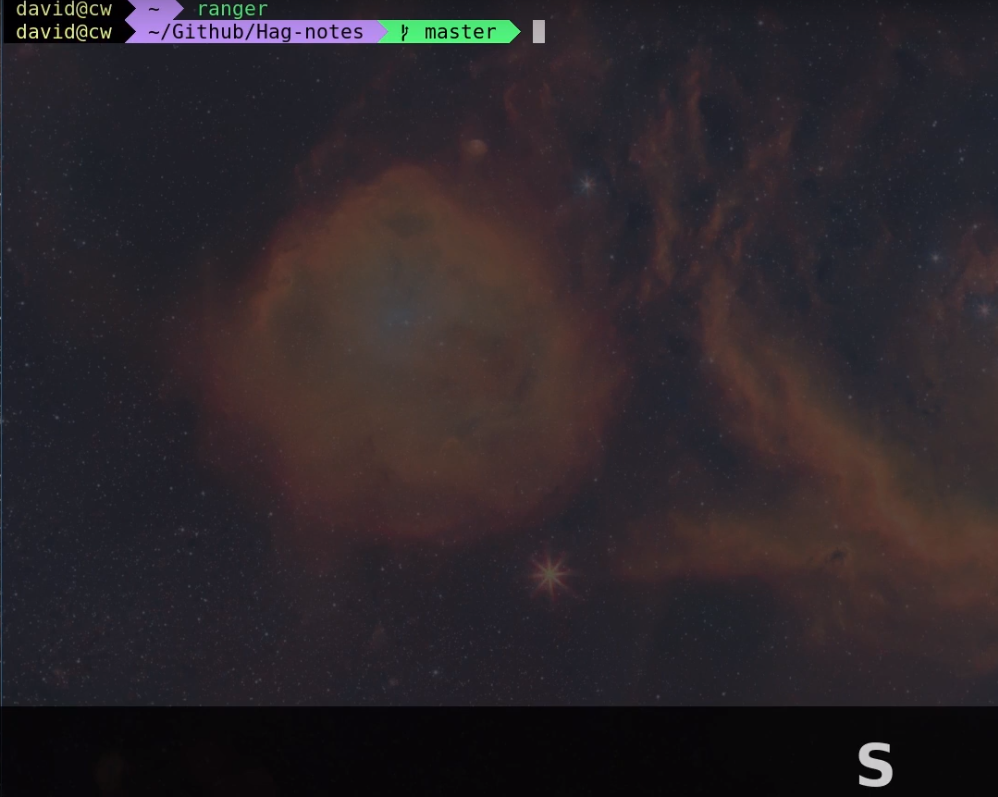

## ranger初始化配置

`ranger --copy-config=rc`

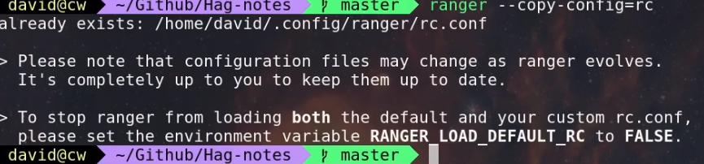

### config配置

`~/.config/ranger/rc.conf`

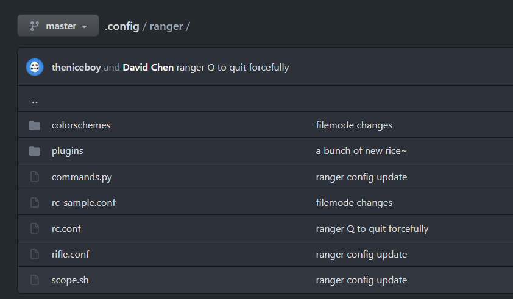

```bash
set viewmode miller

set column_ratios 1,3,4

# Which files should be hidden? (regular expression)
set hidden_filter ^\.|\.(?:pyc|pyo|bak|swp)$|^lost\+found$|^__(py)?cache__$

# Show hidden files? You can toggle this by typing 'zh'
set show_hidden false

# Ask for a confirmation when running the "delete" command?
# Valid values are "always", "never", "multiple" (default)
# With "multiple", ranger will ask only if you delete multiple files at once.
set confirm_on_delete multiple

# Use non-default path for file preview script?
# ranger ships with scope.sh, a script that calls external programs (see
# README.md for dependencies) to preview images, archives, etc.
set preview_script ~/.config/ranger/scope.sh

# Use the external preview script or display simple plain text or image previews?
set use_preview_script true

# Automatically count files in the directory, even before entering them?
set automatically_count_files true

# Open all images in this directory when running certain image viewers
# like feh or sxiv?  You can still open selected files by marking them.
set open_all_images true

# Be aware of version control systems and display information.
set vcs_aware true

# State of the four backends git, hg, bzr, svn. The possible states are
# disabled, local (only show local info), enabled (show local and remote
# information).
set vcs_backend_git enabled
set vcs_backend_hg disabled
set vcs_backend_bzr disabled
set vcs_backend_svn disabled

# Use one of the supported image preview protocols
set preview_images true

# Set the preview image method. Supported methods:
#
# * w3m (default):
#   Preview images in full color with the external command "w3mimgpreview"?
#   This requires the console web browser "w3m" and a supported terminal.
#   It has been successfully tested with "xterm" and "urxvt" without tmux.
#
# * iterm2:
#   Preview images in full color using iTerm2 image previews
#   (http://iterm2.com/images.html). This requires using iTerm2 compiled
#   with image preview support.
#
#   This feature relies on the dimensions of the terminal's font.  By default, a
#   width of 8 and height of 11 are used.  To use other values, set the options
#   iterm2_font_width and iterm2_font_height to the desired values.
#
# * terminology:
#   Previews images in full color in the terminology terminal emulator.
#   Supports a wide variety of formats, even vector graphics like svg.
#
# * urxvt:
#   Preview images in full color using urxvt image backgrounds. This
#   requires using urxvt compiled with pixbuf support.
#
# * urxvt-full:
#   The same as urxvt but utilizing not only the preview pane but the
#   whole terminal window.
#
# * kitty:
#   Preview images in full color using kitty image protocol.
#   Requires python PIL or pillow library.
#   If ranger does not share the local filesystem with kitty
#   the transfer method is changed to encode the whole image;
#   while slower, this allows remote previews,
#   for example during an ssh session.
#   Tmux is unsupported.
set preview_images_method ueberzug

# Delay in seconds before displaying an image with the w3m method.
# Increase it in case of experiencing display corruption.
set w3m_delay 0.02

# Default iTerm2 font size (see: preview_images_method: iterm2)
set iterm2_font_width 8
set iterm2_font_height 11

# Use a unicode "..." character to mark cut-off filenames?
set unicode_ellipsis false

# BIDI support - try to properly display file names in RTL languages (Hebrew, Arabic).
# Requires the python-bidi pip package
set bidi_support false

# Show dotfiles in the bookmark preview box?
set show_hidden_bookmarks true

# Which colorscheme to use?  These colorschemes are available by default:
# default, jungle, snow, solarized
set colorscheme default

# Preview files on the rightmost column?
# And collapse (shrink) the last column if there is nothing to preview?
set preview_files true
set preview_directories true
set collapse_preview true

# Save the console history on exit?
set save_console_history true

# Draw the status bar on top of the browser window (default: bottom)
set status_bar_on_top false

# Draw a progress bar in the status bar which displays the average state of all
# currently running tasks which support progress bars?
set draw_progress_bar_in_status_bar true

# Draw borders around columns? (separators, outline, both, or none)
# Separators are vertical lines between columns.
# Outline draws a box around all the columns.
# Both combines the two.
set draw_borders none

# Display the directory name in tabs?
set dirname_in_tabs true

# Enable the mouse support?
set mouse_enabled true

# Display the file size in the main column or status bar?
set display_size_in_main_column true
set display_size_in_status_bar true

# Display the free disk space in the status bar?
set display_free_space_in_status_bar true

# Display files tags in all columns or only in main column?
set display_tags_in_all_columns true

# Set a title for the window?
set update_title true

# Set the title to "ranger" in the tmux program?
set update_tmux_title true

# Shorten the title if it gets long?  The number defines how many
# directories are displayed at once, 0 turns off this feature.
set shorten_title 3

# Show hostname in titlebar?
set hostname_in_titlebar true

# Abbreviate $HOME with ~ in the titlebar (first line) of ranger?
set tilde_in_titlebar true

# How many directory-changes or console-commands should be kept in history?
set max_history_size 2000
set max_console_history_size 50

# Try to keep so much space between the top/bottom border when scrolling:
set scroll_offset 8

# Flush the input after each key hit?  (Noticeable when ranger lags)
set flushinput true

# Padding on the right when there's no preview?
# This allows you to click into the space to run the file.
set padding_right true

# Save bookmarks (used with mX and `X) instantly?
# This helps to synchronize bookmarks between multiple ranger
# instances but leads to *slight* performance loss.
# When false, bookmarks are saved when ranger is exited.
set autosave_bookmarks true

# Save the "`" bookmark to disk.  This can be used to switch to the last
# directory by typing "``".
set save_backtick_bookmark true

# You can display the "real" cumulative size of directories by using the
# command :get_cumulative_size or typing "dc".  The size is expensive to
# calculate and will not be updated automatically.  You can choose
# to update it automatically though by turning on this option:
set autoupdate_cumulative_size false

# Turning this on makes sense for screen readers:
set show_cursor false

# One of: size, natural, basename, atime, ctime, mtime, type, random
set sort natural

# Additional sorting options
set sort_reverse false
set sort_case_insensitive true
set sort_directories_first true
set sort_unicode false

# Enable this if key combinations with the Alt Key don't work for you.
# (Especially on xterm)
set xterm_alt_key false

# Whether to include bookmarks in cd command
set cd_bookmarks true

# Changes case sensitivity for the cd command tab completion
set cd_tab_case insensitive

# Use fuzzy tab completion with the "cd" command. For example,
# ":cd /u/lo/b<tab>" expands to ":cd /usr/local/bin".
set cd_tab_fuzzy true

# Avoid previewing files larger than this size, in bytes.  Use a value of 0 to
# disable this feature.
set preview_max_size 0

# The key hint lists up to this size have their sublists expanded.
# Otherwise the submaps are replaced with "...".
set hint_collapse_threshold 10

# Add the highlighted file to the path in the titlebar
set show_selection_in_titlebar true

# The delay that ranger idly waits for user input, in milliseconds, with a
# resolution of 100ms.  Lower delay reduces lag between directory updates but
# increases CPU load.
set idle_delay 2000

# When the metadata manager module looks for metadata, should it only look for
# a ".metadata.json" file in the current directory, or do a deep search and
# check all directories above the current one as well?
set metadata_deep_search false

# Clear all existing filters when leaving a directory
set clear_filters_on_dir_change true

# Disable displaying line numbers in main column.
# Possible values: false, absolute, relative.
set line_numbers false

# When line_numbers=relative show the absolute line number in the
# current line.
set relative_current_zero false

# Start line numbers from 1 instead of 0
set one_indexed false

# Save tabs on exit
set save_tabs_on_exit true

# Enable scroll wrapping - moving down while on the last item will wrap around to
# the top and vice versa.
set wrap_scroll false

# Set the global_inode_type_filter to nothing.  Possible options: d, f and l for
# directories, files and symlinks respectively.
set global_inode_type_filter

# This setting allows to freeze the list of files to save I/O bandwidth.  It
# should be 'false' during start-up, but you can toggle it by pressing F.
set freeze_files false

# ===================================================================
# == Local Options
# ===================================================================
# You can set local options that only affect a single directory.

# Examples:
# setlocal path=~/downloads sort mtime

# ===================================================================
# == Command Aliases in the Console
# ===================================================================

alias e     edit
alias q     quit
alias q!    quit!
alias qa    quitall
alias qa!   quitall!
alias qall  quitall
alias qall! quitall!
alias setl  setlocal

alias filter     scout -prts
alias find       scout -aets
alias mark       scout -mr
alias unmark     scout -Mr
alias search     scout -rs
alias search_inc scout -rts
alias travel     scout -aefklst


# ===================================================================
# == Define keys for the browser
# ===================================================================

# Basic
map q quit
map Q quit!
map ; console
map : console
map V console shell nvim%space 
map T console shell touch%space 
map r  chain draw_possible_programs; console open_with%space

map R     reload_cwd
map F     set freeze_files!
map <C-r> reset
map <C-l> redraw_window
map <C-c> abort
map <esc> change_mode normal
map ` set viewmode!

map <c-e> scroll_preview 5
map <c-u> scroll_preview -5
#map ? help
map W display_log
map w taskview_open
map S shell $SHELL

# Change the line mode
map mf linemode filename
map mi linemode fileinfo
map mm linemode mtime
map mh linemode humanreadablemtime
map mp linemode permissions
map ms linemode sizemtime
map mH linemode sizehumanreadablemtime
map mt linemode metatitle

map <Space> mark_files toggle=True
map v       mark_files all=True toggle=True
map <c-v>   toggle_visual_mode
map lv      toggle_visual_mode reverse=True

map <C-c> abort
map w taskview_open

# Jumping around
map to console cd%space

map H     history_go -1
map L     history_go 1
map ]     move_parent 1
map [     move_parent -1
#map }     traverse

map <CR> toggleVCS

# Open lazygit
map <c-g> shell lazygit
map <c-n> shell lazynpm

# locations
map gh cd ~
map gi cd ~/Github
map gD cd ~/Desktop
map gd cd ~/Downloads
map gfa cd ~/.config/alacritty
map gff cd ~/.config
map gfr cd ~/.config/ranger
map gfb cd ~/.config/bin
map gfn cd ~/.config/nvim
map gfm cd ~/.config/mutt
map gfz cd ~/.config/zsh
map gft cd ~/.config/tmux
map gfl cd ~/.config/jesseduffield/lazygit/
map gfd cd ~/prog/dwm/
map gfs cd ~/prog/st/
map gF cd ~/.sconfig
map gs cd ~/scripts
map ge cd /etc
map guu cd /usr
map gub cd /usr/bin
map gul cd /usr/local
map gus cd /usr/share
map guf cd /usr/share/fonts
map gud cd /usr/share/doc
map go cd ~/OneDrive
map gv cd /var
map gm cd /run/media
map gM cd /mnt
map gG cd ~/go/src
map gp cd ~/prog
map gw cd ~/Pictures/wallpapers
source ~/.sconfig/ranger/rc.conf


# In case you work on a keyboard with dvorak layout
map <UP>       move up=1
map <DOWN>     move down=1
map <LEFT>     move left=1
map <RIGHT>    move right=1
map <HOME>     move to=0
map <END>      move to=-1
map <PAGEDOWN> move down=1   pages=True
map <PAGEUP>   move up=1     pages=True
#map <CR>       move right=1
#map <DELETE>   console delete
map <INSERT>   console touch%space


# VIM-like
copymap <UP>       u
copymap <DOWN>     e
copymap <LEFT>     n
copymap <RIGHT>    i
copymap <HOME>     gg
copymap <END>      G
map E move down=5
map U move up=5
#copymap <PAGEDOWN> <C-E>
#copymap <PAGEUP>   <C-U>


# External Programs
map du shell -p du --max-depth=1 -h --apparent-size
map dU shell -p du --max-depth=1 -h --apparent-size | sort -rh
map yp yank path
map yd yank dir
map yn yank name
map y. yank name_without_extension

# Filesystem Operations

# diff
map df console open_with colordiff

map M console mkcd%space

map + chmod

map cw eval fm.execute_console("bulkrename") if fm.thisdir.marked_items else fm.open_console("rename ")
#map cw console rename%space
#map cW console bulkrename
map a  rename_append
map A  eval fm.open_console('rename ' + fm.thisfile.relative_path.replace("%", "%%"))
map k  eval fm.open_console('rename ' + fm.thisfile.relative_path.replace("%", "%%"), position=7)

map pp paste
map po paste overwrite=True
map pP paste append=True
map pO paste overwrite=True append=True
map pl paste_symlink relative=False
map pL paste_symlink relative=True
map phl paste_hardlink
map pht paste_hardlinked_subtree

map dD console delete

map dd cut
map ld uncut
map da cut mode=add
map dr cut mode=remove
map dt cut mode=toggle

map yy copy
map ly uncut
map ya copy mode=add
map yr copy mode=remove
map yt copy mode=toggle

map C console compress%space
map X console extracthere%space
map cp shell pandoc %f -o %f.pdf
map ytv console shell youtube-dl -ic%space
map yta console shell youtube-dl -xic%space

# Filesystem Operations
map mo  chmod

# Searching
map /  console search%space
map =  search_next
map -  search_next forward=False
map <C-f> fzf_select
map f console scout -ftsea%space

# Tabs
map tu     tab_new
map ti     tab_move 1
map tn   tab_move -1
map lq        tab_restore
map tmi     tab_shift 1
map tmn     tab_shift -1

# Sorting
map or set sort_reverse!
map oz set sort=random
map os chain set sort=size;      set sort_reverse=False
map ob chain set sort=basename;  set sort_reverse=False
map on chain set sort=natural;   set sort_reverse=False
map om chain set sort=mtime;     set sort_reverse=False
map oc chain set sort=ctime;     set sort_reverse=False
map oa chain set sort=atime;     set sort_reverse=False
map ot chain set sort=type;      set sort_reverse=False
map oe chain set sort=extension; set sort_reverse=False

map oS chain set sort=size;      set sort_reverse=True
map oB chain set sort=basename;  set sort_reverse=True
map oN chain set sort=natural;   set sort_reverse=True
map oM chain set sort=mtime;     set sort_reverse=True
map oC chain set sort=ctime;     set sort_reverse=True
map oA chain set sort=atime;     set sort_reverse=True
map oT chain set sort=type;      set sort_reverse=True
map oE chain set sort=extension; set sort_reverse=True

map dc get_cumulative_size

# Settings
map zc    set collapse_preview!
map zd    set sort_directories_first!
map zh    set show_hidden!
map <C-h> set show_hidden!
copymap <C-h> <backspace>
copymap <backspace> <backspace2>
map zI    set flushinput!
map zi    set preview_images!
map zm    set mouse_enabled!
map zp    set preview_files!
map zP    set preview_directories!
map zs    set sort_case_insensitive!
map zu    set autoupdate_cumulative_size!
map zv    set use_preview_script!
map zf    console filter%space
# copymap zf zz


# Bookmarks
#map `<any>  enter_bookmark %any
#map '<any>  enter_bookmark %any
#map m<any>  set_bookmark %any
#map dm<any> unset_bookmark %any

#map m<bg>   draw_bookmarks
#copymap m<bg>  lm<bg> `<bg> '<bg>

# ===================================================================
# == Taskview Keybindings
# ===================================================================

# Movement
tmap <up>        taskview_move up=1
tmap <down>      taskview_move down=1
tmap <home>      taskview_move to=0
tmap <end>       taskview_move to=-1
tmap <pagedown>  taskview_move down=1.0  pages=True
tmap <pageup>    taskview_move up=1.0    pages=True
#tmap <C-d>       taskview_move down=0.5  pages=True
#tmap <C-u>       taskview_move up=0.5    pages=True

copytmap <UP>       u
copytmap <DOWN>     e
copytmap <HOME>     gg
copytmap <END>      G
copytmap <PAGEDOWN> <C-E>
copytmap <PAGEUP>   <C-U>

# Changing priority and deleting tasks
tmap <C-E>      eval -q fm.ui.taskview.task_move(-1)
tmap <C-U>      eval -q fm.ui.taskview.task_move(0)
tmap dd         eval -q fm.ui.taskview.task_remove()
#tmap <pagedown> eval -q fm.ui.taskview.task_move(-1)
#tmap <pageup>   eval -q fm.ui.taskview.task_move(0)
tmap <delete>   eval -q fm.ui.taskview.task_remove()

# Basic
#tmap <C-l> redraw_window
tmap <ESC> taskview_close
copytmap <ESC> q Q w <C-c>


# ===================================================================
# == Define keys for the console
# ===================================================================
# Note: Unmapped keys are passed directly to the console.

# Basic
cmap <tab>   eval fm.ui.console.tab()
cmap <s-tab> eval fm.ui.console.tab(-1)
cmap <ESC>   eval fm.ui.console.close()
cmap <CR>    eval fm.ui.console.execute()
cmap <C-l>   redraw_window

copycmap <ESC> <C-c>
copycmap <CR>  <C-j>

# Move around
cmap <up>    eval fm.ui.console.history_move(-1)
cmap <down>  eval fm.ui.console.history_move(1)
cmap <left>  eval fm.ui.console.move(left=1)
cmap <right> eval fm.ui.console.move(right=1)
cmap <home>  eval fm.ui.console.move(right=0, absolute=True)
cmap <end>   eval fm.ui.console.move(right=-1, absolute=True)
cmap <a-b> eval fm.ui.console.move_word(left=1)
cmap <a-f> eval fm.ui.console.move_word(right=1)

copycmap <a-b> <a-left>
copycmap <a-f> <a-right>

# Line Editing
cmap <backspace>  eval fm.ui.console.delete(-1)
cmap <delete>     eval fm.ui.console.delete(0)
cmap <C-w>        eval fm.ui.console.delete_word()
cmap <A-d>        eval fm.ui.console.delete_word(backward=False)
cmap <C-k>        eval fm.ui.console.delete_rest(1)
cmap <C-u>        eval fm.ui.console.delete_rest(-1)
cmap <C-y>        eval fm.ui.console.paste()

# And of course the emacs way
copycmap <ESC>       <C-g>
copycmap <up>        <C-p>
copycmap <down>      <C-n>
copycmap <left>      <C-b>
copycmap <right>     <C-f>
copycmap <home>      <C-a>
copycmap <end>       <C-e>
copycmap <delete>    <C-d>
copycmap <backspace> <C-h>

# Note: There are multiple ways to express backspaces.  <backspace> (code 263)
# and <backspace2> (code 127).  To be sure, use both.
copycmap <backspace> <backspace2>

# This special expression allows typing in numerals:
cmap <allow_quantifiers> false


# a plugin that adds file glyphs / icon support to Ranger:
# https://github.com/alexanderjeurissen/ranger_devicons
default_linemode devicons
```

### ranger基本操作

`V` 新建文件

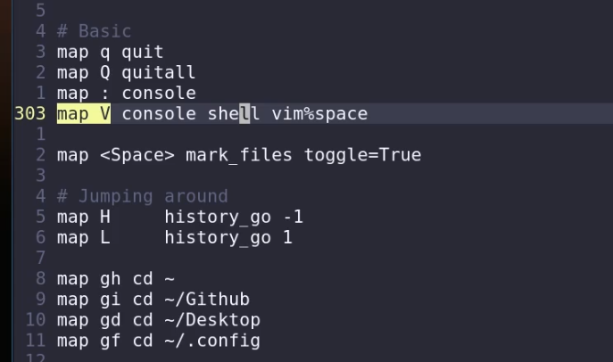

### 修改文件名 cw i a

```bash
map cw eval fm.execute_console("bulkrename") if fm.thisdir.marked_items else fm.open_console("rename ")
#map cw console rename%space
#map cW console bulkrename
map a  rename_append
map A  eval fm.open_console('rename ' + fm.thisfile.relative_path.replace("%", "%%"))
map k  eval fm.open_console('rename ' + fm.thisfile.relative_path.replace("%", "%%"), position=7)
```

==批量修改多个文件名==:bulkrename

`map cW console bulkrename`

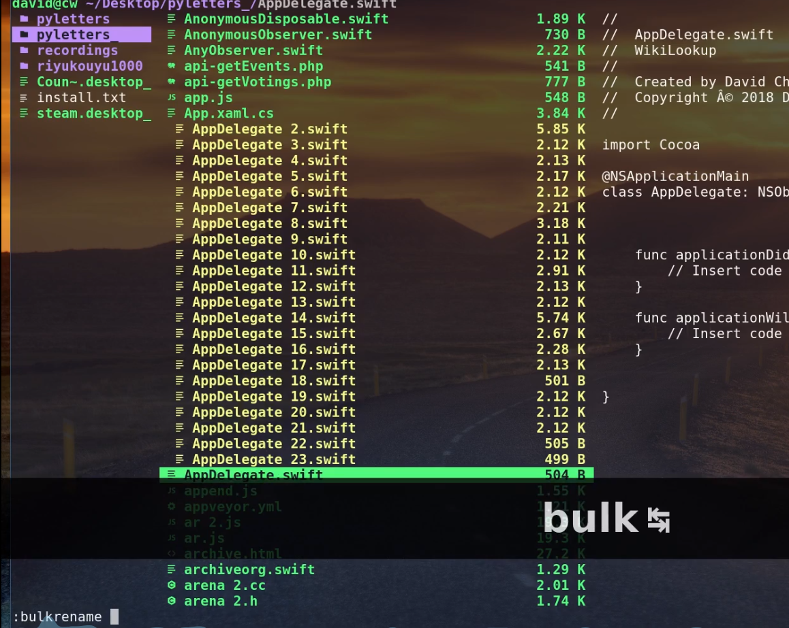

### 删除文件或文件夹 dD

```bash
map dD console delete

map dd cut
map ld uncut
map da cut mode=add
map dr cut mode=remove
map dt cut mode=toggle
```

### 选中 单选用空格,全选V  

```bah
map <Space> mark_files toggle=True
map v       mark_files all=True toggle=True
map <c-v>   toggle_visual_mode
map lv      toggle_visual_mode reverse=True
```

### 显示隐藏文件夹`zh`

```bash
# Settings
map zc    set collapse_preview!
map zd    set sort_directories_first!
map zh    set show_hidden!
map <C-h> set show_hidden!
copymap <C-h> <backspace>
copymap <backspace> <backspace2>
map zI    set flushinput!
map zi    set preview_images!
map zm    set mouse_enabled!
map zp    set preview_files!
map zP    set preview_directories!
map zs    set sort_case_insensitive!
map zu    set autoupdate_cumulative_size!
map zv    set use_preview_script!
map zf    console filter%space
# copymap zf zz
```

## 显示文件夹大小并排序 `dU`

```bash
# External Programs
map du shell -p du --max-depth=1 -h --apparent-size
map dU shell -p du --max-depth=1 -h --apparent-size | sort -rh
map yp yank path
map yd yank dir
map yn yank name
map y. yank name_without_extension
```

## 文件排序

```bash
# Sorting
map or set sort_reverse!
map oz set sort=random
map os chain set sort=size;      set sort_reverse=False
map ob chain set sort=basename;  set sort_reverse=False
map on chain set sort=natural;   set sort_reverse=False
map om chain set sort=mtime;     set sort_reverse=False
map oc chain set sort=ctime;     set sort_reverse=False
map oa chain set sort=atime;     set sort_reverse=False
map ot chain set sort=type;      set sort_reverse=False
map oe chain set sort=extension; set sort_reverse=False

map oS chain set sort=size;      set sort_reverse=True
map oB chain set sort=basename;  set sort_reverse=True
map oN chain set sort=natural;   set sort_reverse=True
map oM chain set sort=mtime;     set sort_reverse=True
map oC chain set sort=ctime;     set sort_reverse=True
map oA chain set sort=atime;     set sort_reverse=True
map oT chain set sort=type;      set sort_reverse=True
map oE chain set sort=extension; set sort_reverse=True

map dc get_cumulative_size
```

## tab页

```bash
# Tabs
map tu     tab_new
map ti     tab_move 1
map tn   tab_move -1
map lq        tab_restore
map tmi     tab_shift 1
map tmn     tab_shift -1
```

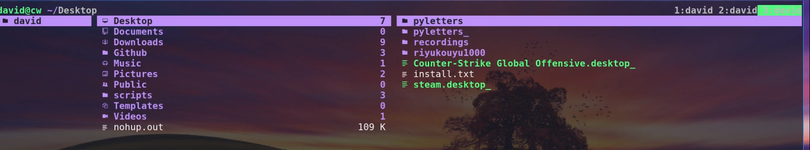

## 切换路径

```bash
# locations
map gh cd ~
map gi cd ~/Github
map gD cd ~/Desktop
map gd cd ~/Downloads
map gfa cd ~/.config/alacritty
map gff cd ~/.config
map gfr cd ~/.config/ranger
map gfb cd ~/.config/bin
map gfn cd ~/.config/nvim
map gfm cd ~/.config/mutt
map gfz cd ~/.config/zsh
map gft cd ~/.config/tmux
map gfl cd ~/.config/jesseduffield/lazygit/
map gfd cd ~/prog/dwm/
map gfs cd ~/prog/st/
map gF cd ~/.sconfig
map gs cd ~/scripts
map ge cd /etc
map guu cd /usr
map gub cd /usr/bin
map gul cd /usr/local
map gus cd /usr/share
map guf cd /usr/share/fonts
map gud cd /usr/share/doc
map go cd ~/OneDrive
map gv cd /var
map gm cd /run/media
map gM cd /mnt
map gG cd ~/go/src
map gp cd ~/prog
map gw cd ~/Pictures/wallpapers
source ~/.sconfig/ranger/rc.conf
```

## 搜索`/`   `/ra + tab` 自动跳转到匹配的位置

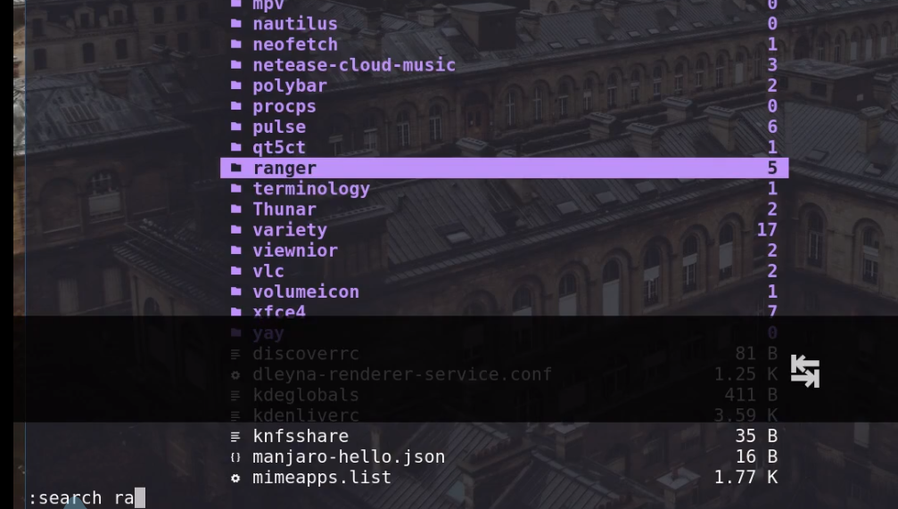

## ranger 默认使用nano打开文件

==ranger默认用nano打开，如何修改。卸载nano后打不开文件==

1. 卸了nano然后sudo ln -s /usr/bin/vim /usr/bin/nano

2. 在终端输入select-editor 命令  就可以重新选择了

3. echo export EDITOR=/usr/bin/vim >> ~/.zshrc
   直接修改系统的默认文本编辑器，ranger里面也跟着变了，nice

## fish 中添加ranger加载配置文件设置

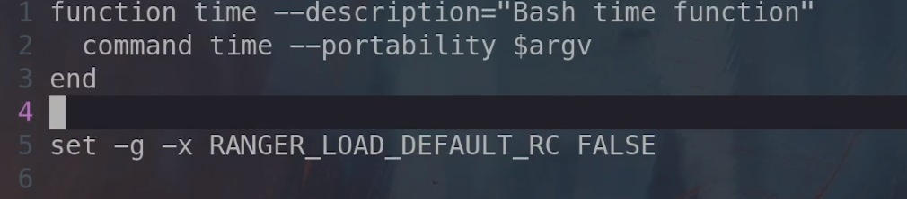

## ranger 图片预览:

1. w3m 显示图片用到的工具

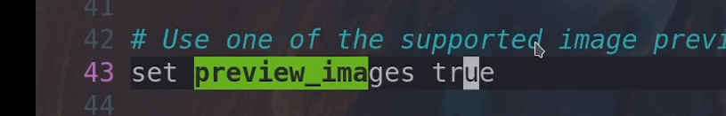


如果还不能预览图片,换一个终端继续使用

2. iterm设置预览图片

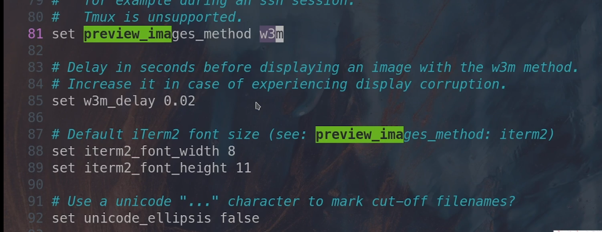

## 查找文件或文件内容


## 下载YouTube视频 + 压缩/解压缩

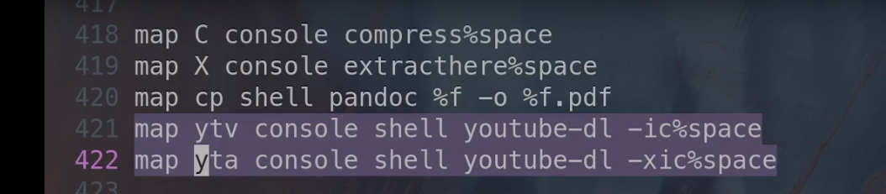

`sudo pacan -S youtube-dl` 先安装这个工具

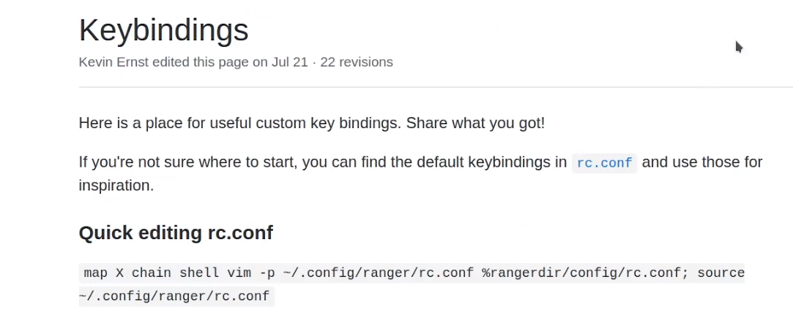

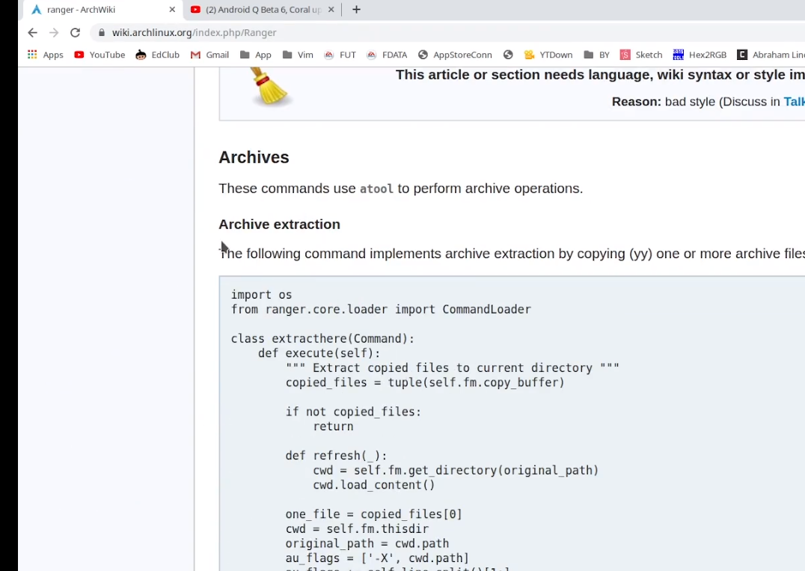

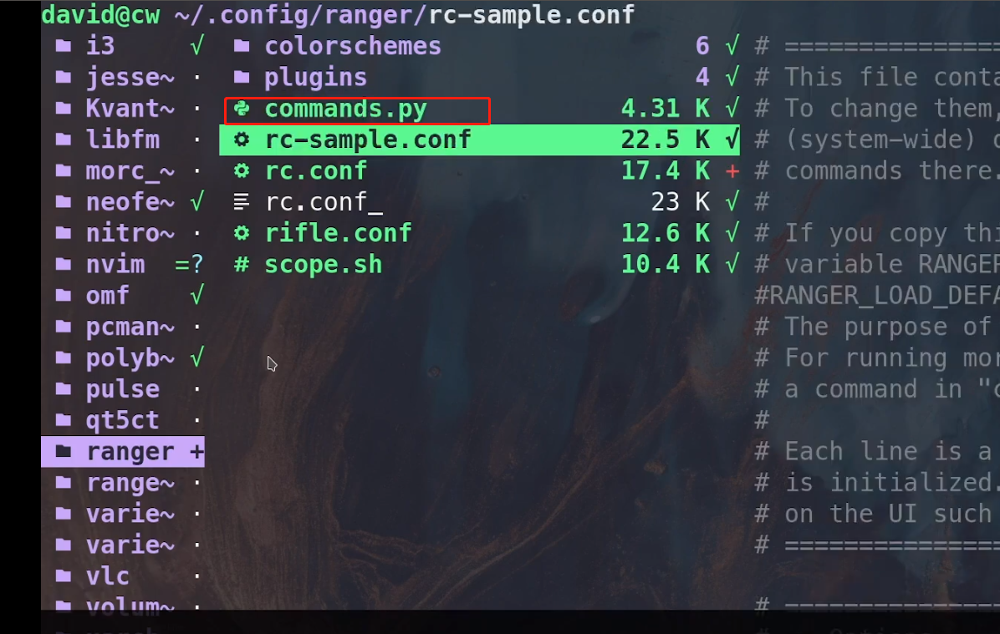

## comac键盘键位映射

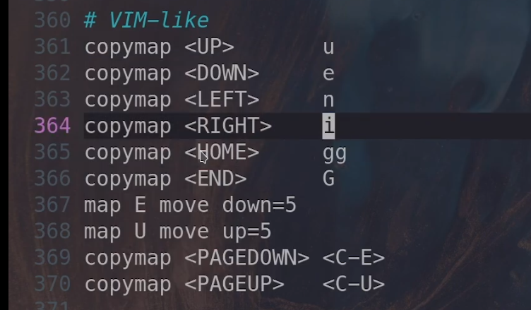

