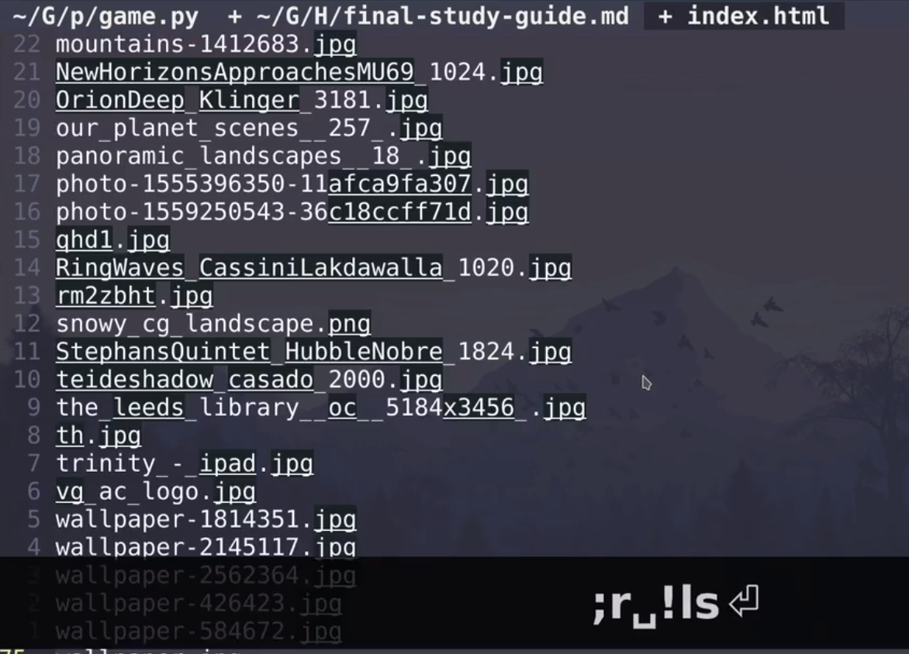
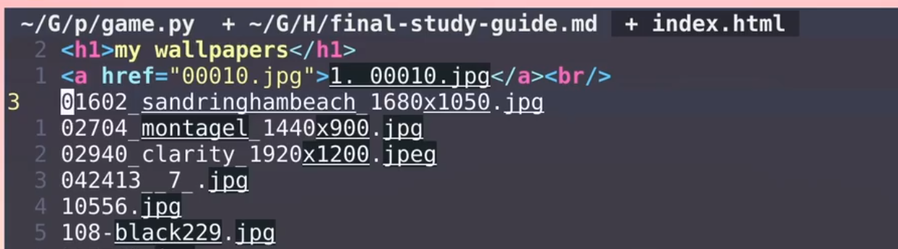
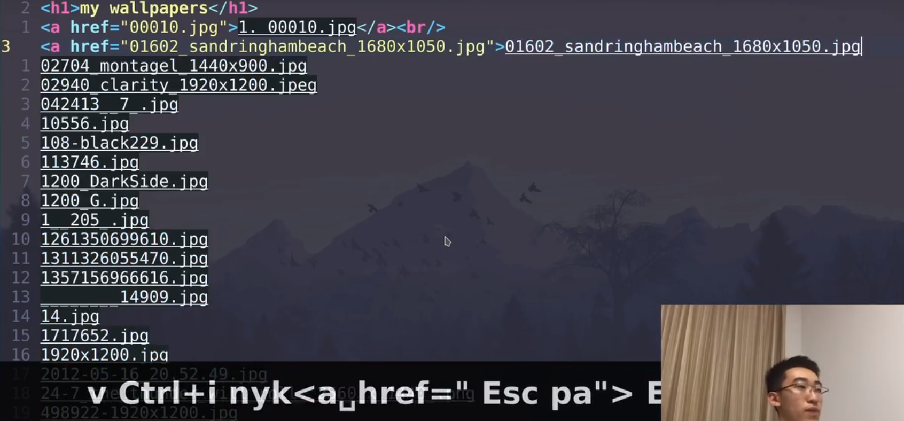
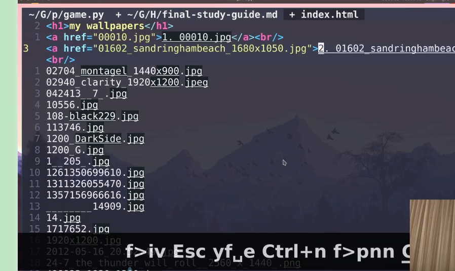
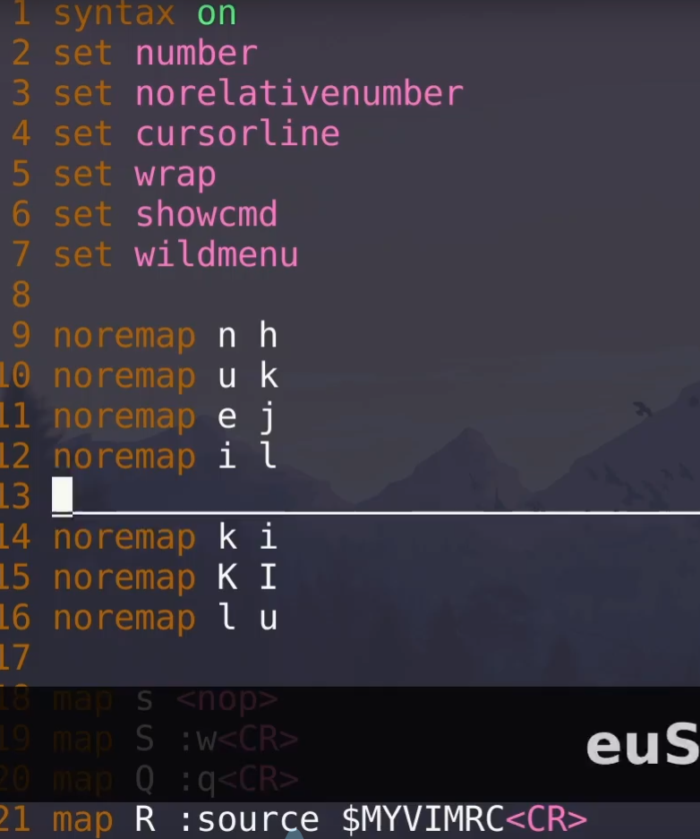
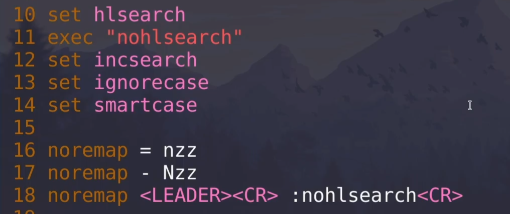
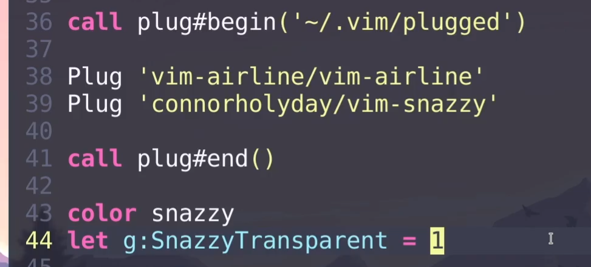

# VIM 上古神器

[toc]

## 将命令执行结果打印到文件中

# vim数字输入（加1，减1）大小写切换

数字加减：普通模式下:ctrl+a(+) ctrl+x(-)

- ~：切换光标所在位置的字符的大小写形式，大写转换为小写，小写转换为大写
- 3~：将光标位置开始的3个字母改变其大小写

 

  https://blog.csdn.net/lanchunhui/article/details/51542211

  注意以下均是在，normal mode（普通模式）下操作的。

\1. 单个字符的处理

  ~：切换光标所在位置的字符的大小写形式，大写转换为小写，小写转换为大写
  3~：将光标位置开始的3个字母改变其大小写

\2. 文本整体的处理

gu：切换为小写，gU：切换为大写，剩下的就是对这两个命令的限定（限定行字母和单词）等等。
2.1 整篇文章

无须进入命令行模式，键入：

  ggguG：整篇文章转换为小写，gg：文件头，G：文件尾，gu：切换为小写
  gggUG：整篇文章切换为大写，gg：文件头，G：文件尾，gU：切换为大写

2.2 只转化某个单词

  guw、gue
  gUw、gUe
  gu5w：转换 5 个单词
  gU5w

2.3 转换行

  gU0 ：从光标所在位置到行首，都变为大写
  gU$ ：从光标所在位置到行尾，都变为大写
  gUG ：从光标所在位置到文章最后一个字符，都变为大写
  gU1G ：从光标所在位置到文章第一个字符，都变为大写  
\---------------------  

## 键位配置

搜索并高亮

snazzy主题安装和透明效果设置

顶i 写入模式、i插入之前、a插入之后、A行尾插入、I行首插入、o下行插入、O上行插入
x 删除光标后一个字符
d + ←→删除光标←→字符（d +3←）、dd删除一行（其实是剪切，p粘贴）
y+ ←→复制光标←→字符 （y+3←）
c 删除并进入写入模式、w 光标向下移动一个词、cw删除一个词并进入写入模式、b光标到上一个词 、ciw词中删除一个词并进入写入模式，yi
f 找词
/ 搜索、n下 N上
【y i c d f 】
esc 回到正常模式
：w保存
：q退出vim
：source $MYVIMRC 刷新vim
jkhl上下左右
：split 上下分屏 、：vsplit 左右分屏 Q退出
~/.vim/vimrc
noremap a b a键改b键
map a b a键改b键
syntax on 打开高亮
set number 显示行号
set wildmenu   ：命令补全
set hlsearch  /搜索高亮
set incsearch  一面输入一面高亮
set ignorecase 忽略大小写43：35美化！

