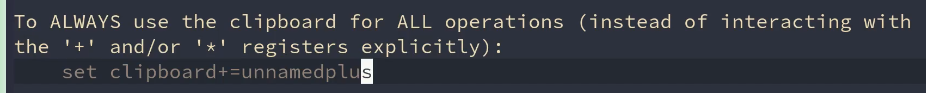

# vim 复制和粘贴

[toc]

## y0 复制 当前光标到行首(不包括当前光标) 也就是左闭右开

## y$ 复制 当前光标到行末(包括当前光标) 左闭右闭

## p 粘贴

## "+yy (双引号 加号 yy) 复制当前行到系统剪切板中, 在vim外可以用cv粘贴

## "ayy 复制当前行到a寄存器中

## "ap 粘贴a寄存器中的值

## "Ayy 追加当前当到a寄存器.

## "byy 复制当前行到b寄存器

## 可以设置vim使用系统剪切板 在init.vim中添加 `set clipboard=unnamedplus`

### ==vim下的复制都是剪切==
x剪切
c复制
### vim剪切板和系统剪切板不是共享的
让vim和系统剪切板共享

## 插件 coc.nvim 可以查看剪切板历史
## 插件 vim-peekaboo 可以预览像之前寄存器a, b的内容.

+p 如果不能成功复制到系统剪切板的的话, 需要查看vim是否具有该功能 在终端执行 `vim --version | grep clipboard` 查找Clipboard是否正常(- 代表没有此功能), 不正常, 执行 `sudo apt install vim-gtk` 即可

