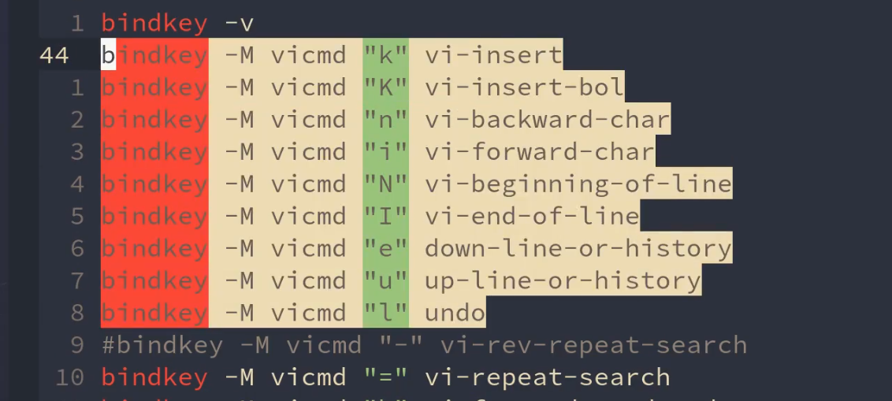
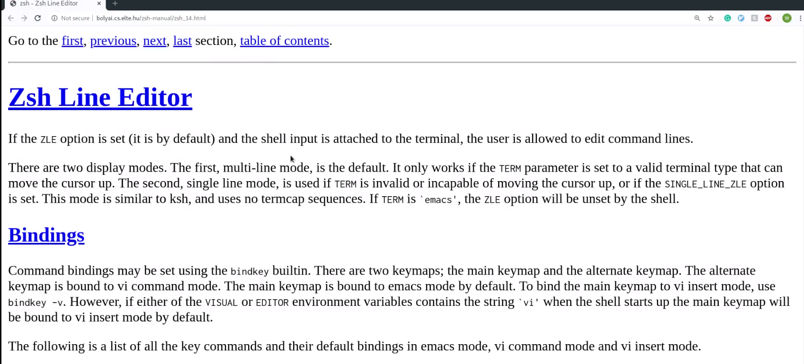
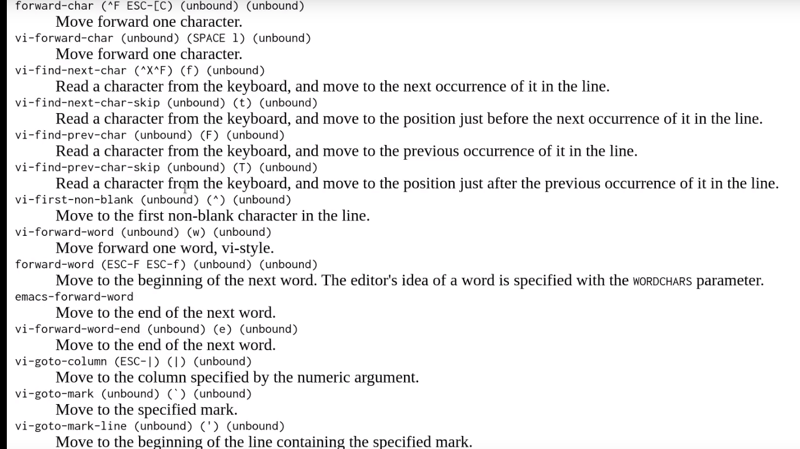
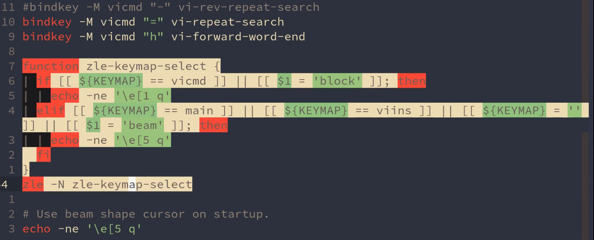

# zsh VI-mode

[toc]

## zsh 的vi模式

`~/.config/zsh/zshrc`

所有可定义的快捷键：http://bolyai.cs.elte.hu/zsh-manual/zsh_14.html

我的zshrc：https://github.com/theniceboy/.config/blob/master/zsh/zshrc

修改zsh中光标显示样式

