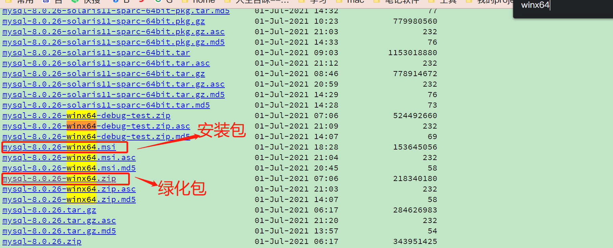
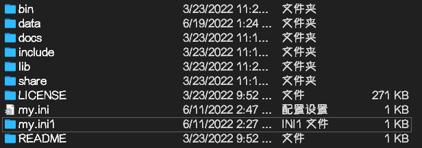
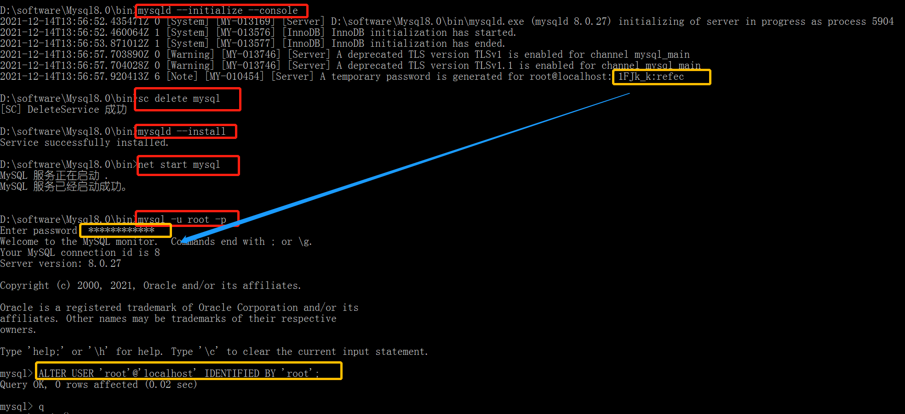

# mysql 8.0.21.zip安装配置方法图文教程(windows 64位)

[toc]

## 先去[**官网**](https://dev.mysql.com/downloads/mysql/)**下载点击的MySQL的下载(借用网络图片，8.0.21)**


```
mysql国内镜像下载网址
http://mirrors.sohu.com/mysql/
http://mirrors.ustc.edu.cn/mysql-ftp/Downloads/
http://mirrors.ustc.edu.cn/mysql-ftp/Downloads/MySQL-8.0/
```



## 下载完以后解压,新建data文件夹，复制粘贴my.ini文件



配置初始化的my.ini文件的文件:写入基本配置：

```
[mysqld] 
character-set-client-handshake = FALSE 
character-set-server = utf8mb4
collation-server = utf8mb4_unicode_ci 
init_connect='SET NAMES utf8mb4'
sql_mode="STRICT_TRANS_TABLES,NO_ENGINE_SUBSTITUTION"
default_storage_engine=innodb
innodb_buffer_pool_size=1000M
innodb_log_file_size=50M
innodb_file_per_table=true
max_allowed_packet=500M
# 设置mysql的安装目录
basedir=D:\\software\\MySQL
# 设置mysql数据库的数据的存放目录
datadir=D:\\software\\MySQL\\data
# 允许最大连接数
max_connections=200
 
[mysql]
default-character-set = utf8mb4
 
[client]
default-character-set = utf8mb4
```

## 初始化MySQL

在安装时，避免出错我们尽量全部使用管理员身份运行CMD，否则在安装时会报错，会导致安装失败的情况

打开后进入mysql的bin目录

在MySQL目录下的bin目录下执行命令：

```bash
d:
cd D:\software\MySQL\bin
# mysql初始化
mysqld --initialize --console
# 删除mysql服务
sc delete mysql 
# 安装mysql服务 
mysqld --install
# 启动mysql服务
net start mysql
# 连接并修改密码
mysql -u root -p"初始化生成的密码字符串"
ALTER USER 'root'@'localhost' IDENTIFIED BY '新密码';
```



