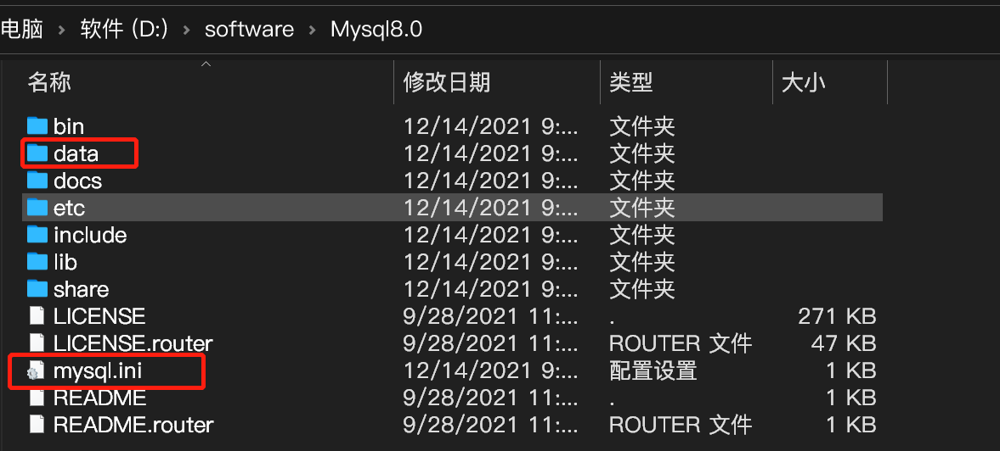

# mysql 8.0.21.zip安装配置方法图文教程(windows 64位)

[toc]


## **1.先去**[**官网**](https://dev.mysql.com/downloads/mysql/)**下载点击的MySQL的下载(借用网络图片，8.0.21)**


```
mysql国内镜像下载网址
http://mirrors.sohu.com/mysql/
http://mirrors.ustc.edu.cn/mysql-ftp/Downloads/

http://mirrors.ustc.edu.cn/mysql-ftp/Downloads/MySQL-8.0/
```


## 下载完以后解压,新建data文件夹，复制粘贴mysql.ini文件




配置初始化的my.ini文件的文件:写入基本配置：

```
[mysqld]
# 设置3306端口
port=3306
# 设置mysql的安装目录
basedir=D:\software\Mysql8.0
# 设置mysql数据库的数据的存放目录
datadir=D:\software\Mysql8.0\Data
# 允许最大连接数
max_connections=200
# 允许连接失败的次数。
max_connect_errors=10
# 服务端使用的字符集默认为utf8
character-set-server=utf8
# 创建新表时将使用的默认存储引擎
default-storage-engine=INNODB
# 默认使用“mysql_native_password”插件认证
#mysql_native_password
default_authentication_plugin=mysql_native_password
[mysql]
# 设置mysql客户端默认字符集
default-character-set=utf8
[client]
# 设置mysql客户端连接服务端时默认使用的端口
port=3306
default-character-set=utf8
```

## 初始化MySQL

在安装时，避免出错我们尽量全部使用管理员身份运行CMD，否则在安装时会报错，会导致安装失败的情况

打开后进入mysql的bin目录

在MySQL目录下的bin目录下执行命令：

```bash
d:
cd D:\software\Mysql8.0\bin
# mysql初始化
mysqld --initialize --console
# 删除mysql服务
sc delete mysql 
# 安装mysql服务 
mysqld --install
# 启动mysql服务
net start msyql
# 连接并修改密码
mysql -u root -p"初始化生成的密码字符串"
ALTER USER 'root'@'localhost' IDENTIFIED BY '新密码';
```


