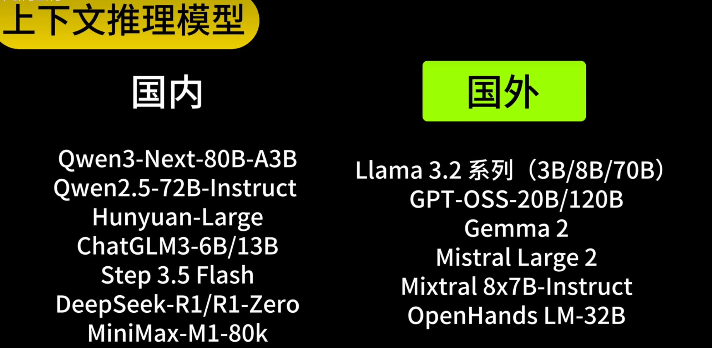
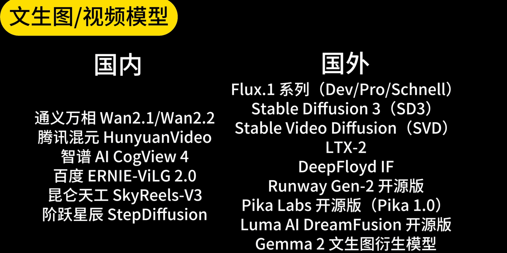
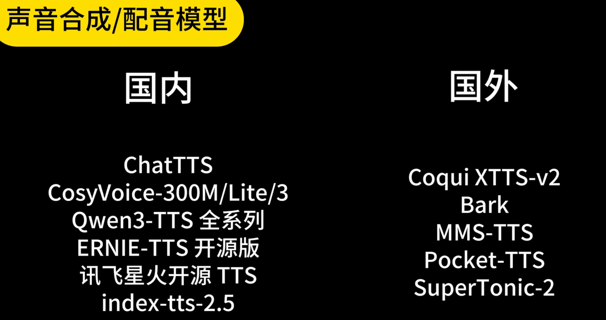
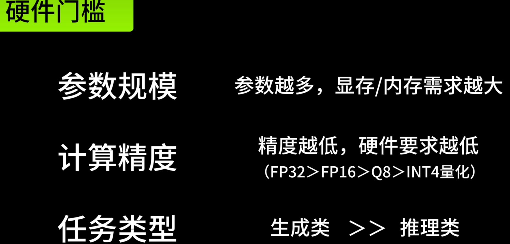
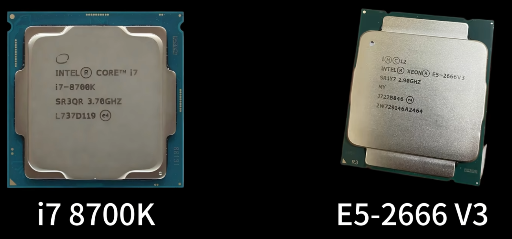
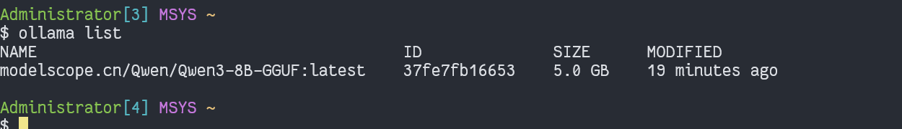
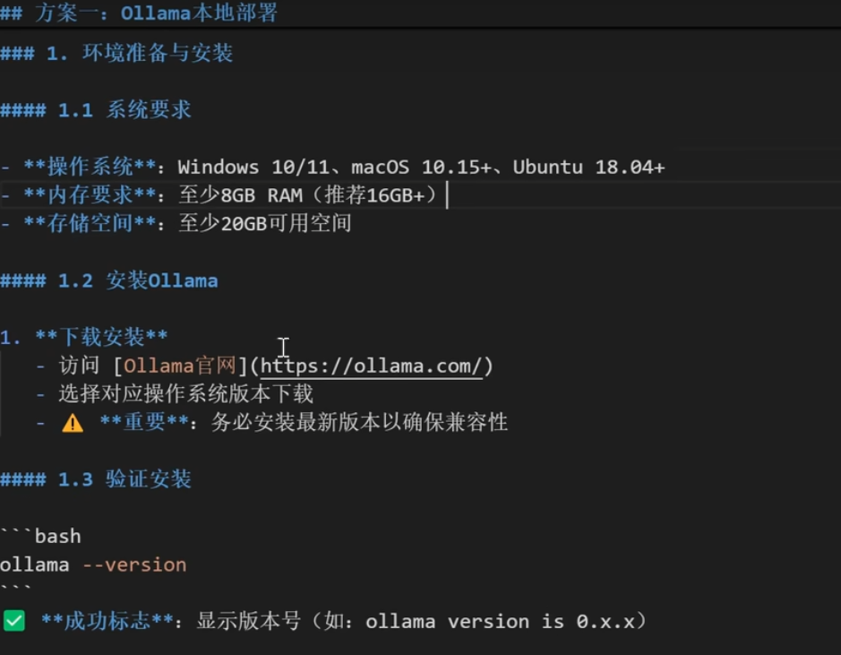
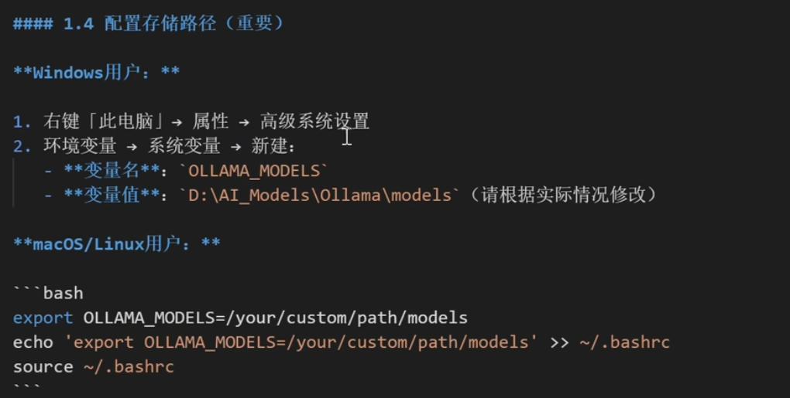
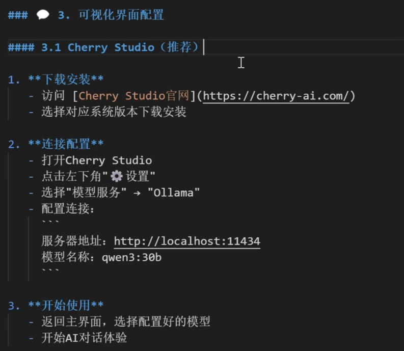
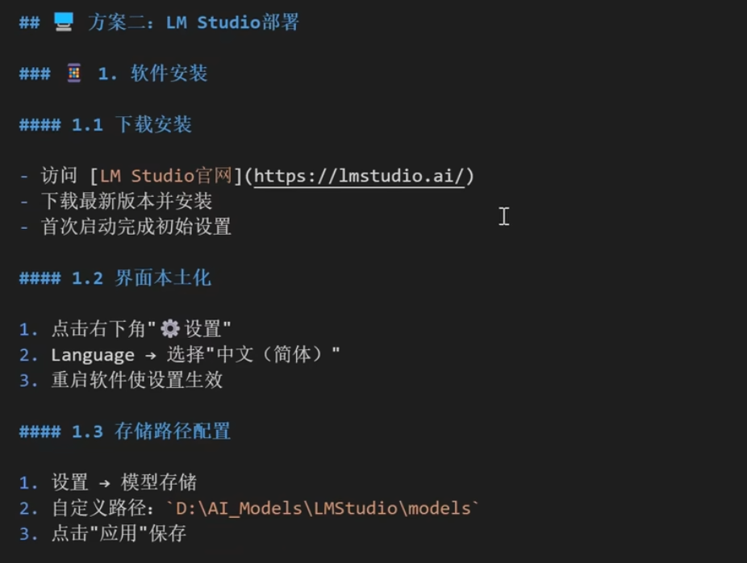

## 1 ollama安装 0.15.6 
github.com/ollama/ollama

https://ghfile.geekertao.top/https://github.com/ollama/ollama/releases/download/v0.15.6/ollama-windows-amd64.zip

## 2 下载models
### 2.1 官网下载
```bash
ollama run qwen3:32b
```

### 2.2 在ollama pull时，添加魔塔地址进行加速下载
https://modelscope.cn/models

```bash
# 格式为：modelscope.cn + gguf模型地址
ollama pull modelscope.cn/Qwen/Qwen3-8B-GGUF
ollama pull modelscope.cn/deepseek-ai/DeepSeek-Coder-V2-Lite-Instruct
ollama pull modelscope.cn/prithivMLmods/qwen3-4b-code-reasoning.Q8_0
git clone https://www.modelscope.cn/prithivMLmods/qwen3-4b-code-reasoning-f32-GGUF.git

```
### 2.3 查看下载模型列表

## 3 启动ollama
### 3.1 Ollama 服务已启动
Ollama 必须作为<mark style="background-color: green；color: black">后台服务运行</mark>才能接受请求。根据你的[操作系统](https://so.csdn.net/so/search?q=%E6%93%8D%E4%BD%9C%E7%B3%BB%E7%BB%9F&spm=1001.2101.3001.7020)操作：

#### 3.1.1 **Windows**
- 打开任务管理器，检查 `ollama app` 是否在后台运行。
- 如果没有运行，手动启动：
    ```undefined
    ollama serve
    ```
    （注意：在 Windows 中可能需要以<mark style="background-color: yellow；color: black">管理员权限</mark>运行）。
#### 3.1.2 **Mac/Linux**
- 检查服务状态：
- ```lua
    systemctl status ollama
    ```
- 启动服务：
    ```sql
    systemctl start ollama
    ```
- 如果使用手动启动：
    ```undefined
    ollama serve
    ```
### 3.2 检查 Ollama 端口监听
Ollama 默认使用 `11434` 端口。确认该端口已被监听：
##### 3.2.1.1 **所有系统**

```cobol
# Linux/Maclsof -i :11434 # Windowsnetstat -ano | findstr :11434
```
- 如果端口未被监听，说明 Ollama 服务未正确启动。
#### 3.2.2 验证 Ollama API 连通性
直接通过 `curl` 或浏览器测试 API 是否可达：
```cobol
curl http://localhost:11434/api/tags
```
如果返回类似以下内容，说明服务正常：
```csharp
{"models": [...]}
```
如果返回 `Connection refused`，继续排查：
#### 3.2.3 防火墙或网络限制

- **本地防火墙**：确保防火墙未阻止 `11434` 端口。
    - **Windows**：检查 `Windows Defender 防火墙`。
    - **Mac**：检查 `系统偏好设置 -> 安全性与隐私 -> 防火墙`。
    - **Linux**：检查 `ufw` 或 `iptables` 规则。
- **Docker 或虚拟机**：如果是容器内运行，确保端口已映射（例如 `-p 11434:11434`）。
#### 3.2.4 检查客户端配置
如果你通过代码（如 Python、JavaScript）调用 Ollama，确保 URL 指向正确地址：
python

```coffeescript
# Python 示例import ollamaclient = ollama.Client(host='http://localhost:11434')  # 确保地址和端口正确
```
#### 3.2.5 重启 Ollama 服务
强制重启服务以清除潜在问题：
##### 3.2.5.1 **Mac/Linux**

```undefined
systemctl restart ollama
```
##### 3.2.5.2 **Windows**
- 在任务管理器中结束 `ollama` 进程，然后重新运行 `ollama serve`。
#### 3.2.6 查看 Ollama 日志
日志中可能包含更详细的错误信息：
##### 3.2.6.1 **Mac/Linux**

```undefined
journalctl -u ollama -f
```
##### 3.2.6.2 **Windows**
日志默认在：

```cobol
C:\Users\<YourUsername>\.ollama\logs\server.log
```
#### 3.2.7 重新安装 Ollama
如果以上步骤无效，尝试重新安装：
1. 卸载 Ollama。
2. 删除残留文件：
    - **Mac/Linux**: `rm -rf ~/.ollama`
    - **Windows**: 删除 `C:\Users\<YourUsername>\.ollama`。
3. 重新安装并启动。
#### 3.2.8 常见问题
- **权限问题**：在 Linux/Mac 上，确保当前用户有权限运行服务。
- **端口冲突**：如果 `11434` 被占用，修改 Ollama 配置：
    ```bash
    export OLLAMA_HOST="0.0.0.0:11435"  # 更换端口
    ```

## 4 本地大模型部署方案一
qwen3-30b-nothinking 

### 4.1 更改模型路径

OLLAMA_MODELS
C:\software\ollama_models
### 4.2 ollama管理命令
#### 4.2.1 常用管理命令

```bash
# 查看已安装模型
ollama list

# 启动特定模型
ollama run qwen3:30b

# 查看模型信息
ollama show qwen3:30b

# 删除模型（释放空间）
ollama rm qwen3:30b

# 停止所有模型
ollama stop qwen3:30b

# 1.安装非思考模型 
ollama pull qwen3:30b-a3b-instruct-2507-q4_K_M 
# 2.重命名为qwen3:30b-instruct 
ollama cp qwen3:30b-a3b-instruct-2507-q4_K_M qwen3:30b-instruct 
# 3.删除原来名字qwen3:30b-a3b-instruct-2507-q4_K_M 
ollama rm qwen3:30b-a3b-instruct-2507-q4_K_M
```
### 4.3 可视化界面



## 5 本地大模型部署方案二 -- LM Studio部署



