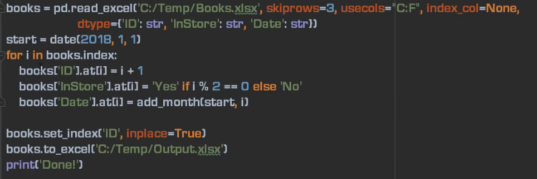
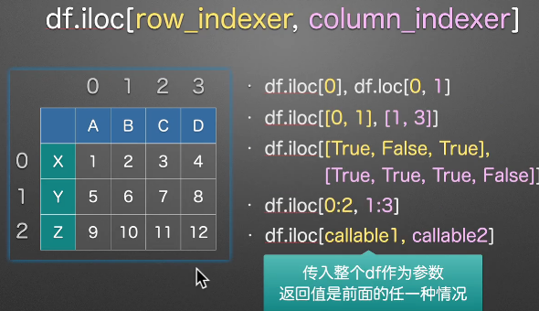
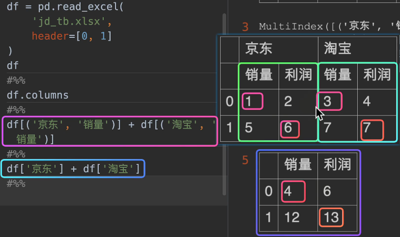
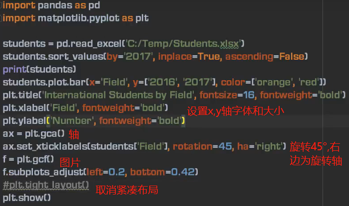
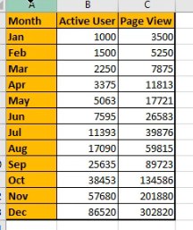
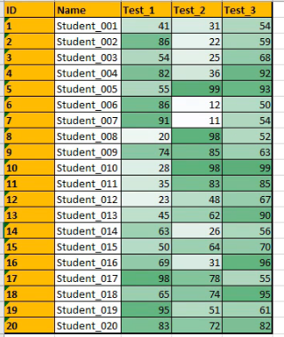

# pandas excel

[toc]


## 新建文件

```python
import pandas as pd

df = pd.DataFrame({'ID':[1,2,3],'Name':['Tim','Victor','Nick']})
df = df.set_index('ID')
df.to_excel('001.xlsx')
print('done!')

```


### pandas写excel


指定index的name


### ExcelWriter写excel


## 打开文件


### index索引


### 获取表格基本信息


### 指定特定行为表头header=row_index


### 没有表头:header=None

```python
df=pd.read_excel('001.xlsx',header=None)
print(df.columns)
# Int64Index([0,1,2,3,4,5], dtyp'int64)
```
### 自定义表头

```python
df.columns=['ID','type','title']
df.set_index('ID',inplace=True) # 重新设置行索引
df.to_excel('001.xlsx')
```

设置为index后,该列就不会出现再columns中,两者是分开的


### 指定index_col

指定后,重新保存将不会默认设置index


### read_excel其他参数

1. index_col


2. 单列转换为series


3. 处理重复列名


4. 处理的行数


5. 千分位分隔符


6. 浮点


## 行\列\单元格

### 创建series


### series加入datafreame(按照列方式加入)


### series加入datafreame(按照行方式加入)

```python
df=pd.DataFrae([s1,s2,s3])
```


### 非对齐series


## 数据区域的读取,填充文字数字


```python
import pandas as pd
from datetime import date,timedelta

def add_month(d,md):
    yd=md//12
    m=d.month+md%12
    if m!=12:
        yd+=m//12
        m=m%12
    return date(d.year+yd,m,d.day)

books=pd.read_excel('001.xlsx',skiprows=3,usecols='C:F',index_col=None,dtype={'ID':str,'InStore':str,'Date':str})

start=date(2018,1,1)
for i in books.index:
    books['ID'].at[i]=i+1   
    books['InStore'].at[i]='Yes' if i%2==0 else 'No'
    books['Date'].at[i]=start+timedelta(days=1) #天数加1
	# books['Date'].at[i]=date(start.year+i,start.month,start,day) # year=1
    # books['Date'].at[i]=add_month(start,i) # month=1 
```



books[‘ID’].at[i]

books.at[i,’ID’]   


## 函数填充

给一列值加2

1. 只修改特定行的值


2. 修改所有行的值

3. 使用函数修改值
4. 
5. 


## 排序


1. 逆序排列


### 多列排序

从左到右,先按照worthy从小到大顺序排,再按照price从大到小排


## 数据筛选和过滤


1. 字典


2. 切片


3. 点选


### loc


链式调用


### iloc




### 赋值


### 加减乘除


不显示无穷大inf


index不对齐:


### mutiindex(header=[0,1])




### 字符串处理函数


## pd.str方法


## 柱状图

### 一般柱状图


### 分组柱图,优化




### 叠加柱状图,水平柱状图


### 饼图


## 折线趋势图,叠加区域图


## 散点图,直方图,密度图


### 散点图scatter


### 直方图hist


### 密度图kde


### 数据相关性corr


## 多表联合


##3 join


## 数据校验


1. assert普通校验


## 把一列数据分成两列


## 求和,求平均,统计导引


## 清楚重复数据


1. 删除重复列


2. 打印重复列


## 行列互相转换




## 读取csv/tsv/txt文件数据


## 透视表,分组,聚合

### 透视表


计算各个配件的每年的销售额和销售数量


## 线性回归,数据预测


## 条件格式jupyter


1. 颜色深浅
2. 



2. 进度条


## 行操作


从中间插入一行


删除一行


按条件删除行


## 列操作


## 读取数据库


## 复杂方程


## 数据处理转换converters


## true false valuses(只对字符串有效)


## dtype转换


