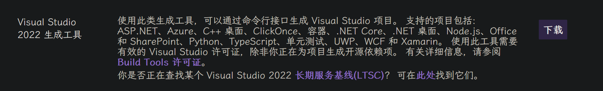
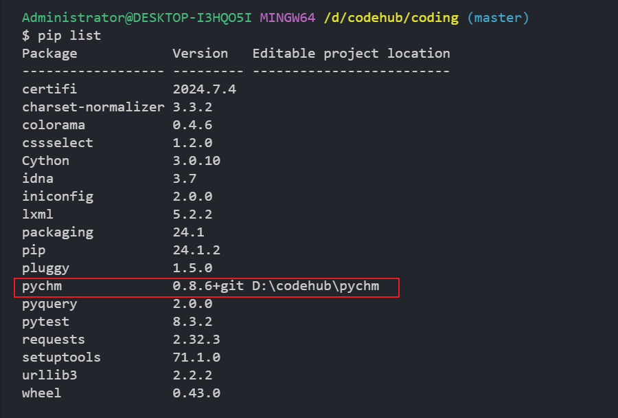
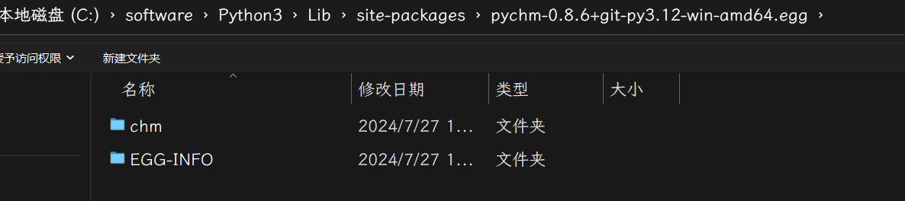
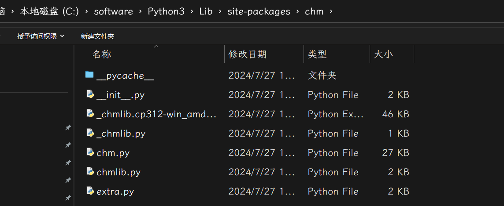

# pychm 安装和使用

## 1 in msys2
### 1.1 安装vs buildtools
https://visualstudio.microsoft.com/zh-hans/downloads/

下载安装 https://aka.ms/vs/17/release/vs_BuildTools.exe ，选择”使用 C++的桌面开发“，右边选择 win10 sdk 或者 win11 sdk 等


### 1.2 安装 msys 2
打开 mingw64. exe

```bash
# https://packages.msys2.org/package/mingw-w64-x86_64-chmlib
pacman -S mingw-w64-x86_64-chmlib make gcc
```
### 1.3 下载pychm
```
git clone https://github.com/dottedmag/pychm
cd pychm
```
1. 修改 scripts/win-travis-before-install. sh, 注释安装 python 那一行
```bash
# choco install python --version 3.7.5
```
2. 修改 scripts/build-chmlib. Bat  中 VsDevCmd. Bat 路径为真实安装路径，内容如下
```bash
call "C:\Program Files (x86)\Microsoft Visual Studio\2022\BuildTools\Common7\Tools\VsDevCmd.bat" -arch=amd64
```
3. 修改 scripts/win-travis-run. Sh  ，python 路径和安装命令
python 路径：`/c/software/Python3`
chmLib 源码路径：`D:\\codehub\\pychm\\deps\\chmlib\\src`
安装命令： （windows 中 python 路径替换 python）：`/c/software/Python3/python.exe`
```bash
export PATH=/c/software/Python3:/c/software/Python3/Scripts:$PATH
export CL=-ID:\\codehub\\pychm\\deps\\chmlib\\src
export LINK=/LIBPATH:D:\\codehub\\pychm\\deps\\chmlib\\src

pip install --user pytest
/c/software/Python3/python.exe setup.py build
/c/software/Python3/python.exe setup.py develop
/c/software/Python3/python.exe  -m pytest
```
### 1.4 执行脚本
```bash
cd pychm
sh -x scripts/win-travis-before-install.sh  # 安装并编译chmlib
sh -x scripts/win-travis-run.sh   # 编译pychm并安装
CFLAGS=-I/mingw64/include LDFLAGS=-L/mingw64/lib /c/software/Python3/python.exe setup.py install
```


### 1.5 重命名
安装成功后目录为

需要将里面的 chm 拷贝出来，放到 site-packages 中，拷贝后如下


## 2 in linux(推荐) 最简单

```bash
https://www.jedrea.com/chmlib/
wget https://www.jedrea.com/chmlib/chmlib-0.40.tar.gz
tar -xf chmlib-0.40.tar.gz
cd chmlib && ./configure
make && make install
pip install pychm
```


## 3 pychm 使用

```bash
import pychm.chm.chm as sut, pychm.chm.chmlib as sut_chmlib
f = sut.CHMFile()
f.LoadCHM("tests/integration/example.chm")

f.CloseCHM()

# 获取目录
def test_retrieve():
    f = sut.CHMFile()
    f.LoadCHM("tests/integration/example.chm")
	 print(f.GetLCID()) #文件编码格式 (b'iso8859_1', b'Norwegian_Bokmal', b'Western Europe & US')
    tt = f.GetTopicsTree()
    print(tt)  # 目录列表list
    f.CloseCHM()
# 获取目录
def test_enumerate():
    f = sut.CHMFile()
    f.LoadCHM("tests/integration/example.chm")
    ret = []
    def enumerator(chm_file, ui, context):
        ret.append(ui.path)
    sut_chmlib.chm_enumerate(f.file, sut_chmlib.CHM_ENUMERATE_NORMAL, enumerator, None)
	print(ret)  # 目录列表list
    f.CloseCHM()
# 获取文件内容
def get_content():
	succ, ui = f.ResolveObject(b'/page 1.html')
	
```