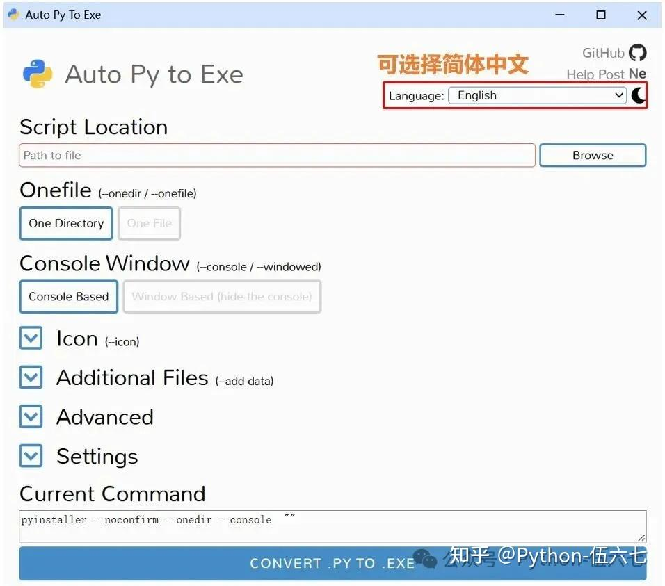
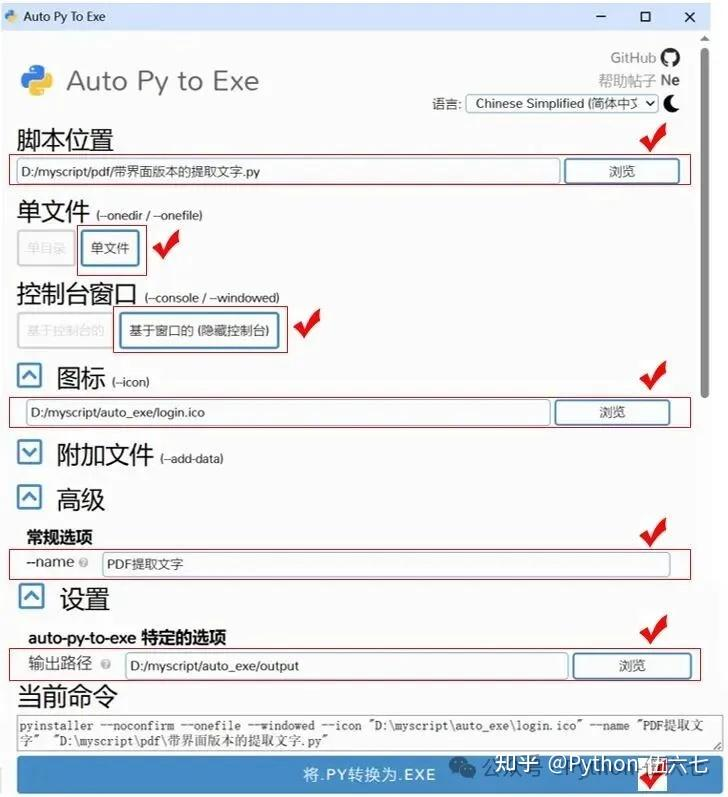

# python打包指南
## 1 **🚀PyInstaller**：是打包Python程序最流行的工具之一，它可以生成独立可执行的程序
```text
pip install pyinstaller
```

### 1.1 **⚙️常用参数选项与意义：**

**--icon**：指定可执行文件的图标（.ico格式）

**--clean**：清理之前的构建文件

**--name**：指定打包后的可执行文件或文件夹的名称

**--add-data**：添加额外的数据或目录到应用程序中

**--onefile**：所有依赖项打包成一个单独可执行文件

**--onedir**：项目打包成一个文件夹（默认选项）
## 2 **可视化的auto-py-to-exe**
🚀**auto-py-to-exe：**该工具通过提供直观的图形界面，简化了复杂的命令行配置流程，用户无需记忆繁琐参数，即可轻松完成打包，显著降低了使用门槛，但其内核仍基于PyInstaller
1. 安装依赖包：**
```text
pip install auto-py-to-exe
```
2. 怎么启动auto-py-to-exe ?**
在命令行中输入`auto-py-to-exe`启动程序如下所示：

3.  **⚙️常用参数选项与意义：**

**📍 Script Location**：要打包 Python 主程序位置

**📁 One Directory**：项目打包成一个文件夹

**📄 One File**：项目打包成一个exe文件，方便分发

**⌨️ Console Based**：运行时会弹出控制台窗口

**🖥️ Window Based**：隐藏控制台，适合GUI应用程序

**🖼️ Icon**：为生成的.exe文件设置图标（.ico格式）

**📎 Additional Files**：添加程序运行所需的额外文件

## 3 **能生成安装包的cx_Freeze**
**🚀cx_Freeze**：是另一个强大的 Python 程序打包工具，它支持跨平台，并能生成专业的 Windows 安装包 msi 文件
1.  **📥安装依赖包：**

```text
pip install cx_Freeze
```
2.  **⚙️常用参数选项与意义：**
与 PyInstaller 直接使用命令行不同，cx_Freeze 主要通过创建一个 setup.py 文件来配置打包参数，下面是一个典型的 setup.py 文件示例和关键配置项说明

```python
from cx_Freeze import setup, Executable
# 打包选项
build_options = {
    "packages": ["os"],  # 需打包的库
    "excludes": ["tkinter"],  # 要排除的库
    "include_files": ["config.ini", "images/"]  # 包含的额外文件
}
# 生成exe的设置
executable = Executable(
    script="main.py",  # 你的主程序
    base="Console",  # 控制台
    icon="logo.ico",  # 程序图标（.ico）
    target_name="我的程序.exe"# 输出的exe文件名
)
# 执行打包
setup(
    name="我的程序",  # 程序名
    version="1.0",
    options={"build_exe": build_options},
    executables=[executable]
)
```
## 4 **防止反编译的Nuitka**
**🚀Nuitka**：理念与其他工具截然不同，它并非简单的“打包”，而是将Python代码编译成C/C++代码，再编译为本地机器码，性能和安全将提升，特别适合小型应用程序（大程序打包时间可能较长）


1. **📥安装依赖包：**

```text
pip install nuitka
```
2.  **⚙️常用参数选项与意义：**
**📦①打包成单个exe文件**： --standalone --onefile创建独立可执行文件`nuitka --standalone --onefile my_script.py`
**🏷️②指定输出文件名**：-output-filename=FILENAME`nuitka --output-filename="我的程序.exe" script.py`
**📂③指定输出目录**：--output-dir=DIRECTORY`nuitka --output-dir="dist" script.py`
**🖼️④设置exe文件的图标**：--windows-icon-from-ico=FILE`nuitka --windows-icon-from-ico="D:\myscript\login.ico" script.py`
**📋⑤禁用控制台窗口**：--windows-disable-console`nuitka --windows-disable-console script.py`
**🔌⑥启用特定插件**：--enable-plugin=PLUGIN_NAME`nuitka --enable-plugin=tk-inter script.py # Tkinter支持`
**📦⑦明确包含某个包**：--include-package=PACKAGE`nuitka --include-package=requests script.py`
**⚡⑧多核并行编译加快打包速度**：--jobs=N`nuitka --jobs=4 script.py`

3. **🎨使用示例**

🔔将 hello.py 编译成单个可执行文件 我的应用程序.exe，并使用 logo.ico 作为图标，命令如下：

```text
nuitka --standalone --onefile --output-filename="我的应用程序.exe" --windows-icon-from-ico=logo.ico hello.py
```
```bash
# 打包为文件夹 
python -m nuitka --mingw64 --standalone --enable-plugin=tk-inter --remove-output  --output-dir=out  desk.py
# 打包为exe程序
python -m nuitka --mingw64 --standalone --onefile --enable-plugin=tk-inter --remove-output  --output-dir=out  desk.py
```
## 5 **📊 工具综合对比与选型建议**

| 特性维度 | PyInstaller    | auto-py-to-exe    | cx_Freeze        | Nuitka             |
| ---- | -------------- | ----------------- | ---------------- | ------------------ |
| 核心原理 | 打包Python解释器与依赖 | PyInstaller的GUI封装 | 打包依赖，可生成MSI      | 将Python编译为C/C++二进制 |
| 使用难度 | ★★☆☆☆ (简单)     | ★☆☆☆☆ (极简)        | ★★★☆☆ (中等)       | ★★★★☆ (较复杂)        |
| 输出文件 | 目录或单个.exe      | 同PyInstaller      | 目录、或msi安装包       | 目录或单个.exe（本地二进制）   |
| 性能表现 | 解释执行，启动较慢      | 同PyInstaller      | 同PyInstaller     | 编译执行，启动快，运行快       |
| 代码保护 | 较弱（可被反编译）      | 同PyInstaller      | 同PyInstaller     | 很强（编译为机器码）         |
| 打包速度 | 快              | 快                 | 快                | 较慢（需编译）            |
| 适用场景 | 快速打包、原型交付      | 新手、畏惧命令行的开发者      | 需Windows安装包的专业分发 | 追求性能、保护代码的商业项目     |

