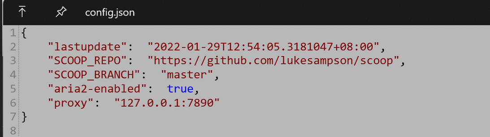

# scoop安装


使用Scoop管理开发工具最近抽空将本地的开发工具都升级了一遍，以前都是用一个装一个，多年下来也积累了不少，虽说常用的也都用nvm、uv管理了，但每个都升级一边也着实挺累。想起来以前折腾PowerShell时安装的scoop，觉得还是全部交给它把，反正用起来和brew一样丝滑，不用配置环境变量，还不怎么污染注册表。

## 1 安装Scoop

### 1.1 安装Scoop，需要PowerShell 5以上，我本地用的是pws7，所以照着官方文档安装即可
```powershell
# 打开权限
Set-ExecutionPolicy -ExecutionPolicy RemoteSigned -Scope CurrentUser 
# 安装
Invoke-RestMethod -Uri https://get.scoop.sh | Invoke-Expression
```
### 1.2 如果访问不了

```powershell
iwr -useb get.glimmer.ltd | iex
# 或
irm https://ghproxy.com/raw.githubusercontent.com/duzyn/scoop-cn/master/install.ps1 | iex
# 或者
irm https://cdn.jsdelivr.net/gh/duzyn/scoop-cn/install.ps1 | iex
# 或者
 irm scoop.201704.xyz -outfile 'install.ps1'
.\install.ps1 -ScoopDir 'C:\software\scoop' -ScoopGlobalDir 'C:\software\scoop\apps'  -RunAsAdmin

# 卸载
scoop uninstall scoop
```

已经安装过的就执行下scoop update更新一下就可以了。
### 1.3 安装后的目录如下所示：

```powershell
apps      -- 安装的软件在这个目录下
buckets   -- 已经添加的软件仓库
cache     -- 缓存目录（下载时的 .zip 或 .msi 安装包。安装完可清理。）
modules   --  存放 Scoop 自身的 PowerShell 模块
persist   -- 配置目录（例如 maven:setting.xml等）
shims     --  类似于linux的bin目录，安装的软件都会在这里生成shell脚本，省的去配置环境变量了。
```
## 2 配置Scoop中的app

默认Scoop会把各类软件都安装在`C:\Users\用户名\scoop`，为了节省C盘的空间，我们将其配置在`D:\scoop`目录。
1. 修改环境变量
右键此电脑 -> 属性 -> 高级系统设置 -> 环境变量。
在“用户变量”中：
    修改（或新建）变量名 SCOOP，值为 D:\Scoop。
    修改 Path 变量，将原本指向 C:\...\scoop\shims 的路径改为 D:\Scoop\shims。
2. 检查一下还有没有遗漏的
```bash
scoop config
```
如果还有C:这种的，都替换一下。
对于那种将配置过的开发环境托管到scoop的同学，需要自己将自己配置的所有环境变量统统删除。
以nvm为例（最好是直接删掉，大部分环境使用scoop安装的时候都会自动配置）：
```powershell
[Environment]::SetEnvironmentVariable("NVM_HOME", $null, "User")
[Environment]::SetEnvironmentVariable("NVM_SYMLINK", $null, "User")
```
## 3 Scoop常用命令
```powershell
Command 	Summary
update 	更新
list 	显示已安装软件
install 	安装(全局安装 加 -g)
uninstall 	卸载
search 	搜索
status 	检查更新（outdated）
bucket 	buckets
cache 	缓存
reset 	重设（通常用于多版本切换）
cleanup 	清理下载的旧版
help 	帮助
shim 	shim
-   hold——锁定软件阻止其更新。
-   info——查询软件简要信息。
-   home——打开浏览器进入软件官网。
```
除了install、uninstall、update、update以外，通常使用的命令就是
1. 清理过时（或者安装完的）的安装包: scoop cache rm *
2. 查看社区的bucket列表:  scoop bucket known
### 3.1 添加bucket
```bash
# 添加了多种软件包(带UI的)
scoop bucket add extras
 # 安装历史版本时需要这个源
scoop bucket add versions
# 安装jdk
scoop bucket add java
# 其他常用bucket：https://rasa.github.io/scoop-directory/by-score.html
# 删除bucket
scoop bucket rm main
scoop bucket add main https://mirror.nju.edu.cn/git/scoop-main.git
scoop bucket add extras https://mirror.nju.edu.cn/git/scoop-extras.git
scoop bucket add dorado https://gitee.com/scoop-bucket/dorado.git
# 添加bucket后需要更新一下：
scoop update
# 安装包
scoop install <仓库名>/<软件名> -s # -s是取消hash校验

# 其他bucket频道：
main    https://gitee.com/scoop-installer/Main      2025/2/24 8:37:11      1382
extras  https://gitee.com/scoop-installer/Extras    2025/2/24 8:41:05      2130
dorado  https://gitee.com/scoop-installer/dorado    2025/2/24 8:16:22        257
echo    https://gitee.com/scoop-installer/echo-scoop 2025/2/23 22:14:08      102
scoopcn  https://gitee.com/scoop-installer/scoopcn    2025/2/19 16:37:21        30
scoopet  https://gitee.com/scoop-installer/scoopet    2025/2/24 2:01:44        81
siku    https://gitee.com/scoop-installer/siku      2025/2/24 0:33:43        89
Versions https://gitee.com/scoop-installer/Versions  2025/2/24 4:34:25        477
```
4. 指定仓库安装 `scoop install <bucket_Name>/<packName>`
5. 切换jdk(或者其他什么的都可以)版本
```
# https://github.com/ScoopInstaller/Java/wiki
scoop reset temurin21-jdk 

scoop reset temurin8-jdk 
```
6. 清理所有旧版: scoop cleanup *
7. 查看已安装的程序: scoop list
8. 如果只看名字: scoop list | Select-Object -ExpandProperty Name
9. 查看更新: scoop status
10. 更新版本，仓库: scoop update
11. 自身诊断: scoop checkup
12. 全局安装git: # 需要在开发者那里开启sudo  `sudo scoop install git -g `
13. 查看有哪些保留的安装包: scoop cache show
14. scoop update #更新仓库
15. scoop update --all #更新所有软件
16. scoop list #列出已安装的软件
17. scoop bucket list #列出已订阅的仓库
#### 3.1.1 推荐软件仓库
软件仓库是 Scoop 软件管理的重要基础，通过 json 文件记录仓库中每一个软件的信息，从而实现软件的管理等便捷命令行操作，并由仓库管理员（其实开源项目都是大家用爱发电）负责软件信息的更新。

前面提到，默认安装Scoop后仅有`main`仓库，其中主要是面向程序员的工具，对于一般用户而言并不是那么实用。好在Scoop本身考虑到了这一点，添加了面向一般用户的软件仓库`extras`，其中收录大量好用的小软件，足够日常的使用。

Scoop添加软件仓库的命令是`scoop bucket add bucketname (+ url可选)`。如添加`extras`的命令是`scoop bucket add extras`，执行此命令后会在scoop文件夹中的buckets子文件夹中添加extras文件夹。

此外，Scoop官方还有一些仓库可供使用，本人没有什么需求就不在此处介绍了，仅贴一下官方的介绍：

> [main](https://github.com/ScoopInstaller/Main) - Default bucket for the most common (mostly CLI) apps  
> [extras](https://github.com/ScoopInstaller/Extras) - Apps that don't fit the main bucket's [criteria](https://github.com/ScoopInstaller/Scoop/wiki/Criteria-for-including-apps-in-the-main-bucket)  
> [games](https://github.com/Calinou/scoop-games) - Open source/freeware games and game-related tools  
> [nerd-fonts](https://github.com/matthewjberger/scoop-nerd-fonts) - Nerd Fonts  
> [nirsoft](https://github.com/kodybrown/scoop-nirsoft) - Almost all of the [250+](https://rasa.github.io/scoop-directory/by-apps#kodybrown_scoop-nirsoft) apps from [Nirsoft](https://nirsoft.net/)  
> [java](https://github.com/ScoopInstaller/Java) - A collection of Java development kits (JDKs), Java runtime engines (JREs), Java's virtual machine debugging tools and Java based runtime engines.  
> [nonportable](https://github.com/TheRandomLabs/scoop-nonportable) - Non-portable apps (may require UAC)  
> [php](https://github.com/ScoopInstaller/PHP) - Installers for most versions of PHP  
> [versions](https://github.com/ScoopInstaller/Versions) - Alternative versions of apps found in other buckets

除了官方的软件仓库，Scoop也支持用户自建仓库并共享，于是又有很多大佬提供了许多好用的软件仓库。这里强推[dorado](https://github.com/chawyehsu/dorado)仓库，里面有许多适合中国用户的软件，或者你有兴趣可以去看看仓库作者[关于Scoop更多技术方面的探讨](https://chawyehsu.com/blog/talk-about-scoop-the-package-manager-for-windows-again)。添加`dorado`仓库的命令如下：`scoop bucket add dorado https://github.com/chawyehsu/dorado`。

此外，若多个仓库间的软件名称冲突，可以通过在软件名前添加仓库名的方式避免冲突，如`scoop install dorado/appname`。

### 3.2 对scoop_repo进行更改

```powershell
scoop config SCOOP_REPO https://gitee.com/scoop-bucket/scoop
```
## 4 配置代理

国内使用这些工具，不可避免得要配置这些。（配置加速地址也行）
1. 设置代理: scoop config proxy 127.0.0.1:1080
> 切记不要使用socks5://127.0.0.1:1080 ，兼容性太差了

2. 关闭代理: scoop config rm proxy
3. 使用用户代理: scoop config proxy currentuser@default
4. 直接点，找到Scoop配置文件，路径`C:\Users\username\.config\scoop\config.json`，然后直接修改里面的配置，如下图：

## 5 安装软件
### 5.1 配置Aria2
如果网络不好，需要断点续传或者多线程加速下载，可以将其替换为aria2。
1. 安装aria2： scoop install aria2
2. 关闭aria2: scoop config aria2-enabled false
3. aria2其他参数配置
```powershell
scoop config aria2-retry-wait 4
scoop config aria2-split 16
scoop config aria2-max-connection-per-server 16
scoop config aria2-min-split-size 4M
```
### 5.2 我安装的一些软件
```poershell
scoop list | Select-Object -ExpandProperty Name      
Installed apps:
7zip 21.07 [main]
aria2 1.36.0-1 [main]
baidunetdisk 百度网盘
bat
captura 8.0.0 [extras]
ccleaner 5.89.9401 [extras]
clash-for-windows 0.19.7 [dorado]
composer
curl
dark 3.11.2 [main]
dfcf         东方财富
dingtalk 6.3.25.1219101 [dorado]
dismplusplus 10.1.1002.1 [extras]
draw.io 16.5.1 [extras]
Eudic        欧路词典
everything   搜索软件
exiftool
FantasqueSansMono-NF
fd
ffmpeg 5.0 [main]
fzf
gawk
geekuninstaller
gh
git 2.35.0.windows.1 [main]
git-lfs
github 2.9.6 [extras]
go
gradle
grep
gridea 0.9.2 [extras]
imagemagick
Inkscape 矢量图制作
innounp 0.50 [main]
JetBrainsMono-NF
jianyingpro  剪映pc版
jq
lessmsi 1.10.0 [main]
libwebp
main/ast-grep
make
marktext 0.16.3 [extras]
maven
miller
neovim
neteasemusic 网易云音乐
nginx
nodejs 17.4.0 [main]
nvm
obs-studio 27.1.3 [extras]
pandoc 2.17.0.1 [main]
php
picgo 2.3.0 [dorado]
poppler
potplayer 220106 [extras]
qbittorrent 4.4.0 [extras]
QQ           
ripgrep
rufus 3.17 [extras]
sbt
scala2
scoop-completion
scoop-search
sed
snipaste     截图软件
steam nightly-20200720 [extras]
sublime-text 4-4126 [extras]
sumatraPDF   阅读软件
temurin-lts-jdk
temurin21-jdk
TIM          企业QQ
trafficmonitor 1.82 [extras]
typora 0.11.18 *hold* [extras]
utools 2.5.2 [dorado]
uv
ventoy 1.0.64 [extras]
visualvm
VLC          视频播放器
vscodium     vscode开源版
wechat nightly-20201231 [dorado]
wget
WinPython    python集成软件
xdown        下载软件
xmind8 3.7.9 [extras]
xsv
XunLei       迅雷11
xyplorer   资源管理器  
yq
yu-writer    markdown编辑器
zoxide
zulufx17-jdk
```
还有一些增强的命令也可考虑安装


### 5.3 安装字体：
`scoop bucket add 'nerd-fonts'`
[GitHub - belluzj/fantasque-sans: A font family with a great monospaced variant for programmers.](https://github.com/belluzj/fantasque-sans)
```powershell
> scoop search FantasqueSansMono-NF
> scoop bucket add 'nerd-fonts'
# 下面一个命令要加 sudo 提权
> sudo scoop install FantasqueSansMono-NF
```
## 6 功能增强

可以安装两个增强包，一个是软件补全，一个是搜索增强。
1. 软件名补全： scoop install scoop-completion
2. 搜索增强： scoop install scoop-search
安装完成后，在PowerShell的配置文件中，加入如下代码：
```powershell
 $PROFILE | Select-Object *  # 获取powershell配置文件目录
 # C:\Users\Administrator\Documents\WindowsPowerShell\profile.ps1
```
 
```powershell
# 导入 Scoop 补全模块
if (Get-Module -ListAvailable -Name scoop-completion) {
    Import-Module scoop-completion
}

# 使用 scoop-search 完美接管原生 scoop search 命令
if (Get-Command scoop-search -ErrorAction SilentlyContinue) {
    . ([ScriptBlock]::Create((& scoop-search --hook | Out-String)))
}
```

这样，使用scoop install zulu，按下tab键盘就可以联想出后续的名称。

```
scoop intall
```
## 7 清理残留和旧版本
```bash
scoop cache rm -a
scoop cleanup -a
```