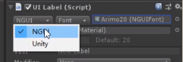
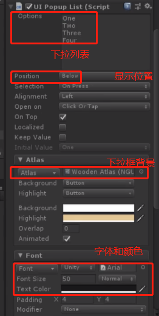

# unity3D UI插件–NGUI

[toc]

## 1 NGUI

## 2 UI Root/UI Panel/UI Camera组件

单独创建Sprite控件,NGUI会自动创建UI Root/UI Panel/UI Camera三个组件

### 2.1 UI Root

#### 2.1.1 flexible灵活的

#### 2.1.2 constrained 约束的

### 2.2 UI Panel

是一个容器,只有这个子对象才可以显示

## 3 UI Camera

是否响应对应的事件

响应鼠标事件允许鼠标按下和抬起坐标的误差范围

### 3.1 UI Camera的原理

UI Camera是通过触摸/鼠标移动的位置的地方发射射线(就是Unity的Raycast)然后获取射线撞击的碰撞体(collider)信息,然后发射消息(通过Unity的SendMessage函数)给该碰撞体关联的GameObject的所有脚本

### 3.2 UI Camera中响应的事件

### 3.3 UI Camera常用相关变量

UICamera.currentTouchID: 用于区分鼠标按下的键位,-1是左键,-2是右键,-3为中键

UICamera.lastHit:RaycastHit类型,用于获取被触发的物体

UICamera.lastTouchPosition:用于获取鼠标和触摸的位置

## 4 Atlas Maker

NGUI区别于UGUI,NGUI在使用2D图片是采用图集的形式,因此,在使用NGUI之前,我们需要学会如何使用图集制作器制作图集

### 4.1 制作图集

### 4.2 替换图集

tooltip 提示信息

## 5 NGUI控件

### 5.1 Sprite 精灵(图片)

### 5.2 Label -文本

#### 5.2.1 Font Maker字体集创建

有Unity和NGUI字体集两种选择,unity支持中文,NGUI只支持英文

==BBCode==

==锚点==

### 5.3 Tooltip

#### 5.3.1 创建tooltip

1. 创建GameObject

UI Root-> new GameObject->rename Gameobject为tooltip

2. 给tooltip添加sprite背景,并选择背景图片,修改尺寸,位置置0

3. 创建label,调整尺寸,

#### 5.3.2 tooltip添加组件UI Tooltip(脚本组件),绑定各对象

#### 5.3.3 使用tooltip

选择一个控件,响应tooltip事件

给控件添加COllider碰撞体组件

创建一个脚本,绑定到控件上

修改tooltip的depth显示层级,让tooltip在最顶层显示

修改pivot中心点,使tooltip在鼠标的右下角显示

左上角显示

### 5.4 Texture 纹理

### 5.5 Input Field 输入框

#### 5.5.1 创建Input Field组件

1. GameObject + label

2. GameObj 添加sprite作为背景:设置图集

3. GameObj添加Input Field组件:

挂载input label

4. GameObj添加Collider组件:
5. 挂载自定义脚本(测试Saved As)

On Change绑定InputField

### 5.6 Button 按钮

添加label,显示文字,添加自定义脚本

onclick绑定函数

添加按钮点击声音

### 5.7 Check Box(Toggle)

1. 添加invisible widget

2. 添加Toggle 并attach Collider

可以设置为none

group同一组中只能选中一个

3. onvaluechange添加脚本

### 5.8 Popup List 弹出框/下拉列表

1. GameObj添加组件: UI Sprite背景,设置图片,type切片方式,

2. GameObj添加组件: UI Popup List:核心组件

绑定onvaluechange

使用脚本初始化option

3. add添加label
4. attach Collider碰撞体检测

### 5.9 Slider 滑杆

#### 5.9.1 创建Slider

1. GameObject==Slider
   1. NGUI Slider,调整depth

​		2. attach collider

1. sprite==Foreground_sprite
2. sprite==Background_sprite
3. sprite==Thumb

4. 自定义脚本

5. 绑定到on valuechange

### 5.10 Scroll Bar 滚动条

#### 5.10.1 创建ScrollBar

1. GameObject==Scrollbar
   1. NGUI ScrollBar
   
      
   
      
   
2. sprite==Foreground_sprite

1. sprite==Background_sprite
2. sprite==Thumb(显示进度百分比)
   1. label(10%)
3. 自定义脚本

### 5.11 Scroll View 滚动视图

设置grid:行和列

添加拖拽视图

