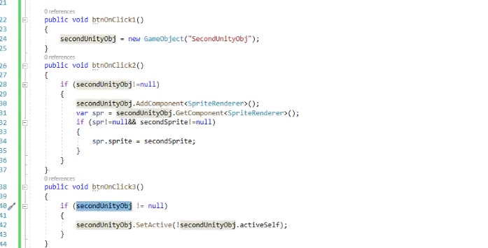
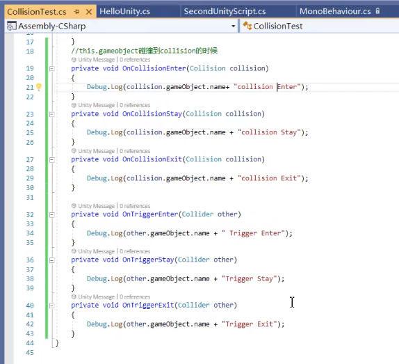

# GameObject方法

[toc]

[【Unity从入门到精通】2021最新C#/Unity脚本开发基础教程(unity学习/unity课程/unity入门/unity入门教程/unity开发）_哔哩哔哩 (゜-゜)つロ 干杯~-bilibili](https://www.bilibili.com/video/BV1r64y1U7fm?p=8&spm_id_from=pageDriver)

## unity3D

## unity的对象和脚本

## unity中的对象

### 组件对象

## 练习一

## unity引擎视图和游戏结构

## unity中的脚本

### unity自带的事件函数执行顺序

## unity常用函数

## 练习二

## sendmessage方法

SendMessage() 调用GameObject 的methodName方法

SendMessageUpwads() 调用GameObject以及所有父物体的methodName方法

BroadcastMessage() 调用GameObject以及所有子物体的methodName方法

## 事件函数–碰撞触发事件

==碰撞触发需要满足三个条件==

1. 碰撞双方带有碰撞体Collider(胶囊体)组件
2. 碰撞其中一方带有Rigidbody(刚体)组件
3. 发生碰撞

==满足以上条件后,既可以通过脚本碰撞事件检测到==

* 碰撞
  * OnCollisionEnter() 当该Cillider/Rigidbody开始接触另一个Cillider/Rigidbody时调用
  * OnCollisionStay() 对每一个与Cillider/Rigidbody接触的Cillider/Rigidbody,每帧调用一次
  * OnCollisionExit() 当此Cillider/Rigidbody停止接触另一个Cillider/Rigidbody时调用
* 触发
  * OnTriggerEnter() 当该Trigger和另一个Trigger/Collider碰撞时调用
  * OnTriggerEnter() 当该Trigger与其他Trigger/Collider接触时,每次Update()调用一次
  * OnTriggerExit() 当Trigger停止接触Trigger/Collider时调用

触发场景

## 事件函数–鼠标事件

## 事件帧率函数

Update() 正常更新,每一帧都会由系统调用一次该方法

LateUpdate() 推迟更新,在Update之后执行,每一帧调用一次

FixedUpdate()固定更新,根据固定时间来更新,常用来模型移动等操作,在Edit->Project Setting->Time菜单可更改更新频率,这个执行先后,和频率有关,默认在update之前

## 其他函数

1. Application.Quit()退出应用程序

Editor模式下,使用UnityEditor.EditorApplication.isPlaying=false退出

2. OnApplicationQuit() 这个函数在应用退出之前的所有游戏物体上调用,在编辑器Editor模式中会在用户停止PlayMode运行模式时调用,在网页播放器webplayer中会在网页视图关闭时调用

3. SceneManager.LoadScene()加载游戏场景

加载场景前需要先将其加载到build settings

